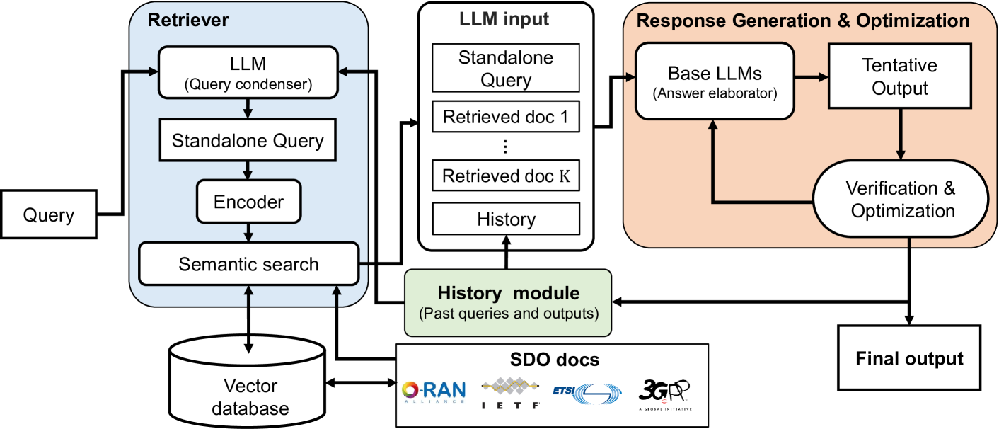
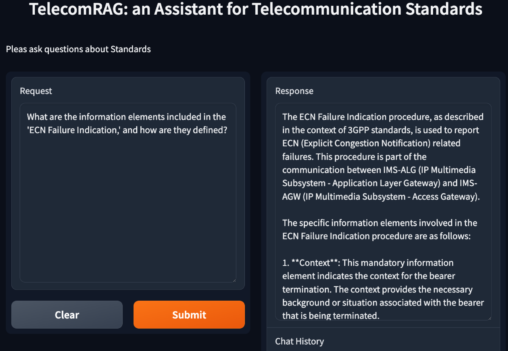

# TelecomRAG：借助检索增强生成与大型语言模型，驾驭电信标准之海

发布时间：2024年06月11日

`RAG

理由：这篇论文介绍了一个专门为电信行业定制的LLM解决方案，即TelecomRAG框架，它利用检索增强生成（RAG）技术来提供精确和基于事实的答案。这与RAG技术的应用直接相关，因此被分类为RAG。虽然它也涉及LLM的应用，但主要焦点是RAG技术的特定应用，而不是LLM的一般应用或理论。` `知识图谱`

> TelecomRAG: Taming Telecom Standards with Retrieval Augmented Generation and LLMs

# 摘要

> 大型语言模型（LLMs）对电信行业具有革命性的潜力，能助专业人士理解复杂标准、编写代码并加速开发。但传统LLMs在精确度和源验证方面难以满足电信需求。为此，我们提出了专为电信标准定制的LLM解决方案——TelecomRAG框架，它通过检索增强生成（RAG）技术，提供精确、基于事实的答案。基于3GPP Release 16和18规范的知识库，我们的实现展示了TelecomRAG助手如何超越通用LLMs，以更高的准确性、技术深度和可验证性，为电信领域带来显著价值。

> Large Language Models (LLMs) have immense potential to transform the telecommunications industry. They could help professionals understand complex standards, generate code, and accelerate development. However, traditional LLMs struggle with the precision and source verification essential for telecom work. To address this, specialized LLM-based solutions tailored to telecommunication standards are needed. Retrieval-augmented generation (RAG) offers a way to create precise, fact-based answers. This paper proposes TelecomRAG, a framework for a Telecommunication Standards Assistant that provides accurate, detailed, and verifiable responses. Our implementation, using a knowledge base built from 3GPP Release 16 and Release 18 specification documents, demonstrates how this assistant surpasses generic LLMs, offering superior accuracy, technical depth, and verifiability, and thus significant value to the telecommunications field.

[Arxiv](https://arxiv.org/abs/2406.07053)