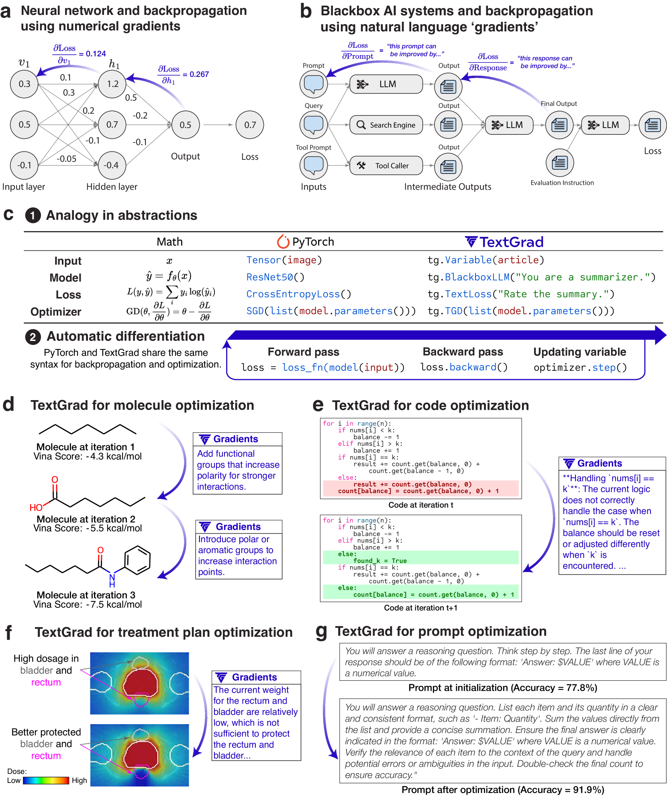
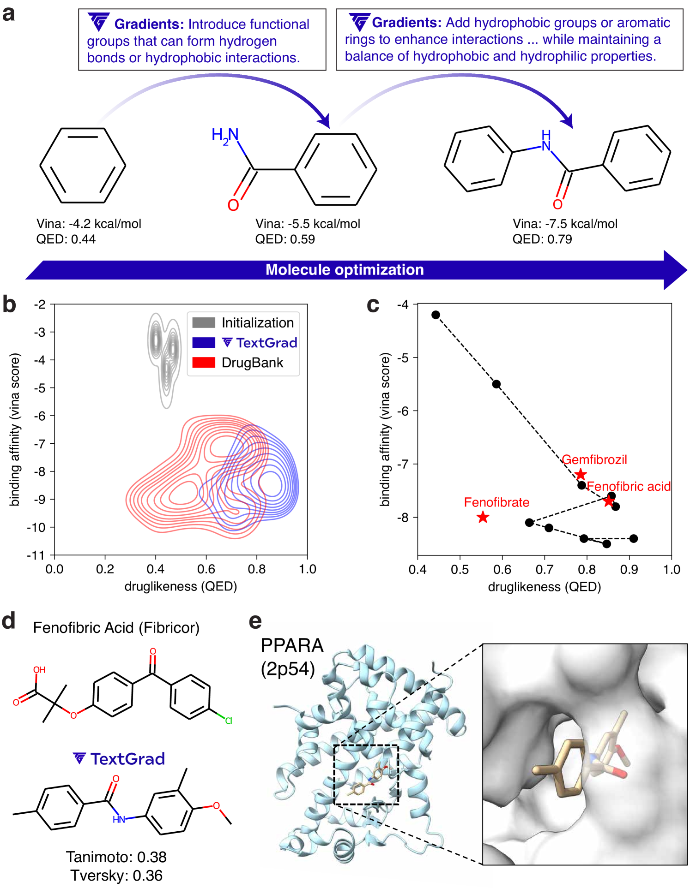
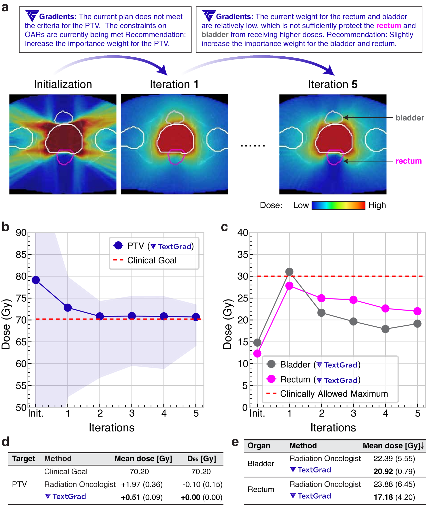
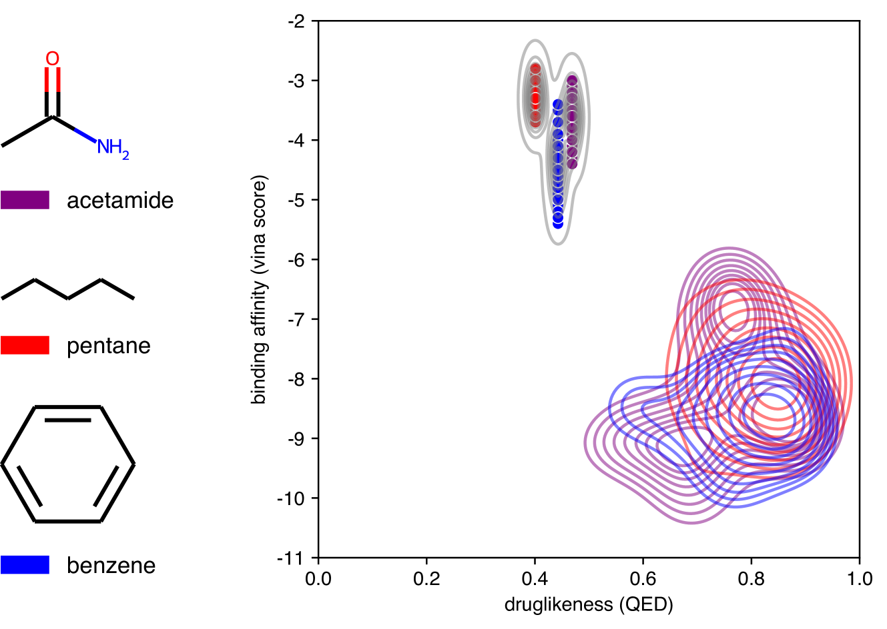
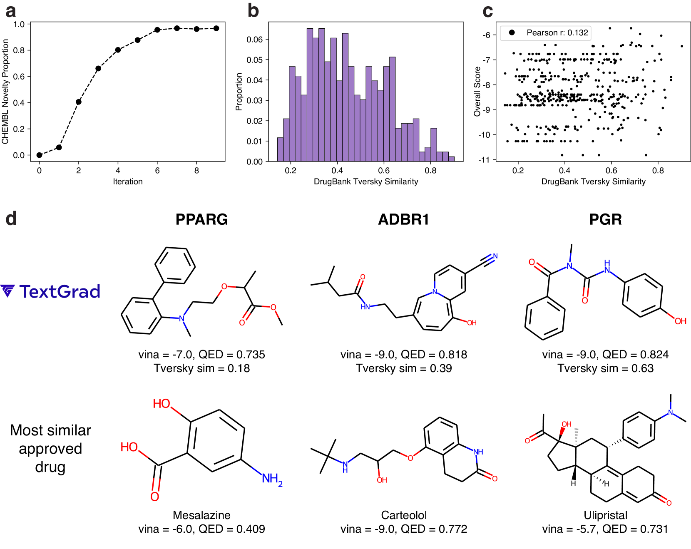
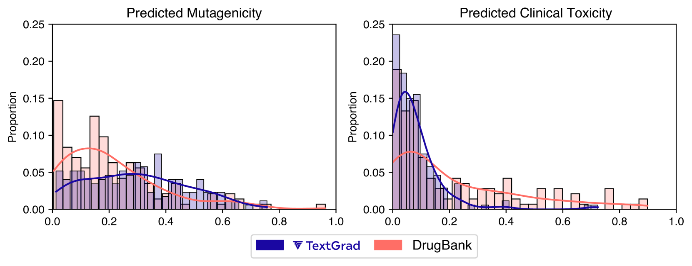

# TextGrad：文本自动微分技术

发布时间：2024年06月11日

`LLM应用

这篇论文摘要描述了一个名为 TextGrad 的框架，它利用大型语言模型（LLMs）的文本反馈来优化复合 AI 系统中的组件。这个框架的应用范围广泛，包括问答、分子设计、放射治疗规划等多个领域，并且展示了在提高问答准确率和优化编程问题等方面的显著效果。因此，这项工作属于 LLM 应用的范畴，因为它展示了如何将 LLMs 应用于实际问题解决和系统优化中。` `人工智能`

> TextGrad: Automatic "Differentiation" via Text

# 摘要

> AI 正经历一场革命，通过整合多个大型语言模型（LLMs）及其他复杂组件的系统取得重大进展。这带来了开发复合 AI 系统自动化优化方法的新挑战。类似地，神经网络早期也面临过优化难题，直到反向传播和自动微分技术使其变得简单。借鉴这一历史，我们推出了 TextGrad，一个通过文本实现自动“微分”的强大框架。TextGrad 利用 LLMs 的文本反馈来优化复合 AI 系统中的组件。它遵循 PyTorch 的简洁语法，灵活易用，无需用户调整，即可广泛应用于问答、分子设计、放射治疗规划等多个领域。TextGrad 不仅提升了 GPT-4o 在 Google-Proof 问答中的零-shot 准确率，还在编程问题优化、药物分子设计等方面展现了显著效果，为下一代 AI 系统的快速发展奠定了坚实基础。

> AI is undergoing a paradigm shift, with breakthroughs achieved by systems orchestrating multiple large language models (LLMs) and other complex components. As a result, developing principled and automated optimization methods for compound AI systems is one of the most important new challenges. Neural networks faced a similar challenge in its early days until backpropagation and automatic differentiation transformed the field by making optimization turn-key. Inspired by this, we introduce TextGrad, a powerful framework performing automatic ``differentiation'' via text. TextGrad backpropagates textual feedback provided by LLMs to improve individual components of a compound AI system. In our framework, LLMs provide rich, general, natural language suggestions to optimize variables in computation graphs, ranging from code snippets to molecular structures. TextGrad follows PyTorch's syntax and abstraction and is flexible and easy-to-use. It works out-of-the-box for a variety of tasks, where the users only provide the objective function without tuning components or prompts of the framework. We showcase TextGrad's effectiveness and generality across a diverse range of applications, from question answering and molecule optimization to radiotherapy treatment planning. Without modifying the framework, TextGrad improves the zero-shot accuracy of GPT-4o in Google-Proof Question Answering from $51\%$ to $55\%$, yields $20\%$ relative performance gain in optimizing LeetCode-Hard coding problem solutions, improves prompts for reasoning, designs new druglike small molecules with desirable in silico binding, and designs radiation oncology treatment plans with high specificity. TextGrad lays a foundation to accelerate the development of the next-generation of AI systems.

[Arxiv](https://arxiv.org/abs/2406.07496)