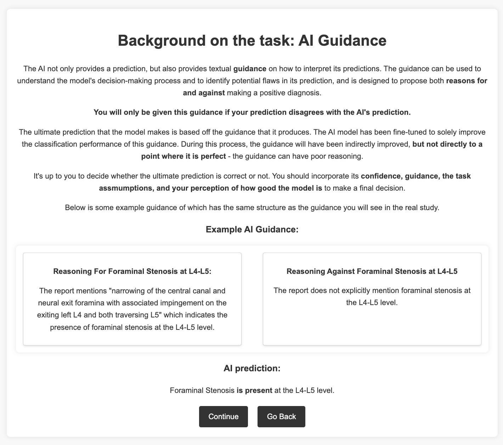

# 探索医疗领域的人机协作：借助大型语言模型优化决策延迟系统

发布时间：2024年06月11日

`Agent

这篇论文介绍了一种创新的智能引导延迟系统，该系统利用大型语言模型（LLMs）的能力来辅助人类决策，特别是在医疗领域中。这种系统通过融合AI和人类的优势，旨在减少LLMs可能产生的幻觉倾向对关键决策的影响。论文中提到的系统设计和实现，包括利用LLMs的表达和内部状态，并通过微调较小模型以大型数据来提升性能和计算效率，表明这是一个具体的Agent应用，即一个智能系统在特定领域（医疗）中辅助或代理人类进行决策。因此，这篇论文应归类为Agent。` `人机协作`

> Towards Human-AI Collaboration in Healthcare: Guided Deferral Systems with Large Language Models

# 摘要

> 大型语言模型（LLMs）虽在医疗领域应用广泛，但其幻觉倾向在关键决策中带来不确定性。人机协作（HAIC）通过融合双方优势，有效降低此风险。本文介绍了一种创新的智能引导延迟系统，当AI将决策权交予人类时，该系统提供精准指导。我们借助LLMs的表达与内部状态构建此系统，并通过微调较小模型以大型数据，实现了性能提升与计算效率的平衡。初步研究已证实该系统的有效性。

> Large language models (LLMs) present a valuable technology for various applications in healthcare, but their tendency to hallucinate introduces unacceptable uncertainty in critical decision-making situations. Human-AI collaboration (HAIC) can mitigate this uncertainty by combining human and AI strengths for better outcomes. This paper presents a novel guided deferral system that provides intelligent guidance when AI defers cases to human decision-makers. We leverage LLMs' verbalisation capabilities and internal states to create this system, demonstrating that fine-tuning smaller LLMs with data from larger models enhances performance while maintaining computational efficiency. A pilot study showcases the effectiveness of our deferral system.

[Arxiv](https://arxiv.org/abs/2406.07212)