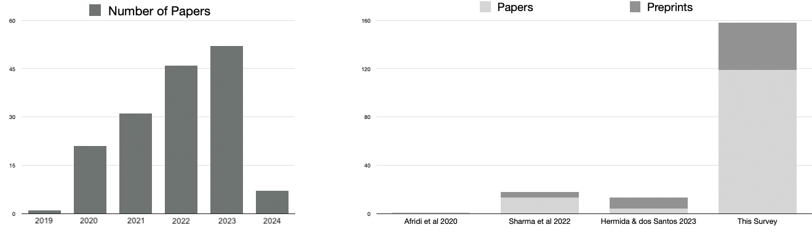
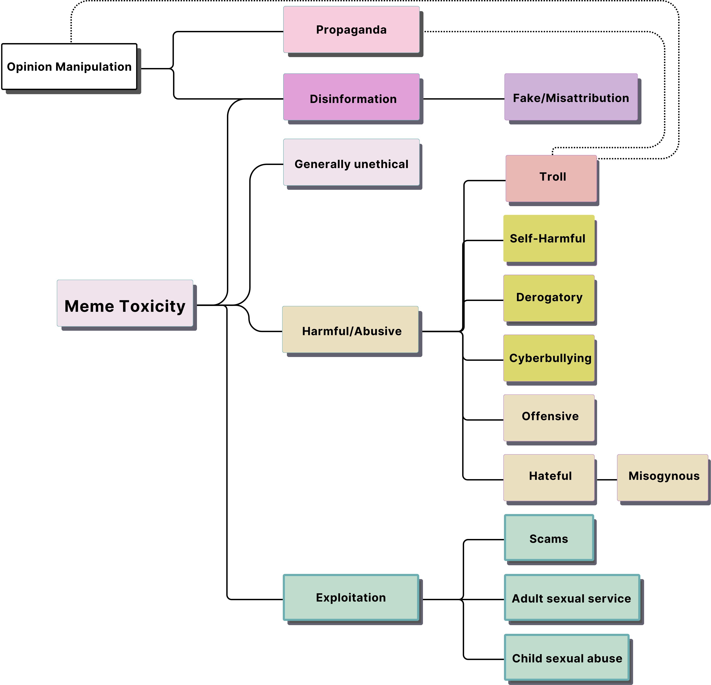
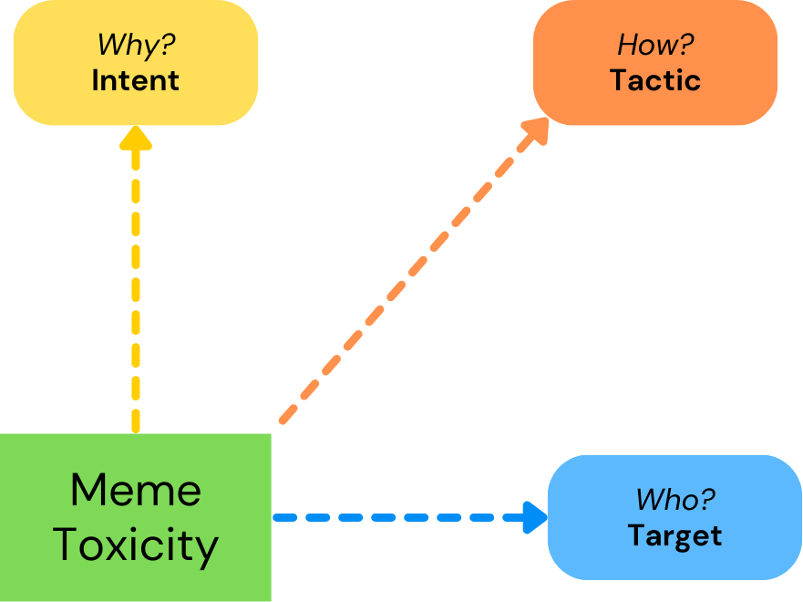

# 模因毒性探析：计算视角下的检测与解释研究综述

发布时间：2024年06月11日

`LLM应用

理由：这篇论文主要探讨了大型语言模型（LLMs）和生成AI在检测和生成有毒模因中的应用，以及它们在处理模因毒性方面的潜力和挑战。论文通过系统综述和分析，提出了新的分类法和框架，以更好地理解和检测模因毒性。这些内容直接关联到LLMs在实际应用中的使用，特别是在社交媒体内容分析和有害信息检测领域，因此属于LLM应用分类。` `社交媒体` `网络安全`

> Toxic Memes: A Survey of Computational Perspectives on the Detection and Explanation of Meme Toxicities

# 摘要

> 互联网模因，既是幽默的载体，也是社会评论和文化表达的工具，如今却越来越多地被用于传播有害信息。尽管过去五年对有毒模因的计算分析研究激增，但截至2022年的相关综述仅有三篇，这导致了术语混乱和研究趋势的忽视。我们的研究通过深入探讨基于内容的计算视角下的有毒模因，并更新至2024年初的关键进展，填补了这一研究空白。运用PRISMA方法论，我们系统地扩展了先前的文献，取得了三方面的成果。首先，我们新增调查了119篇论文，深入分析了158项针对基于内容的有毒模因的计算研究。我们识别并评估了超过30个用于有毒模因分析的数据集及其标签系统。其次，鉴于计算研究中模因毒性定义的模糊性，我们提出了一种新的分类法来界定模因毒性的类型。同时，我们观察到计算任务已超越简单的有毒或无毒二元分类，转向了对毒性更细致的理解。第三，我们明确了三个自动研究下的基于内容的模因毒性维度：目标、意图和传达策略，并构建了一个框架来阐明这些维度与模因毒性之间的关系。该综述还探讨了当前的挑战和趋势，如跨模态推理的强化、专家和文化知识的整合、自动毒性解释的需求，以及低资源语言中模因毒性的处理。此外，我们注意到大型语言模型（LLMs）和生成AI在检测和生成有毒模因中的应用日益增多。最后，我们提出了推进有毒模因检测和解释的未来方向。

> Internet memes, channels for humor, social commentary, and cultural expression, are increasingly used to spread toxic messages. Studies on the computational analyses of toxic memes have significantly grown over the past five years, and the only three surveys on computational toxic meme analysis cover only work published until 2022, leading to inconsistent terminology and unexplored trends. Our work fills this gap by surveying content-based computational perspectives on toxic memes, and reviewing key developments until early 2024. Employing the PRISMA methodology, we systematically extend the previously considered papers, achieving a threefold result. First, we survey 119 new papers, analyzing 158 computational works focused on content-based toxic meme analysis. We identify over 30 datasets used in toxic meme analysis and examine their labeling systems. Second, after observing the existence of unclear definitions of meme toxicity in computational works, we introduce a new taxonomy for categorizing meme toxicity types. We also note an expansion in computational tasks beyond the simple binary classification of memes as toxic or non-toxic, indicating a shift towards achieving a nuanced comprehension of toxicity. Third, we identify three content-based dimensions of meme toxicity under automatic study: target, intent, and conveyance tactics. We develop a framework illustrating the relationships between these dimensions and meme toxicities. The survey analyzes key challenges and recent trends, such as enhanced cross-modal reasoning, integrating expert and cultural knowledge, the demand for automatic toxicity explanations, and handling meme toxicity in low-resource languages. Also, it notes the rising use of Large Language Models (LLMs) and generative AI for detecting and generating toxic memes. Finally, it proposes pathways for advancing toxic meme detection and interpretation.

[Arxiv](https://arxiv.org/abs/2406.07353)