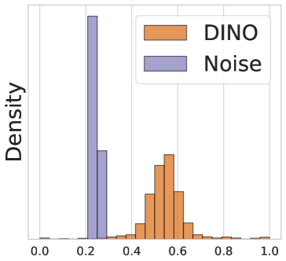

# 大型基础模型知识向小型下游模型的迁移

发布时间：2024年06月11日

`LLM理论

理由：这篇论文主要探讨了如何将大型基础模型的知识高效转移到小型、特定任务的下游模型，提出了自适应特征转移（AFT）方法。这种方法关注于特征而非权重转移，智能选择对下游任务最有益的特征，并通过正则化实现低开销。这一研究属于对大型语言模型（LLM）理论层面的探讨，因为它涉及模型知识的转移和优化，而不是直接的应用或特定的Agent或RAG框架。因此，它被归类为LLM理论。` `机器学习` `数据处理`

> Transferring Knowledge from Large Foundation Models to Small Downstream Models

# 摘要

> 如何将大型基础模型的知识高效转移到小型、特定任务的下游模型，以降低成本？传统的迁移学习依赖于预训练权重，信息传递有限且常需庞大架构。这还限制了结合多个互补预训练模型的可能。为此，我们提出了自适应特征转移（AFT）。AFT不转移权重，而是专注于特征，使预训练模型与下游模型的选择独立。它不是盲目压缩所有特征，而是智能选择对下游任务最有益的特征，通过简单的正则化，开销极小。在多个视觉、语言及多模态数据集上，AFT以相似成本实现了更优的下游性能。即便下游模型小50倍，AFT也能确保预训练模型的改进转化为下游性能的提升，并有效整合多个预训练模型的互补信息。

> How do we transfer the relevant knowledge from ever larger foundation models into small, task-specific downstream models that can run at much lower costs? Standard transfer learning using pre-trained weights as the initialization transfers limited information and commits us to often massive pre-trained architectures. This procedure also precludes combining multiple pre-trained models that learn complementary information. To address these shortcomings, we introduce Adaptive Feature Transfer (AFT). Instead of transferring weights, AFT operates purely on features, thereby decoupling the choice of the pre-trained model from the smaller downstream model. Rather than indiscriminately compressing all pre-trained features, AFT adaptively transfers pre-trained features that are most useful for performing the downstream task, using a simple regularization that adds minimal overhead. Across multiple vision, language, and multi-modal datasets, AFT achieves significantly better downstream performance compared to alternatives with a similar computational cost. Furthermore, AFT reliably translates improvement in pre-trained models into improvement in downstream performance, even if the downstream model is over $50\times$ smaller, and can effectively transfer complementary information learned by multiple pre-trained models.

[Arxiv](https://arxiv.org/abs/2406.07337)