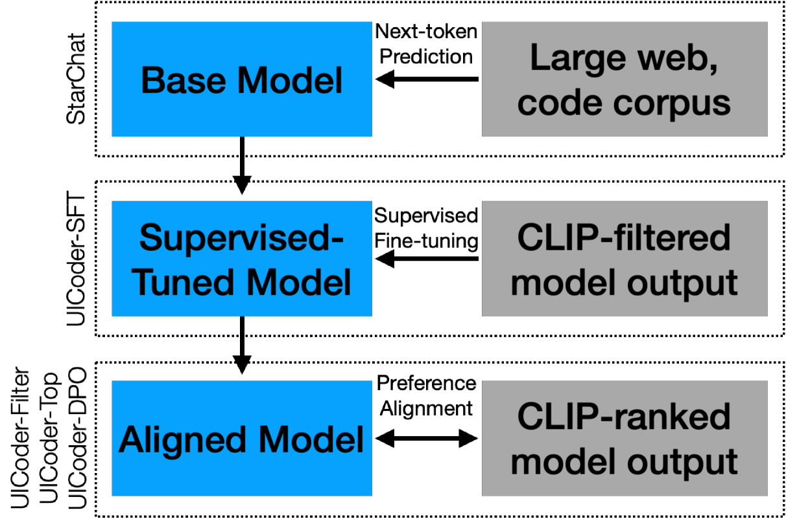
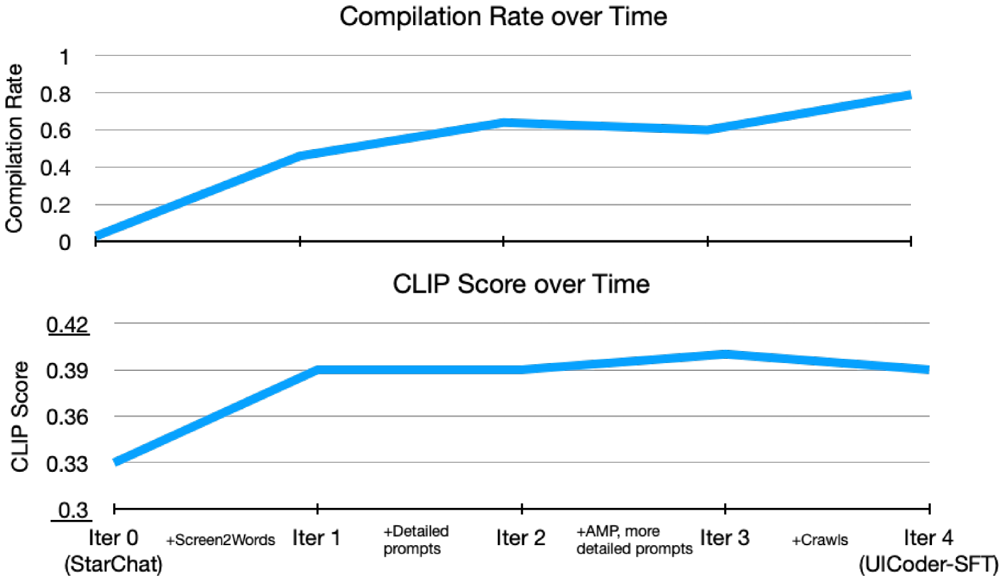
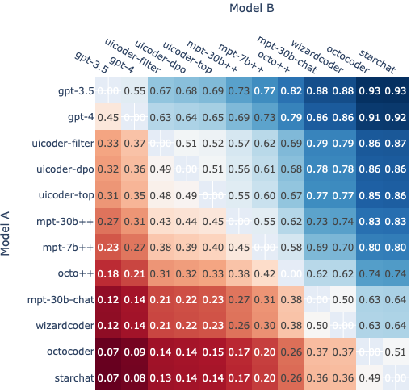
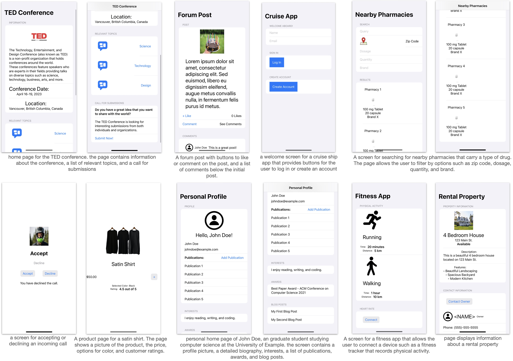
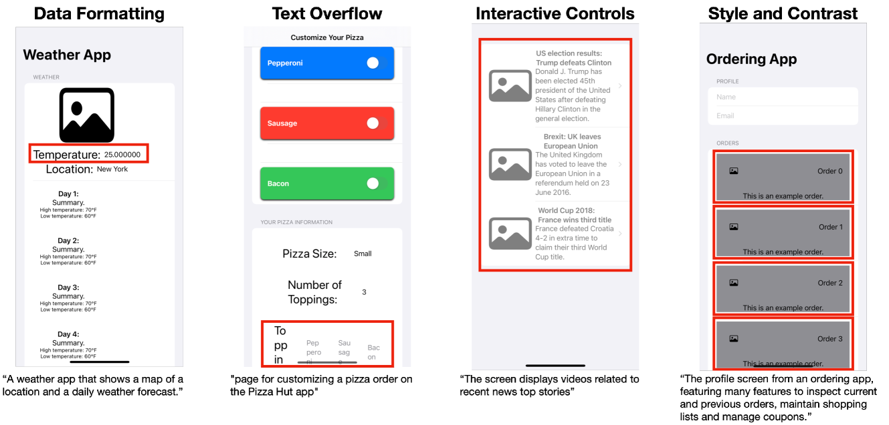
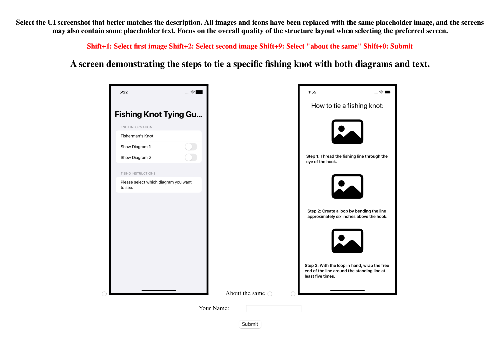

# UICoder：借助自动化反馈，微调大型语言模型，精准生成用户界面代码

发布时间：2024年06月11日

`LLM应用

这篇论文探讨了如何通过自动化反馈机制优化大型语言模型（LLMs）生成高质量UI代码的能力。它提出了一种方法，通过自动化工具筛选、评分和去重合成数据，以此来微调LLM，从而提高其生成UI代码的质量。这种方法不涉及Agent的行为或决策，也不是关于RAG（Retrieval-Augmented Generation）模型的研究，更不是关于LLM理论的深入探讨。因此，它最适合归类为LLM应用，因为它专注于实际应用中如何改进LLM的性能。` `软件开发` `人工智能`

> UICoder: Finetuning Large Language Models to Generate User Interface Code through Automated Feedback

# 摘要

> 大型语言模型（LLMs）在生成既可编译又具有视觉吸引力的UI代码时面临挑战。传统提升生成质量的方法往往依赖于昂贵的人工反馈或专有模型的精馏。本文提出了一种新策略，利用自动化反馈（如编译器和多模态模型）来优化LLMs生成高质量UI代码的能力。我们的方法首先利用现有LLM生成大量合成数据，随后通过自动化工具严格筛选、评分和去重，形成一个精炼的高质量数据集。通过在此数据集上对原始LLM进行微调，我们迭代地改进了模型。实验结果表明，采用此方法的开源LLMs在性能上不仅超越了所有其他可下载的基线模型，甚至接近了更大专有模型的水平。

> Large language models (LLMs) struggle to consistently generate UI code that compiles and produces visually relevant designs. Existing approaches to improve generation rely on expensive human feedback or distilling a proprietary model. In this paper, we explore the use of automated feedback (compilers and multi-modal models) to guide LLMs to generate high-quality UI code. Our method starts with an existing LLM and iteratively produces improved models by self-generating a large synthetic dataset using an original model, applying automated tools to aggressively filter, score, and de-duplicate the data into a refined higher quality dataset. The original LLM is improved by finetuning on this refined dataset. We applied our approach to several open-source LLMs and compared the resulting performance to baseline models with both automated metrics and human preferences. Our evaluation shows the resulting models outperform all other downloadable baselines and approach the performance of larger proprietary models.

[Arxiv](https://arxiv.org/abs/2406.07739)