# 探索不同模型间的视觉概念理解

发布时间：2024年06月11日

`LLM应用

这篇论文主要探讨了大型多模态模型如Stable Diffusion在处理文本到图像生成、开放集对象检测及零样本分类任务时的性能和局限性。特别关注了新词嵌入的模型特异性和跨模型迁移的问题。这些内容直接关联到大型语言模型（LLM）的应用层面，尤其是在多模态理解和生成任务中的应用。因此，将其归类为LLM应用是合适的。` `视觉识别` `机器学习`

> Understanding Visual Concepts Across Models

# 摘要

> 大型多模态模型如Stable Diffusion，通过微调单个词嵌入，便能创造、识别并分类新的视觉概念。但这些模型是否能将相似词汇归类于同一概念（如<橙色猫>即橙色与猫的结合）？我们对文本到图像生成、开放集对象检测及零样本分类领域的三个顶尖模型进行了深入分析，结果揭示：新词嵌入具有模型特异性，无法跨模型迁移。在四个标准数据集上，针对40种视觉概念训练的4800个新词嵌入中，我们发现，任何先前词嵌入的$ε$-球内的微小扰动都能影响任意概念的生成、检测与分类。当这些新词嵌入被整合进新模型时，针对原模型的微调效果不复存在。我们进一步证明，流行的软提示调优方法在视觉概念学习任务中找到了这些扰动解，而视觉概念的词嵌入则无法跨模型迁移。重现实验的代码已公开，详情请访问：https://visual-words.github.io。

> Large multimodal models such as Stable Diffusion can generate, detect, and classify new visual concepts after fine-tuning just a single word embedding. Do models learn similar words for the same concepts (i.e. <orange-cat> = orange + cat)? We conduct a large-scale analysis on three state-of-the-art models in text-to-image generation, open-set object detection, and zero-shot classification, and find that new word embeddings are model-specific and non-transferable. Across 4,800 new embeddings trained for 40 diverse visual concepts on four standard datasets, we find perturbations within an $ε$-ball to any prior embedding that generate, detect, and classify an arbitrary concept. When these new embeddings are spliced into new models, fine-tuning that targets the original model is lost. We show popular soft prompt-tuning approaches find these perturbative solutions when applied to visual concept learning tasks, and embeddings for visual concepts are not transferable. Code for reproducing our work is available at: https://visual-words.github.io.

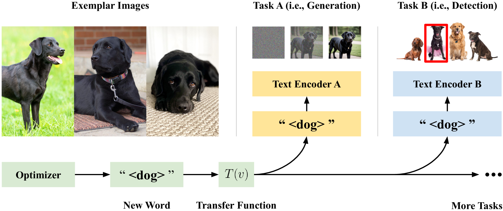

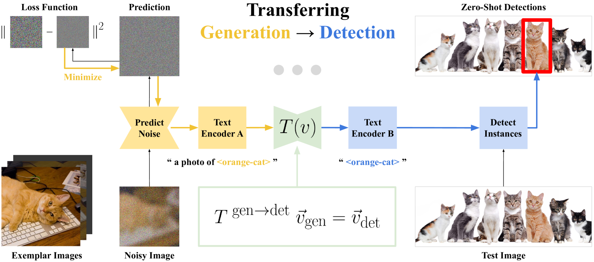

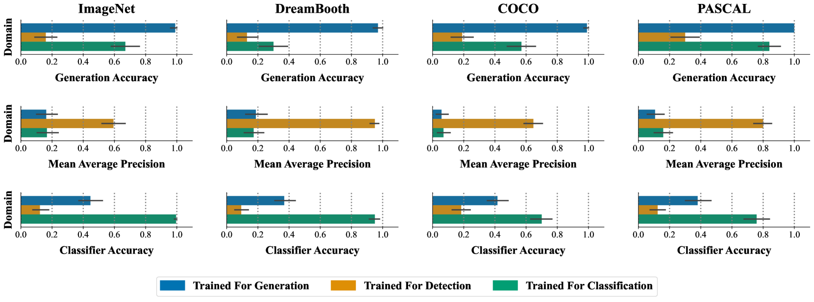

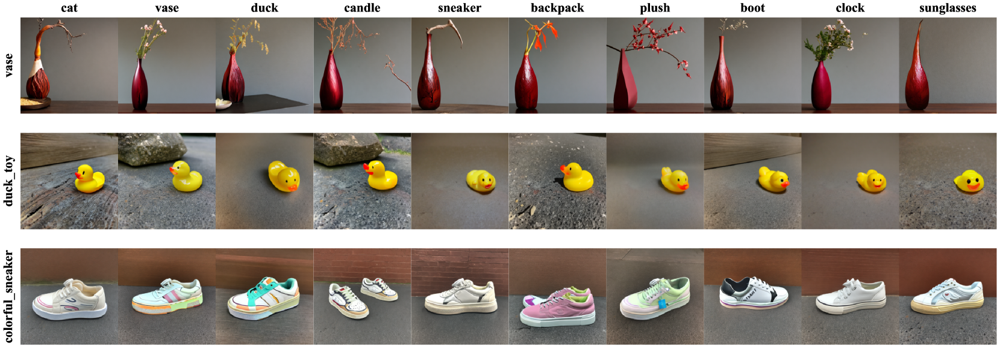

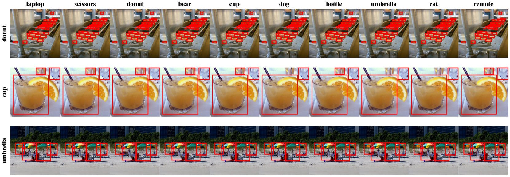

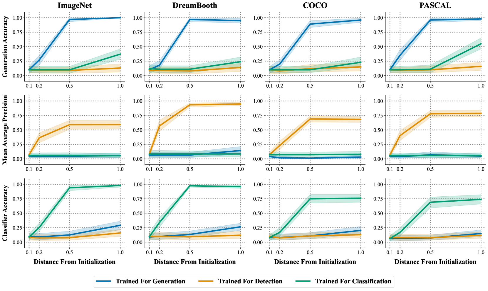

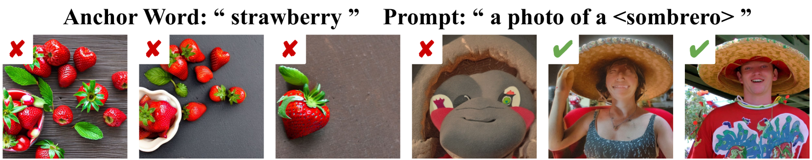

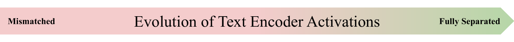

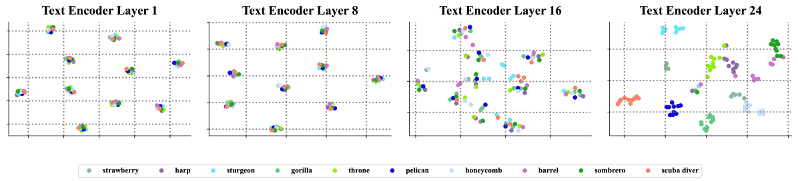

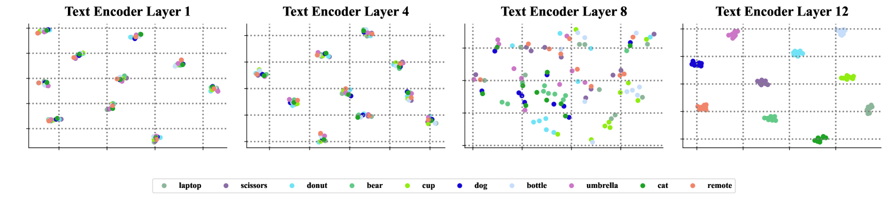

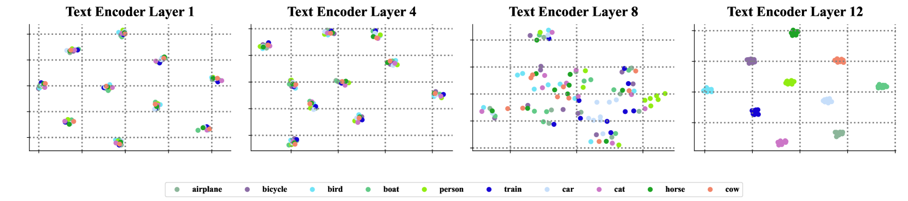

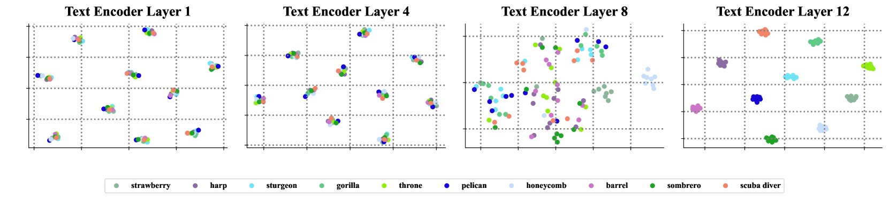

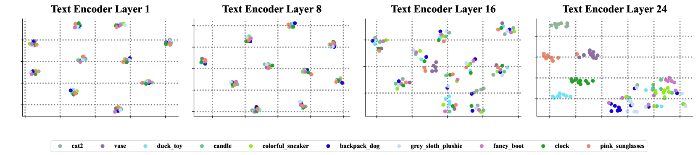

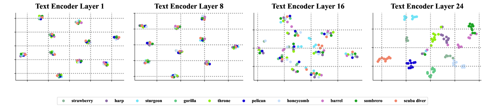

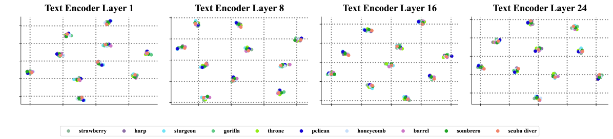

[Arxiv](https://arxiv.org/abs/2406.07506)