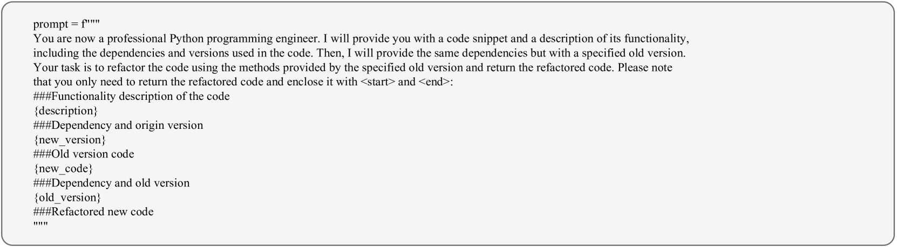

# VersiCode：迈向版本可控的代码生成之旅

发布时间：2024年06月11日

`LLM应用

这篇论文主要关注的是大型语言模型（LLM）在代码生成任务中的应用，特别是在处理特定软件库版本时的能力。论文介绍了VersiCode数据集，这是一个专门设计来评估模型在特定库版本上生成代码能力的数据集，并提出了两个新的评估任务：特定版本代码补全（VSCC）和版本感知代码编辑（VACE）。这些内容直接关联到LLM在实际应用中的表现，尤其是在软件开发领域的应用，因此将其归类为LLM应用。` `软件开发` `数据集`

> VersiCode: Towards Version-controllable Code Generation

# 摘要

> 为了提升大型语言模型在代码任务上的表现，研究者们投入了大量精力。然而，现有的评估数据集忽略了软件开发中的关键因素——“版本”。本文推出的VersiCode数据集，是首个专注于评估模型为特定库版本生成代码的能力的全面数据集，涵盖了300个库的2000多个版本，历时9年。我们设计了特定版本代码补全（VSCC）和版本感知代码编辑（VACE）两个评估任务。实验结果显示，即使是顶尖的LLMs也难以应对这些挑战，这揭示了LLMs在处理特定版本代码生成方面的局限性，并为未来的研究指明了方向。相关资源已发布于https://github.com/wutong8023/VersiCode。

> Significant research has focused on improving the performance of large language model on code-related tasks due to their practical importance. Although performance is typically evaluated using public benchmark datasets, the existing datasets do not account for the concept of \emph{version}, which is crucial in professional software development. In this paper, we introduce VersiCode, the first comprehensive dataset designed to assess the ability of large language models to generate verifiable code for specific library versions. VersiCode encompasses 300 libraries across more than 2,000 versions spanning 9 years. We design two dedicated evaluation tasks: version-specific code completion (VSCC) and version-aware code editing (VACE). Comprehensive experiments are conducted to benchmark the performance of LLMs, revealing the challenging nature of these tasks and VersiCode, that even state-of-the-art LLMs struggle to generate version-correct code. This dataset, together with the proposed tasks, sheds light on LLMs' capabilities and limitations in handling version-specific code generation, and opens up an important new area of research for further investigation. The resources can be found at https://github.com/wutong8023/VersiCode.

[Arxiv](https://arxiv.org/abs/2406.07411)