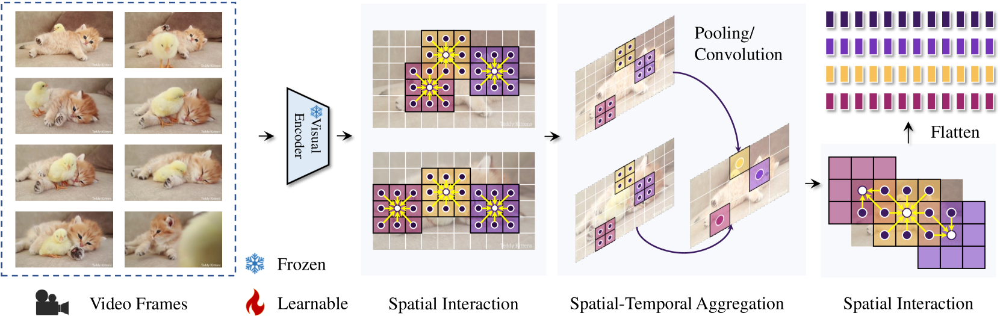

# VideoLLaMA 2：深化视频大型语言模型中的时空与音频智能

发布时间：2024年06月11日

`LLM应用

理由：这篇论文介绍了一种名为VideoLLaMA 2的模型，该模型专注于提升视频和音频任务中的时空建模和音频理解能力。它通过特定的技术手段增强了模型的多模态理解能力，并在多个评估任务中展示了其优越性能。这表明该论文是在应用层面探讨大型语言模型（LLM）在视频和音频处理领域的实际应用，因此属于LLM应用分类。` `视频分析` `多媒体处理`

> VideoLLaMA 2: Advancing Spatial-Temporal Modeling and Audio Understanding in Video-LLMs

# 摘要

> 本文介绍了VideoLLaMA 2，一套旨在提升视频与音频任务中时空建模及音频理解的Video-LLMs。它通过特制的时空卷积连接器，精准捕捉视频数据的时空复杂性，并通过联合训练融入音频分支，增强了模型的多模态理解。在MC-VQA、OE-VQA及VC等任务的评估中，VideoLLaMA 2 不仅在开源模型中表现出色，甚至在某些基准上与专有模型不相上下。在AQA与OE-AVQA基准上，它也显示出对现有模型的显著超越。这些成就，标志着VideoLLaMA 2 在多模态理解上的领先地位，为智能视频分析树立了新标杆。所有模型均已公开，以推动更多研究。

> In this paper, we present the VideoLLaMA 2, a set of Video Large Language Models (Video-LLMs) designed to enhance spatial-temporal modeling and audio understanding in video and audio-oriented tasks. Building upon its predecessor, VideoLLaMA 2 incorporates a tailor-made Spatial-Temporal Convolution (STC) connector, which effectively captures the intricate spatial and temporal dynamics of video data. Additionally, we integrate an Audio Branch into the model through joint training, thereby enriching the multimodal understanding capabilities of the model by seamlessly incorporating audio cues. Comprehensive evaluations on multiple-choice video question answering (MC-VQA), open-ended video question answering (OE-VQA), and video captioning (VC) tasks demonstrate that VideoLLaMA 2 consistently achieves competitive results among open-source models and even gets close to some proprietary models on several benchmarks. Furthermore, VideoLLaMA 2 exhibits reasonable improvements in audio-only and audio-video question-answering (AQA & OE-AVQA) benchmarks over existing models. These advancements underline VideoLLaMA 2's superior performance in multimodal comprehension, setting a new standard for intelligent video analysis systems. All models are public to facilitate further research.

[Arxiv](https://arxiv.org/abs/2406.07476)