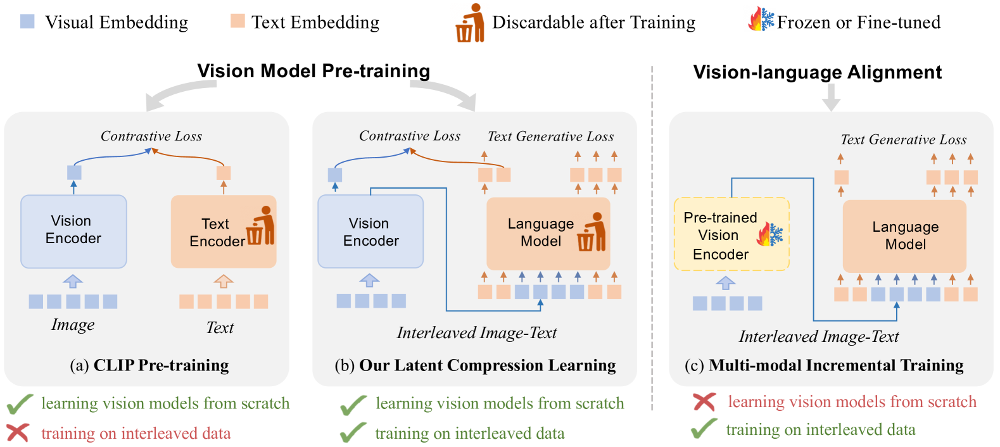
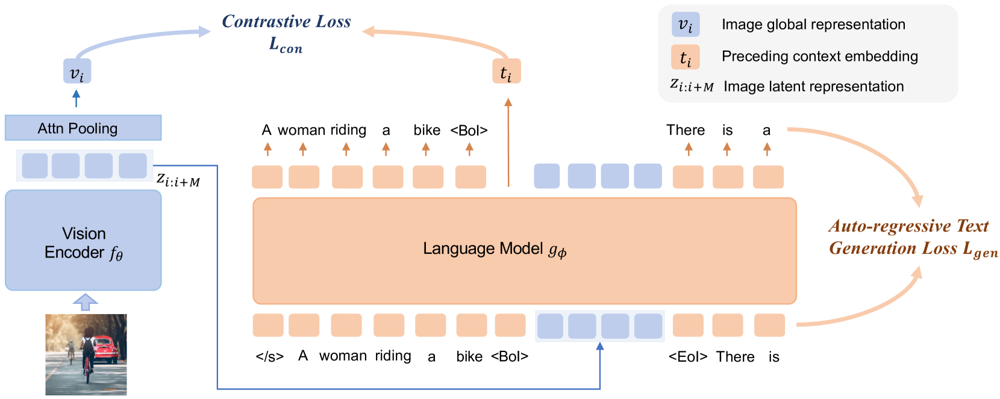
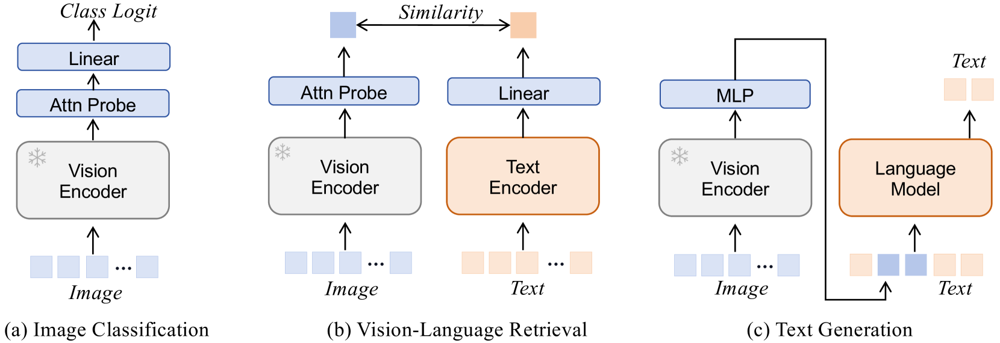

# 利用潜在压缩学习，对交错图像与文本数据进行视觉模型预训练

发布时间：2024年06月11日

`RAG

理由：这篇论文介绍了一种新的预训练方法——潜在压缩学习（LCL），专门设计用于处理交错图像-文本数据。这种方法通过增强因果注意力模型输入与输出间的互信息来实现预训练，这与RAG（Retrieval-Augmented Generation）模型的概念相似，即通过结合检索和生成来增强模型的性能。虽然论文主要关注的是视觉模型的预训练，但其方法论和目标与RAG模型在处理多模态数据时的策略有相似之处，因此将其归类为RAG。` `计算机视觉`

> Vision Model Pre-training on Interleaved Image-Text Data via Latent Compression Learning

# 摘要

> 近期，视觉模型的预训练已从依赖人工标注转向利用网络爬取的大规模图像-文本数据。尽管技术进步，但尚未有方法能有效挖掘互联网上普遍存在的交错图像-文本数据。受自然语言处理中压缩学习成功的启发，我们提出了一种名为潜在压缩学习（LCL）的新预训练方法，专为交错图像-文本数据设计。LCL通过增强因果注意力模型输入与输出间的互信息，实现潜在压缩学习，其训练目标包括两个核心任务：对比视觉表示与先前上下文，以及基于视觉表示生成后续文本。实验证明，LCL不仅在配对预训练数据集（如LAION）上媲美CLIP，还能利用交错数据（如MMC4）自零开始构建鲁棒视觉表示，彰显了交错图像-文本数据在视觉模型预训练中的潜力。相关代码已发布于https://github.com/OpenGVLab/LCL。

> Recently, vision model pre-training has evolved from relying on manually annotated datasets to leveraging large-scale, web-crawled image-text data. Despite these advances, there is no pre-training method that effectively exploits the interleaved image-text data, which is very prevalent on the Internet. Inspired by the recent success of compression learning in natural language processing, we propose a novel vision model pre-training method called Latent Compression Learning (LCL) for interleaved image-text data. This method performs latent compression learning by maximizing the mutual information between the inputs and outputs of a causal attention model. The training objective can be decomposed into two basic tasks: 1) contrastive learning between visual representation and preceding context, and 2) generating subsequent text based on visual representation. Our experiments demonstrate that our method not only matches the performance of CLIP on paired pre-training datasets (e.g., LAION), but can also leverage interleaved pre-training data (e.g., MMC4) to learn robust visual representation from scratch, showcasing the potential of vision model pre-training with interleaved image-text data. Code is released at https://github.com/OpenGVLab/LCL.

[Arxiv](https://arxiv.org/abs/2406.07543)