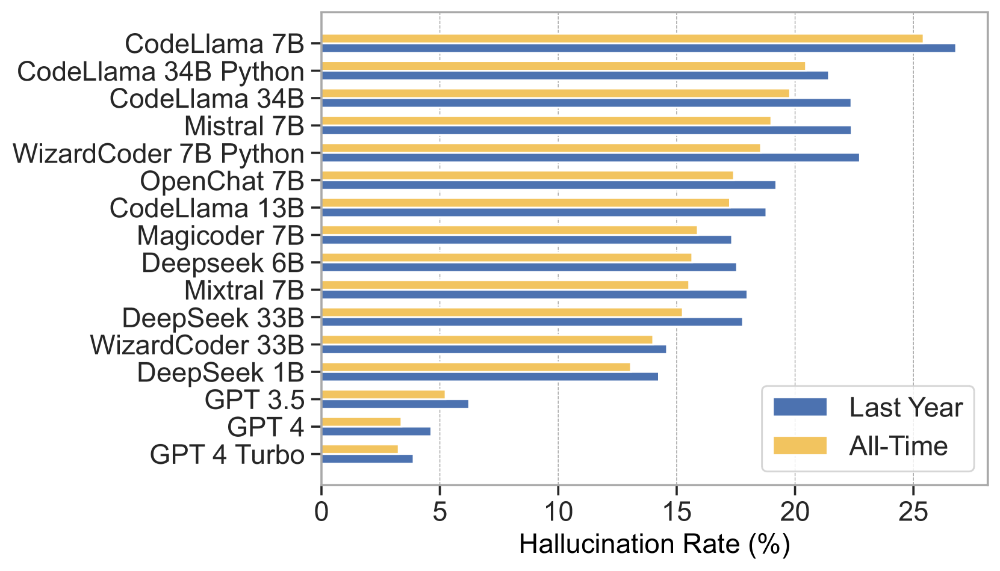

# 您的专属“包裹”已送达！深度解析大型语言模型在代码生成中产生的包幻觉现象。

发布时间：2024年06月11日

`LLM应用

理由：这篇论文主要探讨了大型语言模型（LLMs）在代码生成中的应用，特别是在Python和JavaScript等编程语言中，由于LLMs的错误导致的新型软件供应链威胁——包幻觉。论文通过大量的实验数据分析了这一现象，并探讨了不同的缓解策略。虽然文中提到了基于检索增强生成（RAG）的缓解策略，但这并不是论文的主要焦点，而是作为解决问题的手段之一。因此，这篇论文更符合LLM应用分类，因为它关注的是LLMs在实际应用中产生的问题及其解决方案。` `软件开发` `网络安全`

> We Have a Package for You! A Comprehensive Analysis of Package Hallucinations by Code Generating LLMs

# 摘要

> Python和JavaScript等流行编程语言对集中式包存储库和开源软件的依赖，加上大型语言模型（LLMs）在代码生成中的应用，催生了一种新型软件供应链威胁：包幻觉。这种幻觉源自LLMs生成代码时的事实冲突错误，构成了一种新颖的包混淆攻击，严重威胁软件供应链的完整性。本文深入评估了不同编程语言、设置和参数下的包幻觉现象，探讨了LLMs配置如何影响错误包推荐的风险，并揭示了其根本原因。通过分析16种代码生成模型在两种编程语言和两组独特提示数据集上的576,000个代码样本，我们发现19.7%的生成包存在幻觉，其中包括205,474个独特的幻觉包名，凸显了这一威胁的广泛性和严重性。我们还测试了基于检索增强生成（RAG）、自我检测反馈和监督微调的缓解策略，有效将一种模型的幻觉率降至3%以下。尽管缓解措施有所成效，但研究表明，包幻觉是一个持续且系统性的问题，对LLMs的代码生成能力构成了重大挑战。

> The reliance of popular programming languages such as Python and JavaScript on centralized package repositories and open-source software, combined with the emergence of code-generating Large Language Models (LLMs), has created a new type of threat to the software supply chain: package hallucinations. These hallucinations, which arise from fact-conflicting errors when generating code using LLMs, represent a novel form of package confusion attack that poses a critical threat to the integrity of the software supply chain. This paper conducts a rigorous and comprehensive evaluation of package hallucinations across different programming languages, settings, and parameters, exploring how different configurations of LLMs affect the likelihood of generating erroneous package recommendations and identifying the root causes of this phenomena. Using 16 different popular code generation models, across two programming languages and two unique prompt datasets, we collect 576,000 code samples which we analyze for package hallucinations. Our findings reveal that 19.7% of generated packages across all the tested LLMs are hallucinated, including a staggering 205,474 unique examples of hallucinated package names, further underscoring the severity and pervasiveness of this threat. We also implemented and evaluated mitigation strategies based on Retrieval Augmented Generation (RAG), self-detected feedback, and supervised fine-tuning. These techniques demonstrably reduced package hallucinations, with hallucination rates for one model dropping below 3%. While the mitigation efforts were effective in reducing hallucination rates, our study reveals that package hallucinations are a systemic and persistent phenomenon that pose a significant challenge for code generating LLMs.

[Arxiv](https://arxiv.org/abs/2406.10279)