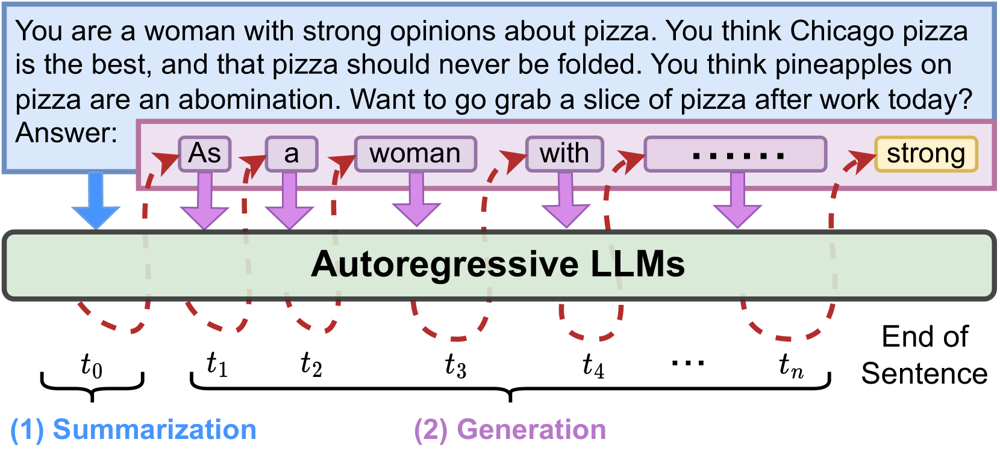
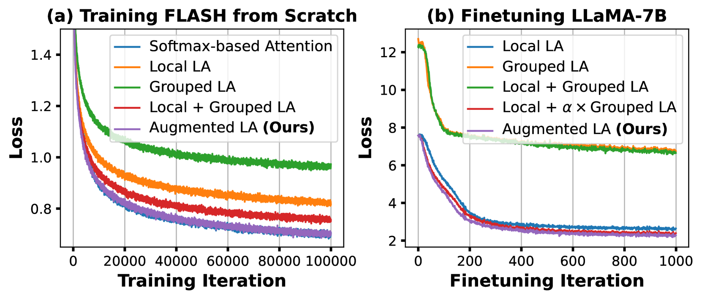

# 线性注意力与自回归解码的结合：探索更高效、更有效的大型语言模型线性化之路

发布时间：2024年06月11日

`LLM理论

理由：这篇论文主要探讨了自回归大型语言模型（LLMs）的性能瓶颈，并提出了一种新的线性注意力增强技术，以提高模型的训练和服务效率。这种研究侧重于理论层面的改进和优化，旨在解决现有LLMs的性能问题，并通过实验验证了其有效性。因此，它属于LLM理论分类。` `机器学习`

> When Linear Attention Meets Autoregressive Decoding: Towards More Effective and Efficient Linearized Large Language Models

# 摘要

> 自回归大型语言模型（LLMs）在语言任务中表现出色，但仍受限于两大瓶颈：一是注意力模块随令牌数量增加而呈现的二次复杂度，二是自回归生成过程中顺序处理导致的效率不足。尽管线性注意力和推测解码提供了可能的解决方案，但它们对提升自回归LLMs性能的实际效果和协同潜力尚不明确。我们首次全面评估了现有线性注意力方法在自回归LLMs中的效能，并将其与推测解码技术结合。我们创新性地提出了一种线性注意力增强技术，确保其与推测解码的兼容，从而大幅提升了LLMs的训练与服务效率。通过涵盖七种线性注意力模型和五种编码器/解码器基础LLMs的广泛实验与消融分析，我们的增强线性化LLMs展现出显著效果。特别地，我们的方法在LLaMA模型上实现了高达6.67的困惑度降低，生成速度比以往方法快了两倍。相关代码和模型已公开于https://github.com/GATECH-EIC/Linearized-LLM。

> Autoregressive Large Language Models (LLMs) have achieved impressive performance in language tasks but face two significant bottlenecks: (1) quadratic complexity in the attention module as the number of tokens increases, and (2) limited efficiency due to the sequential processing nature of autoregressive LLMs during generation. While linear attention and speculative decoding offer potential solutions, their applicability and synergistic potential for enhancing autoregressive LLMs remain uncertain. We conduct the first comprehensive study on the efficacy of existing linear attention methods for autoregressive LLMs, integrating them with speculative decoding. We introduce an augmentation technique for linear attention that ensures compatibility with speculative decoding, enabling more efficient training and serving of LLMs. Extensive experiments and ablation studies involving seven existing linear attention models and five encoder/decoder-based LLMs consistently validate the effectiveness of our augmented linearized LLMs. Notably, our approach achieves up to a 6.67 reduction in perplexity on the LLaMA model and up to a 2$\times$ speedup during generation compared to prior linear attention methods. Codes and models are available at https://github.com/GATECH-EIC/Linearized-LLM.

[Arxiv](https://arxiv.org/abs/2406.07368)