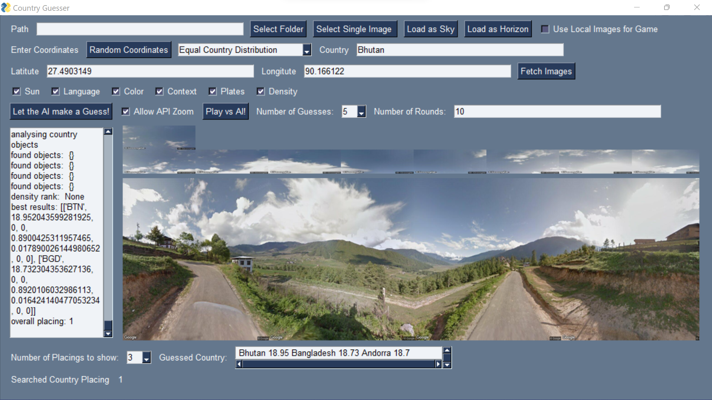

# 街景照片中的国家辨识：自动排名解析

发布时间：2024年06月11日

`Agent

理由：这篇论文介绍了一个名为 Country Guesser 的系统，该系统通过分析视觉和文本信息来推断照片的拍摄地点。这个系统可以被视为一个智能代理（Agent），因为它能够处理输入数据（照片），并基于这些数据做出决策（推断拍摄地点）。此外，系统利用了大型语言模型来增强其文本处理能力，但主要关注点是系统的实际应用和功能，而不是语言模型的理论研究或特定技术（如RAG或LLM应用）。因此，将其归类为Agent更为合适。` `地理信息系统`

> Which Country Is This? Automatic Country Ranking of Street View Photos

# 摘要

> 本次演示中，我们推出了Country Guesser系统，它能实时推断照片拍摄地。通过分析Google街景图，我们的模型融合了视觉识别、机器学习与文本检索技术，为图像中的地点生成可能的国家列表。令人惊喜的是，利用文本特征与大型语言模型的互动，我们实现了跨模态的精准指导。据我们所知，这是首个同时利用视觉与文本信息的国家识别系统。

> In this demonstration, we present Country Guesser, a live system that guesses the country that a photo is taken in. In particular, given a Google Street View image, our federated ranking model uses a combination of computer vision, machine learning and text retrieval methods to compute a ranking of likely countries of the location shown in a given image from Street View. Interestingly, using text-based features to probe large pre-trained language models can assist to provide cross-modal supervision. We are not aware of previous country guessing systems informed by visual and textual features.

[Arxiv](https://arxiv.org/abs/2406.07227)