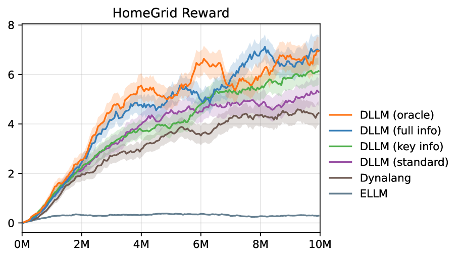

# 借助大型语言模型提示的世界模型，助力目标实现

发布时间：2024年06月11日

`Agent

这篇论文介绍了一种名为“大型语言模型之梦”（DLLM）的新型多模态模型强化学习方法，该方法通过将大型语言模型（LLMs）提供的提示子目标融入模型展开过程，以促进在复杂任务中目标的发现与达成。这种方法特别适用于处理长视野任务和稀疏目标，通过在模型展开中对符合语言模型提示的样本赋予更高内在奖励，有效地引导了代理进行有目的且高效的探索。因此，这篇论文更符合Agent分类，因为它主要关注的是如何通过强化学习方法改进代理（Agent）的行为和决策过程。` `游戏开发`

> World Models with Hints of Large Language Models for Goal Achieving

# 摘要

> 强化学习在处理长视野任务和稀疏目标时面临挑战，原因在于手动设定奖励的复杂性。尽管现有方法通过引入内在奖励来应对，但在状态和动作空间庞大的长视野决策任务中，这些方法可能无法提供有效的指导，导致探索缺乏目的性。借鉴人类认知，我们开发了一种名为“大型语言模型之梦”（DLLM）的新型多模态模型强化学习方法。DLLM通过将LLMs提供的提示子目标融入模型展开过程，促进在复杂任务中目标的发现与达成。通过在模型展开中对符合语言模型提示的样本赋予更高内在奖励，DLLM有效地引导了代理进行有目的且高效的探索。实验结果显示，DLLM在HomeGrid、Crafter和Minecraft等稀疏奖励环境中，分别超越了近期方法27.7%、21.1%和9.9%。

> Reinforcement learning struggles in the face of long-horizon tasks and sparse goals due to the difficulty in manual reward specification. While existing methods address this by adding intrinsic rewards, they may fail to provide meaningful guidance in long-horizon decision-making tasks with large state and action spaces, lacking purposeful exploration. Inspired by human cognition, we propose a new multi-modal model-based RL approach named Dreaming with Large Language Models (DLLM). DLLM integrates the proposed hinting subgoals from the LLMs into the model rollouts to encourage goal discovery and reaching in challenging tasks. By assigning higher intrinsic rewards to samples that align with the hints outlined by the language model during model rollouts, DLLM guides the agent toward meaningful and efficient exploration. Extensive experiments demonstrate that the DLLM outperforms recent methods in various challenging, sparse-reward environments such as HomeGrid, Crafter, and Minecraft by 27.7\%, 21.1\%, and 9.9\%, respectively.

[Arxiv](https://arxiv.org/abs/2406.07381)