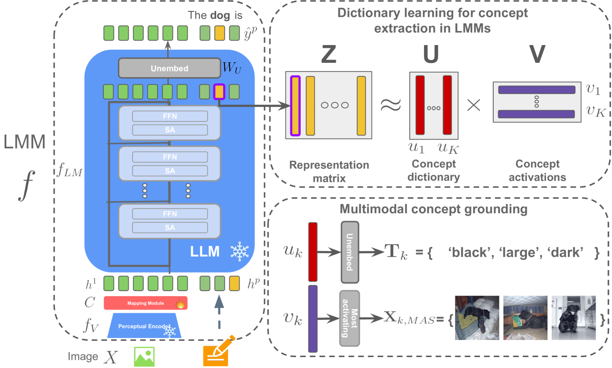

# 大型多模态模型的概念驱动解释框架

发布时间：2024年06月12日

`LLM理论

理由：这篇论文主要探讨了大型多模态模型（LMMs）的内部运作机制，并提出了一种新的解释框架，通过字典学习方法解析令牌表示，以理解多模态概念。这种研究更偏向于理论层面，旨在深入理解模型的运作原理和概念表示，而不是直接应用于特定的Agent或RAG系统，也不是直接讨论LLM的应用场景。因此，将其归类为LLM理论是合适的。` `多模态学习` `人工智能解释性`

> A Concept-Based Explainability Framework for Large Multimodal Models

# 摘要

> 大型多模态模型（LMMs）通过融合单模态编码器与大型语言模型（LLMs），实现了多模态任务的执行。尽管解释性研究取得了进展，LMMs的内部运作仍充满神秘。本文中，我们创新性地提出了一种解释LMMs的框架，采用基于字典学习的方法来解析令牌表示，其中字典元素代表我们定义的“多模态概念”。这些概念在视觉与文本领域均展现出坚实的语义基础。我们通过定性与定量分析，验证了这些概念在解读测试样本表示中的实用性，并探讨了概念间的独立性及其视觉与文本基础的质量。我们承诺将代码公开。

> Large multimodal models (LMMs) combine unimodal encoders and large language models (LLMs) to perform multimodal tasks. Despite recent advancements towards the interpretability of these models, understanding internal representations of LMMs remains largely a mystery. In this paper, we present a novel framework for the interpretation of LMMs. We propose a dictionary learning based approach, applied to the representation of tokens. The elements of the learned dictionary correspond to our proposed concepts. We show that these concepts are well semantically grounded in both vision and text. Thus we refer to these as "multi-modal concepts". We qualitatively and quantitatively evaluate the results of the learnt concepts. We show that the extracted multimodal concepts are useful to interpret representations of test samples. Finally, we evaluate the disentanglement between different concepts and the quality of grounding concepts visually and textually. We will publicly release our code.

[Arxiv](https://arxiv.org/abs/2406.08074)