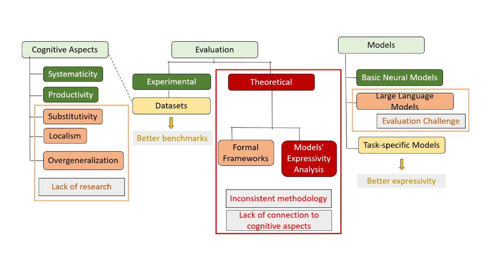

# AI模型组合学习综述：理论与实践探索

发布时间：2024年06月12日

`LLM理论

这篇论文主要关注的是大型语言模型（LLM）在组合学习方面的理论研究，探讨了组合学习在AI模型中的应用，以及它与认知科学的联系。论文中提到了组合学习的正式定义、任务、评估标准、多样化的模型及理论成果，这些都是理论层面的探讨，而非具体的应用实例或Agent的设计。因此，这篇论文更适合归类于LLM理论。` `人工智能` `认知科学`

> A Survey on Compositional Learning of AI Models: Theoretical and Experimetnal Practices

# 摘要

> 组合学习，即整合基本概念以构建更复杂概念的能力，对人类认知至关重要，尤其体现在语言理解和视觉感知上。这一能力与未见情况的泛化紧密相关。尽管在智能中占据核心地位，但缺乏系统的理论与实验方法，使得计算模型的组合学习能力分析变得复杂。本文综述了AI模型的组合学习研究，并探讨了其与认知科学的联系。我们识别了认知与语言学中的组合性概念，并将其与语言和视觉模型在组合推理中的计算挑战相联系。文章概述了组合学习的正式定义、任务、评估标准、多样化的模型及理论成果，并深入探讨了大型语言模型的最新研究，揭示了AI领域尖端组合能力的现状，并为未来的研究指明了方向。

> Compositional learning, mastering the ability to combine basic concepts and construct more intricate ones, is crucial for human cognition, especially in human language comprehension and visual perception. This notion is tightly connected to generalization over unobserved situations. Despite its integral role in intelligence, there is a lack of systematic theoretical and experimental research methodologies, making it difficult to analyze the compositional learning abilities of computational models. In this paper, we survey the literature on compositional learning of AI models and the connections made to cognitive studies. We identify abstract concepts of compositionality in cognitive and linguistic studies and connect these to the computational challenges faced by language and vision models in compositional reasoning. We overview the formal definitions, tasks, evaluation benchmarks, variety of computational models, and theoretical findings. We cover modern studies on large language models to provide a deeper understanding of the cutting-edge compositional capabilities exhibited by state-of-the-art AI models and pinpoint important directions for future research.

[Arxiv](https://arxiv.org/abs/2406.08787)