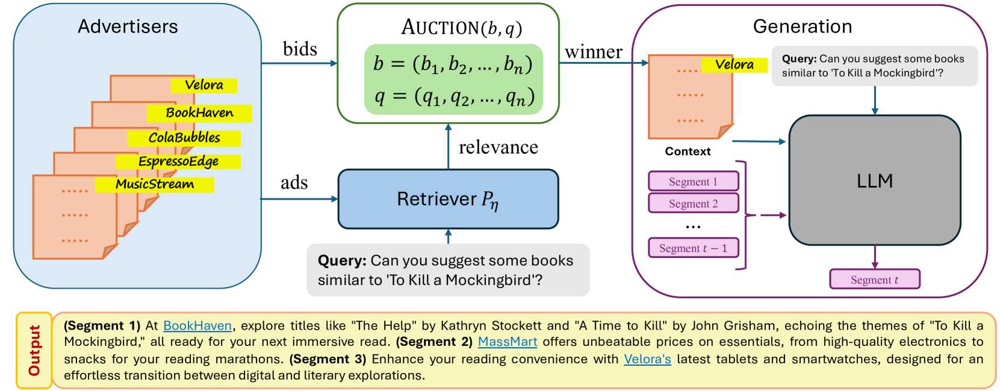

# 大型语言模型广告拍卖：检索增强生成法

发布时间：2024年06月12日

`RAG

这篇论文主要关注的是在大型语言模型（LLMs）的输出中如何巧妙地融入广告，并提出了基于检索增强生成（RAG）的拍卖机制来实现这一目标。论文中设计了一种段落拍卖机制，用于在RAG框架下为每个话语段匹配广告并定价，同时考虑了广告的出价和相关性。此外，论文还探讨了多广告分配的情况，并通过实证评估展示了其方法的可行性和效能。因此，这篇论文更符合RAG分类，因为它主要讨论了RAG框架在广告分配和定价中的应用。` `计算广告` `拍卖机制`

> Ad Auctions for LLMs via Retrieval Augmented Generation

# 摘要

> 在计算广告领域，将广告巧妙地融入大型语言模型（LLMs）的输出，既能支持服务又不损内容之真。本文创新性地提出了基于检索增强生成（RAG）的拍卖机制，用于LLMs文本输出中的广告分配与定价。我们设计了一种段落拍卖机制，根据广告的出价和相关性，在RAG框架下为每个话语段（如段落、章节或全文）概率性地匹配广告，并依据竞争出价定价。研究表明，此拍卖机制能最大化对数社会福利，这是一种兼顾分配效率与公平的新福利标准，并揭示了其激励兼容的定价规则。此外，我们还探讨了每个段落多广告分配的情况。通过实证评估，我们的方法在多种广告拍卖场景中展现了其可行性与效能，并揭示了当赋予LLM更多广告分配灵活性时，各指标间的微妙平衡。

> In the field of computational advertising, the integration of ads into the outputs of large language models (LLMs) presents an opportunity to support these services without compromising content integrity. This paper introduces novel auction mechanisms for ad allocation and pricing within the textual outputs of LLMs, leveraging retrieval-augmented generation (RAG). We propose a segment auction where an ad is probabilistically retrieved for each discourse segment (paragraph, section, or entire output) according to its bid and relevance, following the RAG framework, and priced according to competing bids. We show that our auction maximizes logarithmic social welfare, a new notion of welfare that balances allocation efficiency and fairness, and we characterize the associated incentive-compatible pricing rule. These results are extended to multi-ad allocation per segment. An empirical evaluation validates the feasibility and effectiveness of our approach over several ad auction scenarios, and exhibits inherent tradeoffs in metrics as we allow the LLM more flexibility to allocate ads.

[Arxiv](https://arxiv.org/abs/2406.09459)