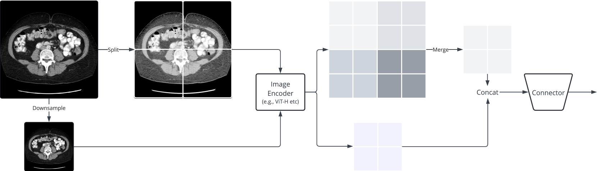
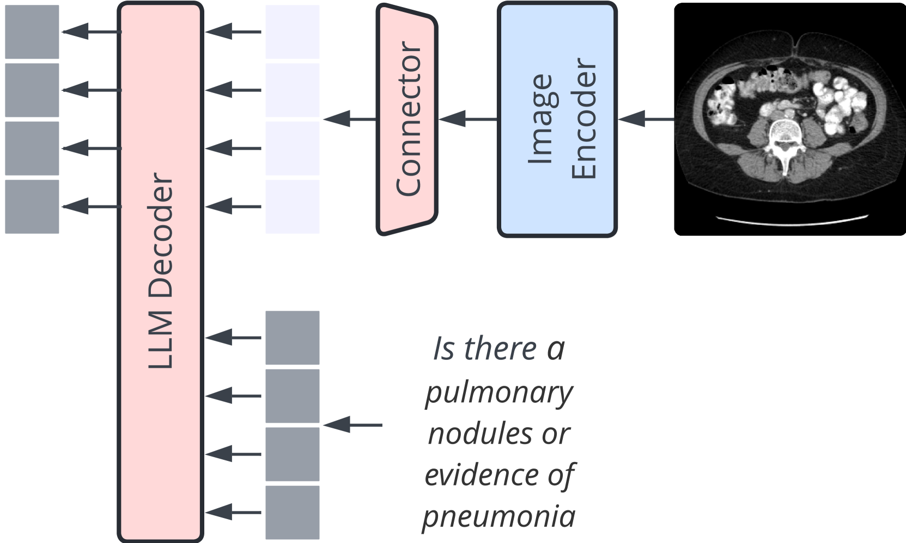

# 生物医学领域高分辨率视觉-语言模型的进步，正开启新的研究篇章。

发布时间：2024年06月12日

`LLM应用

这篇论文主要探讨了在生物医学领域应用大型语言模型（LLM）和多模态学习技术，特别是在视觉问答任务中的应用。论文介绍了新的数据集、图像编码策略以及一个专门针对生物医学领域的模型（Llama3-Med），并展示了其在零-shot性能上的显著提升。这些内容直接关联到LLM的具体应用，特别是在医疗领域的实际应用，因此属于LLM应用分类。` `生物医学`

> Advancing High Resolution Vision-Language Models in Biomedicine

# 摘要

> 多模态学习极大地推动了生成式AI，尤其是在视觉与语言模型的融合上。GPT-4V和开源项目如LLaVA等创新，已能驱动强大的对话系统，实现零-shot任务的完成。但在生物医学领域应用这些技术，却面临特殊挑战。近期，如LLaVA-Med等项目已开始利用PMC-15M等大型数据集，针对生物医学场景进行指令调整。我们的研究成果有三：首先，我们推出了一个包含Claude3-Opus和LLaMA3 70B医学图像-文本对的新指令数据集；其次，我们提出了一种基于层次化表示的新图像编码策略，以增强生物医学视觉理解的精细度；最后，我们开发的Llama3-Med模型在生物医学视觉问答领域达到了顶尖的零-shot性能，平均提升了超过10%。这些进步是医疗专业人员的利器，填补了多模态对话助手的空白，并推动了医学AI的持续创新。

> Multi-modal learning has significantly advanced generative AI, especially in vision-language modeling. Innovations like GPT-4V and open-source projects such as LLaVA have enabled robust conversational agents capable of zero-shot task completions. However, applying these technologies in the biomedical field presents unique challenges. Recent initiatives like LLaVA-Med have started to adapt instruction-tuning for biomedical contexts using large datasets such as PMC-15M. Our research offers three key contributions: (i) we present a new instruct dataset enriched with medical image-text pairs from Claude3-Opus and LLaMA3 70B, (ii) we propose a novel image encoding strategy using hierarchical representations to improve fine-grained biomedical visual comprehension, and (iii) we develop the Llama3-Med model, which achieves state-of-the-art zero-shot performance on biomedical visual question answering benchmarks, with an average performance improvement of over 10% compared to previous methods. These advancements provide more accurate and reliable tools for medical professionals, bridging gaps in current multi-modal conversational assistants and promoting further innovations in medical AI.

[Arxiv](https://arxiv.org/abs/2406.09454)