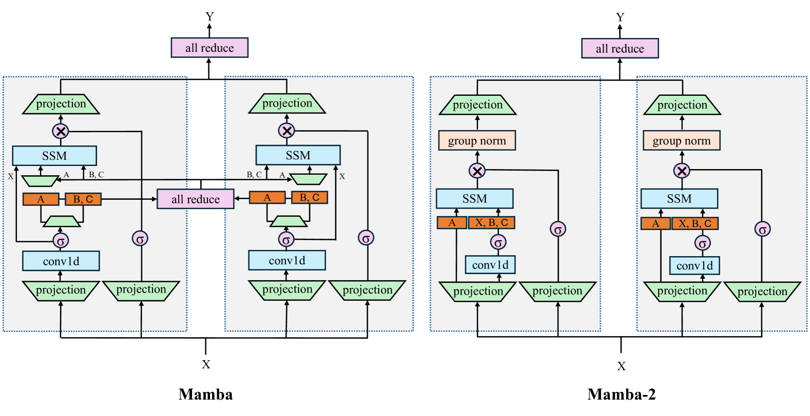
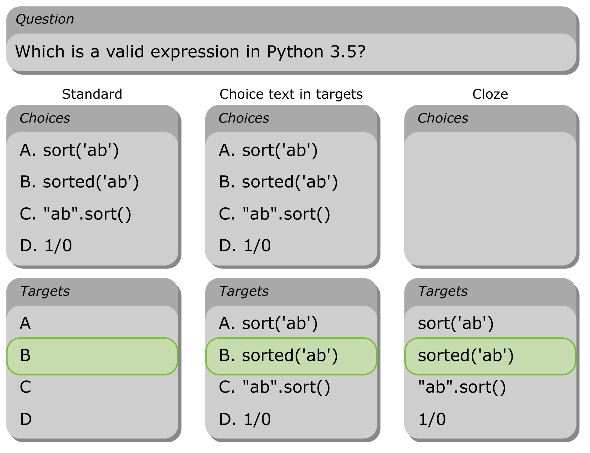
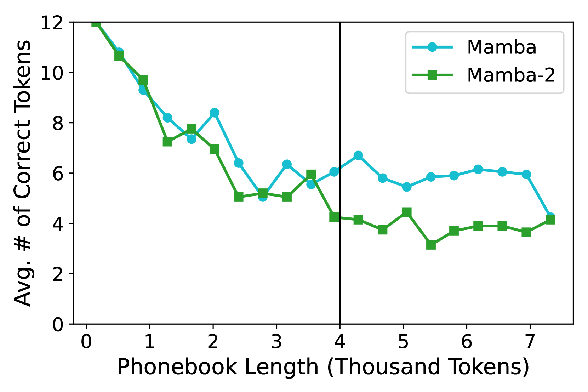
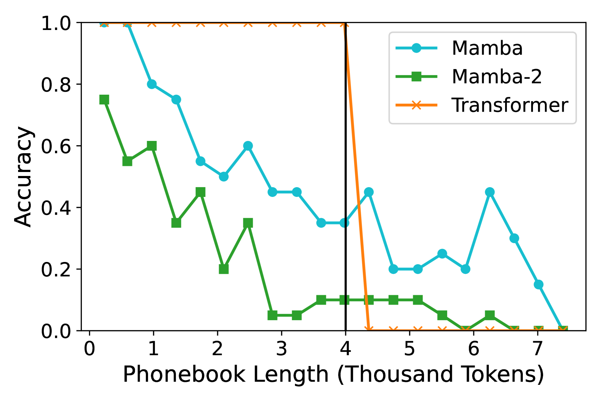
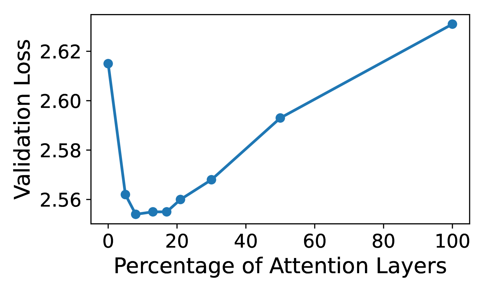
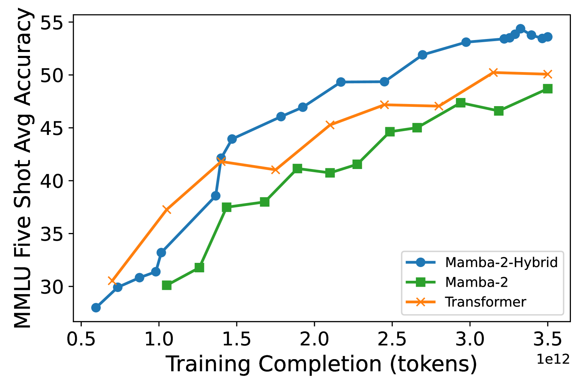
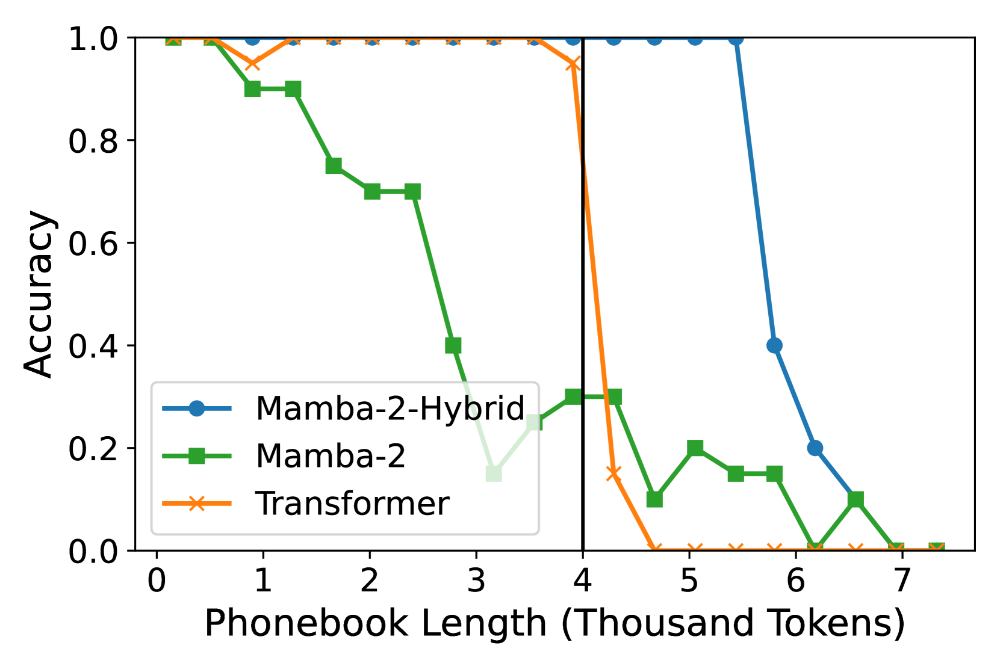
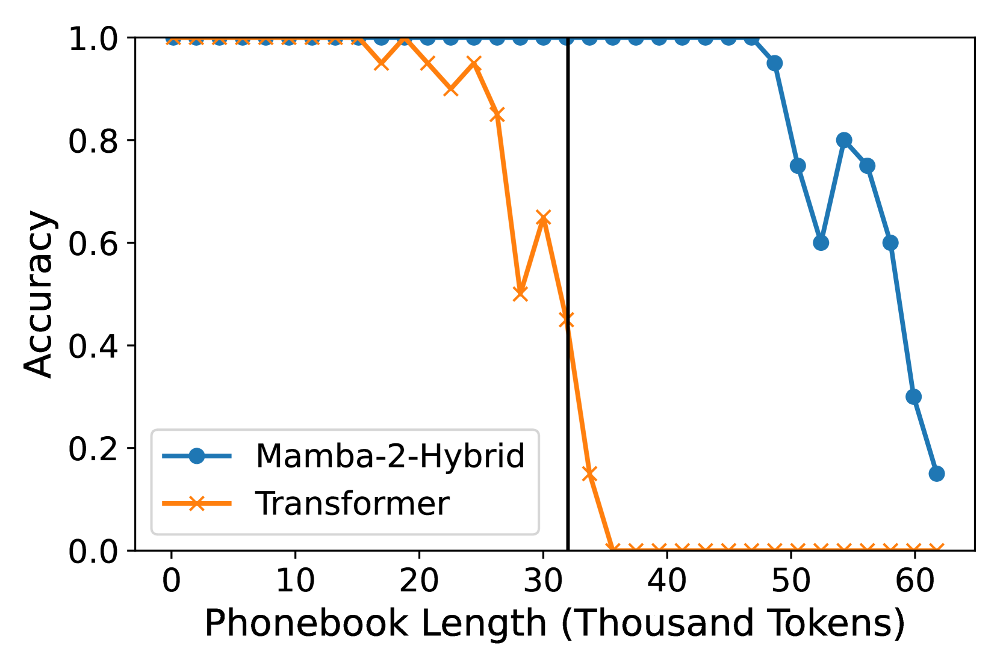

# Mamba语言模型的实证探究

发布时间：2024年06月12日

`LLM理论

这篇论文主要探讨了选择性状态空间模型（SSMs）如Mamba在语言建模方面的性能，并与Transformer模型进行了大规模对比。研究内容涉及模型的设计、性能评估以及长上下文处理能力的测试，这些都是对大型语言模型（LLM）理论的深入研究。因此，这篇论文应归类于LLM理论。` `机器学习`

> An Empirical Study of Mamba-based Language Models

# 摘要

> Mamba等选择性状态空间模型（SSMs）解决了Transformer的一些问题，如序列长度增加导致的二次计算复杂度和键值缓存带来的高内存需求。研究表明，SSMs在语言建模方面能与Transformer媲美甚至超越，成为一种有前景的替代方案。然而，现有研究多限于小规模实验，缺乏大规模对比。为此，我们对比了80亿参数的Mamba、Mamba-2及Transformer，这些模型均在高达3.5万亿令牌的相同数据集上训练。同时，我们还引入了一种混合架构——Mamba-2-Hybrid，它结合了Mamba-2、注意力层和MLP层。通过多样化的任务测试，我们发现纯SSMs在多数任务上表现出色，但在需要复制或上下文学习能力的任务上不及Transformer。相反，80亿参数的Mamba-2-Hybrid在12个标准任务上平均超越了Transformer 2.65分，且推理速度预计快8倍。为验证长上下文处理能力，我们扩展了Mamba-2-Hybrid和Transformer以支持更长的序列，并在23个长上下文任务上，混合模型继续保持与Transformer相当或更优的表现。此外，我们将训练模型所用的检查点和代码作为NVIDIA Megatron-LM项目的一部分公开，以供进一步研究。

> Selective state-space models (SSMs) like Mamba overcome some of the shortcomings of Transformers, such as quadratic computational complexity with sequence length and large inference-time memory requirements from the key-value cache. Moreover, recent studies have shown that SSMs can match or exceed the language modeling capabilities of Transformers, making them an attractive alternative. In a controlled setting (e.g., same data), however, studies so far have only presented small scale experiments comparing SSMs to Transformers. To understand the strengths and weaknesses of these architectures at larger scales, we present a direct comparison between 8B-parameter Mamba, Mamba-2, and Transformer models trained on the same datasets of up to 3.5T tokens. We also compare these models to a hybrid architecture consisting of 43% Mamba-2, 7% attention, and 50% MLP layers (Mamba-2-Hybrid). Using a diverse set of tasks, we answer the question of whether Mamba models can match Transformers at larger training budgets. Our results show that while pure SSMs match or exceed Transformers on many tasks, they lag behind Transformers on tasks which require strong copying or in-context learning abilities (e.g., 5-shot MMLU, Phonebook) or long-context reasoning. In contrast, we find that the 8B Mamba-2-Hybrid exceeds the 8B Transformer on all 12 standard tasks we evaluated (+2.65 points on average) and is predicted to be up to 8x faster when generating tokens at inference time. To validate long-context capabilities, we provide additional experiments evaluating variants of the Mamba-2-Hybrid and Transformer extended to support 16K, 32K, and 128K sequences. On an additional 23 long-context tasks, the hybrid model continues to closely match or exceed the Transformer on average. To enable further study, we release the checkpoints as well as the code used to train our models as part of NVIDIA's Megatron-LM project.

[Arxiv](https://arxiv.org/abs/2406.07887)