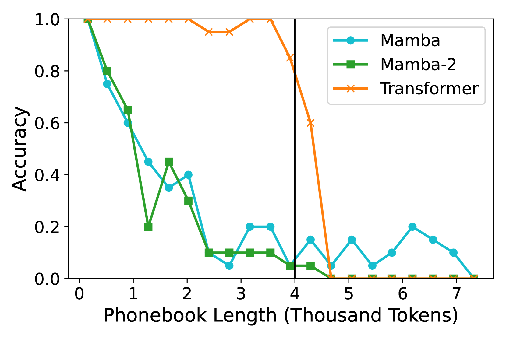
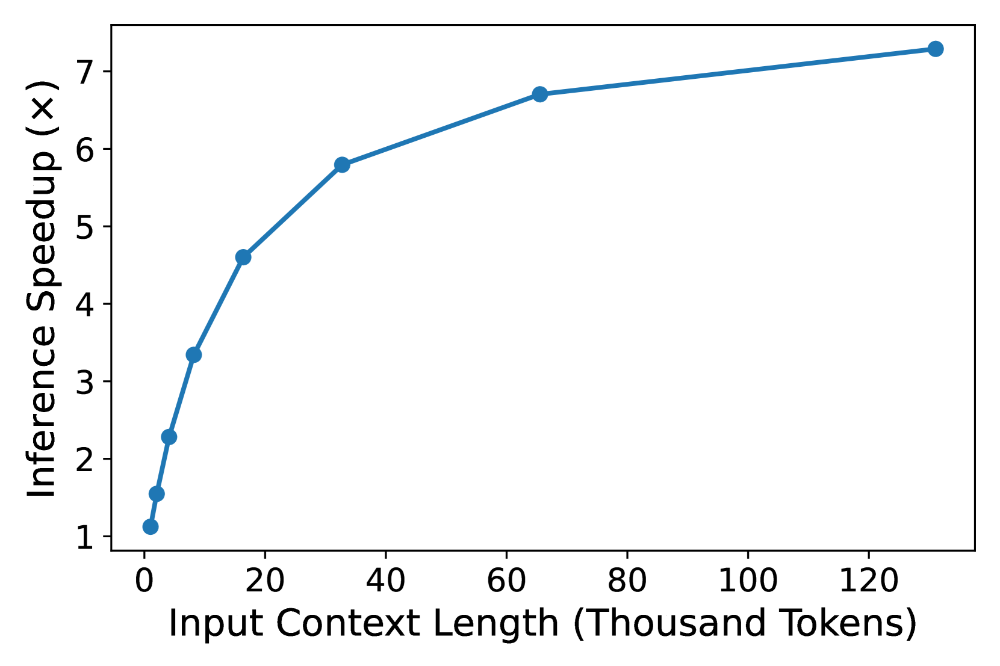
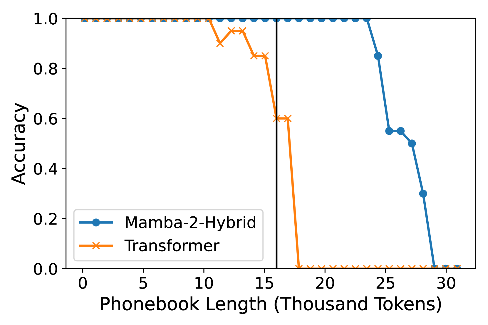
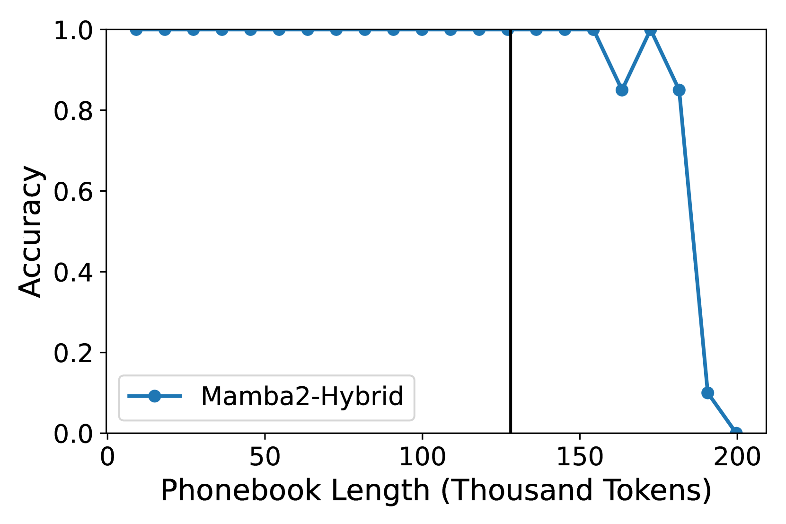

# Mamba语言模型的实证探究

发布时间：2024年06月12日

`LLM理论

理由：这篇论文主要探讨了选择性状态空间模型（SSMs）如Mamba在大规模应用中的表现，特别是在与Transformer模型的比较中。它不仅对比了不同模型在特定任务上的性能，还深入分析了模型在长上下文任务中的表现。这些内容涉及模型的理论性能和架构比较，因此属于LLM理论分类。` `人工智能`

> An Empirical Study of Mamba-based Language Models

# 摘要

> Mamba等选择性状态空间模型（SSMs）解决了Transformer的一些局限，如序列长度增加导致的二次计算复杂度和推理时的高内存需求。研究表明，SSMs在语言建模方面能与Transformer媲美甚至更优，成为一种吸引人的替代方案。尽管如此，现有研究仅在小规模上对比了SSMs和Transformer。为了探究这些架构在大规模应用中的表现，我们对比了80亿参数的Mamba、Mamba-2及Transformer，它们均在相同的大规模数据集上训练。此外，我们还评估了一个混合模型——Mamba-2-Hybrid，它结合了Mamba-2、注意力层和MLP层。通过一系列任务，我们探讨了Mamba模型在更大训练预算下是否能与Transformer竞争。结果表明，纯SSMs在多数任务上表现出色，但在需要复制或上下文学习能力及长上下文推理的任务上稍逊一筹。相反，80亿参数的Mamba-2-Hybrid在所有12个标准任务上平均表现优于Transformer，且在推理时生成令牌的速度预计快8倍。为了测试长上下文能力，我们进一步评估了支持16K、32K和128K序列的模型变体。在23个长上下文任务中，混合模型继续保持与Transformer的竞争力。为了支持进一步研究，我们发布了训练模型的检查点和代码，作为NVIDIA Megatron-LM项目的一部分。

> Selective state-space models (SSMs) like Mamba overcome some of the shortcomings of Transformers, such as quadratic computational complexity with sequence length and large inference-time memory requirements from the key-value cache. Moreover, recent studies have shown that SSMs can match or exceed the language modeling capabilities of Transformers, making them an attractive alternative. In a controlled setting (e.g., same data), however, studies so far have only presented small scale experiments comparing SSMs to Transformers. To understand the strengths and weaknesses of these architectures at larger scales, we present a direct comparison between 8B-parameter Mamba, Mamba-2, and Transformer models trained on the same datasets of up to 3.5T tokens. We also compare these models to a hybrid architecture consisting of 43% Mamba-2, 7% attention, and 50% MLP layers (Mamba-2-Hybrid). Using a diverse set of tasks, we answer the question of whether Mamba models can match Transformers at larger training budgets. Our results show that while pure SSMs match or exceed Transformers on many tasks, they lag behind Transformers on tasks which require strong copying or in-context learning abilities (e.g., 5-shot MMLU, Phonebook) or long-context reasoning. In contrast, we find that the 8B Mamba-2-Hybrid exceeds the 8B Transformer on all 12 standard tasks we evaluated (+2.65 points on average) and is predicted to be up to 8x faster when generating tokens at inference time. To validate long-context capabilities, we provide additional experiments evaluating variants of the Mamba-2-Hybrid and Transformer extended to support 16K, 32K, and 128K sequences. On an additional 23 long-context tasks, the hybrid model continues to closely match or exceed the Transformer on average. To enable further study, we release the checkpoints as well as the code used to train our models as part of NVIDIA's Megatron-LM project.

[Arxiv](https://arxiv.org/abs/2406.07887)