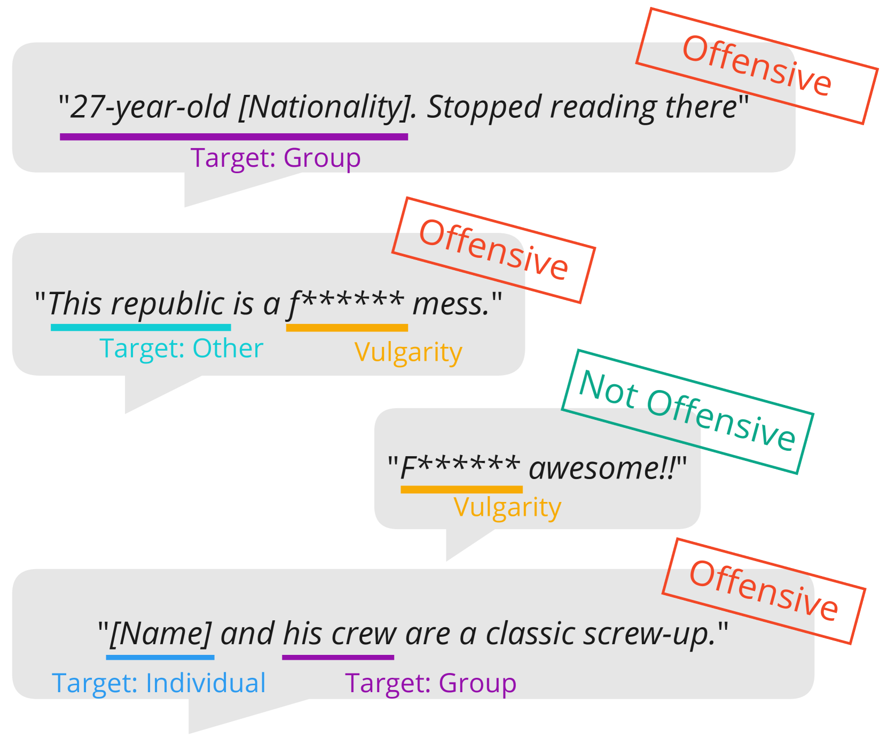
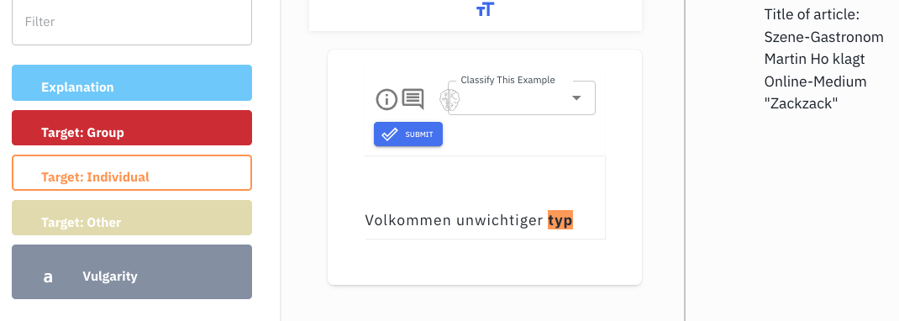
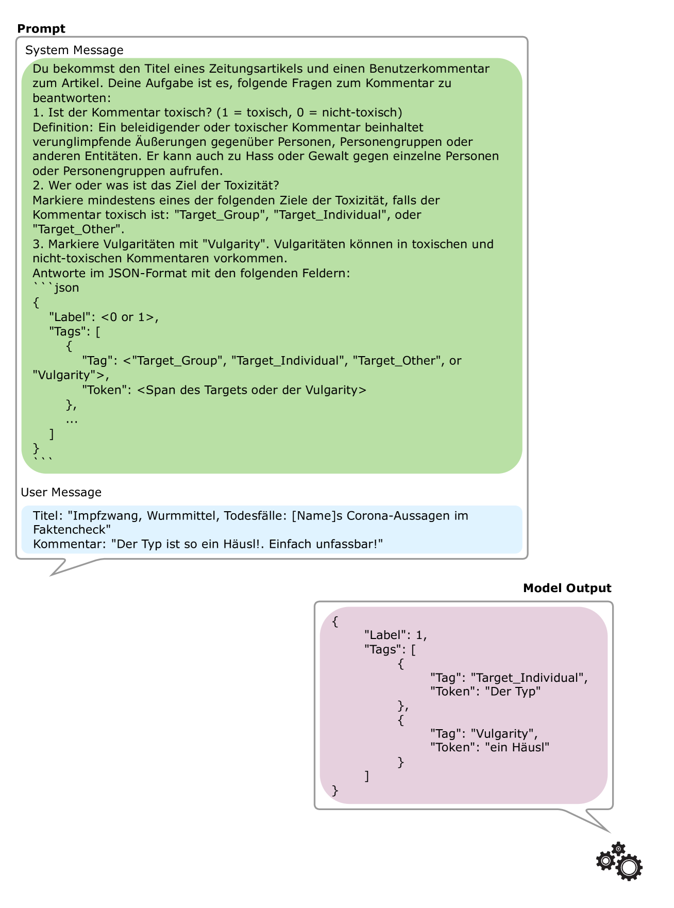

# AustroTox：专为检测奥地利德语中的攻击性语言而设计的目标导向数据集

发布时间：2024年06月12日

`LLM应用

理由：这篇论文主要关注的是在毒性检测领域中，如何利用大型语言模型（LLM）在零-shot和少-shot环境下进行冒犯性语言检测，特别是在奥地利德语方言的数据集上的应用。论文中对比了微调模型与大型语言模型的表现，并公开了数据和代码，这些都是LLM在特定应用场景下的实际应用和效果评估，因此属于LLM应用分类。` `毒性检测` `语言识别`

> AustroTox: A Dataset for Target-Based Austrian German Offensive Language Detection

# 摘要

> 在毒性检测领域，模型的透明度得益于词级标注，但目前这些标注仅限于英语。我们推出了一款包含奥地利德语方言的新闻论坛数据集，用于冒犯性语言检测，共收录4,562条用户评论。该数据集不仅进行二元冒犯性分类，还精确标注了每条评论中的粗俗语言片段及冒犯性言论目标。我们对比了微调模型与大型语言模型在零-shot和少-shot环境下的表现。结果表明，微调模型擅长捕捉方言粗俗等语言细节，而大型语言模型在识别AustroTox中的冒犯性方面更胜一筹。我们已将数据和代码公开。

> Model interpretability in toxicity detection greatly profits from token-level annotations. However, currently such annotations are only available in English. We introduce a dataset annotated for offensive language detection sourced from a news forum, notable for its incorporation of the Austrian German dialect, comprising 4,562 user comments. In addition to binary offensiveness classification, we identify spans within each comment constituting vulgar language or representing targets of offensive statements. We evaluate fine-tuned language models as well as large language models in a zero- and few-shot fashion. The results indicate that while fine-tuned models excel in detecting linguistic peculiarities such as vulgar dialect, large language models demonstrate superior performance in detecting offensiveness in AustroTox. We publish the data and code.

[Arxiv](https://arxiv.org/abs/2406.08080)