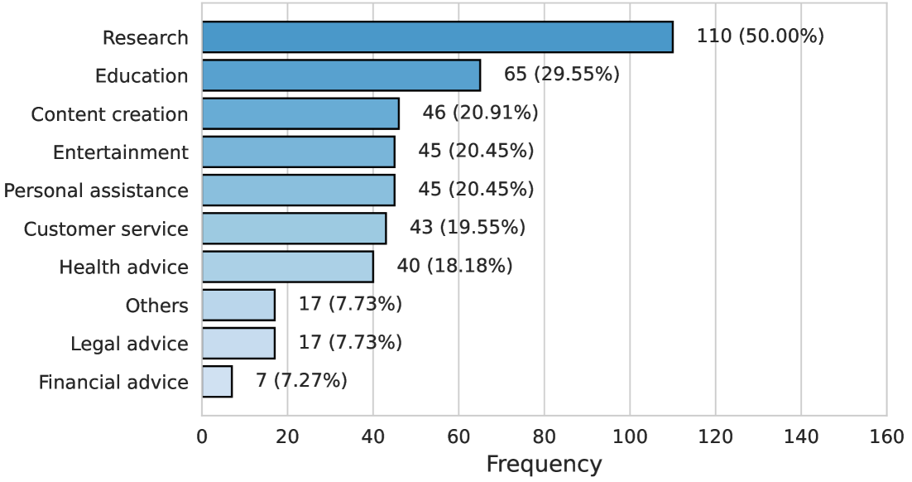
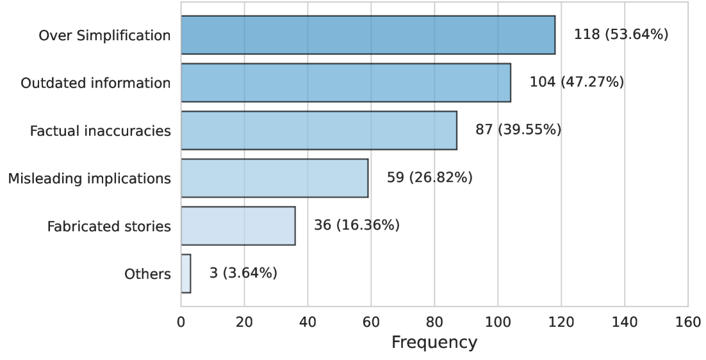
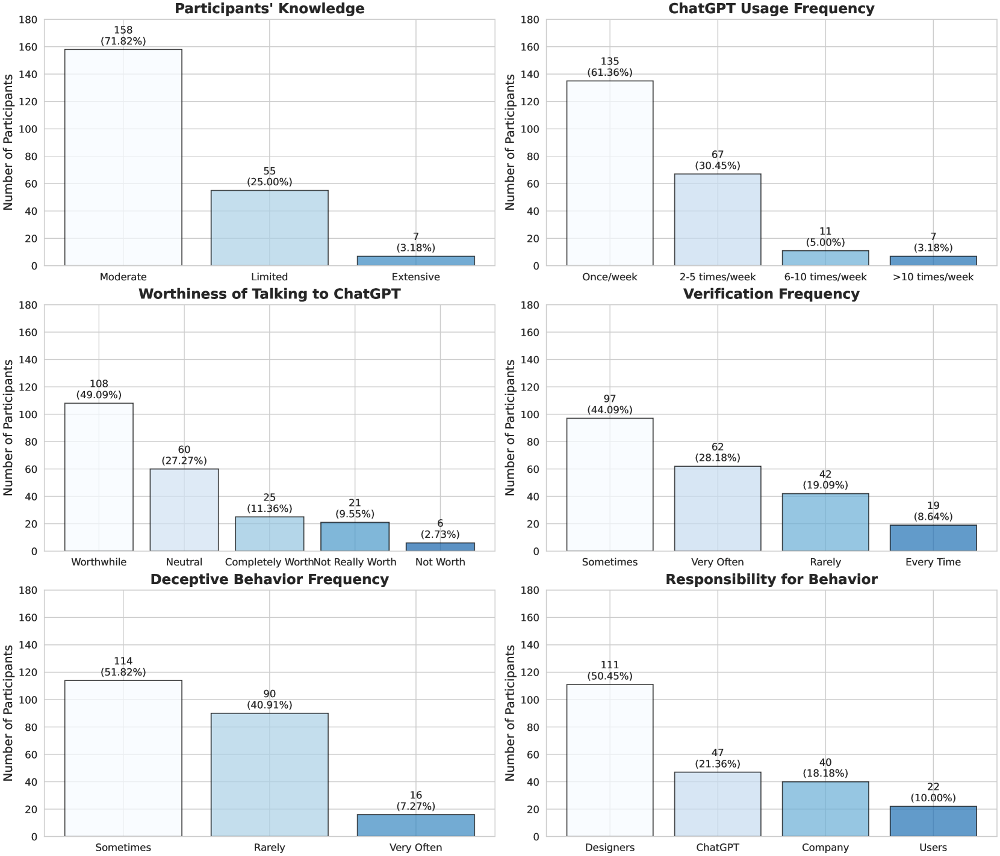

# 欺骗的平凡化：探究人类与AI共存生态中，人们对大型语言模型生成欺骗行为的认知

发布时间：2024年06月12日

`LLM应用

这篇论文主要探讨了大型语言模型（LLMs）如ChatGPT可能提供的虚假、不准确或误导性信息对用户信任和行为的影响。通过在线调查和半结构化访谈，研究了用户对这些欺骗行为的看法及其后果。这属于对LLM在实际应用中的社会和心理影响的探讨，因此归类为LLM应用。` `人机交互`

> Banal Deception Human-AI Ecosystems: A Study of People's Perceptions of LLM-generated Deceptive Behaviour

# 摘要

> 大型语言模型（LLMs）可能提供虚假、不准确或误导性的信息，这种行为被Natale（2021）称为“平庸”的欺骗。本研究通过在线调查（220人参与）和半结构化访谈（12人参与），探讨了人们对ChatGPT欺骗行为的看法及其对信任和行为的影响。研究发现，人们常遇到过度简化或过时的欺骗信息，这种“平庸”欺骗影响了人们对ChatGPT的信任和交流价值感。此外，教育水平和欺骗信息频率影响了对欺骗责任的感知。尽管用户在遭遇欺骗后更加谨慎，但一旦认识到使用该技术的优势，他们对技术的信任反而增强。这些发现有助于理解人机交互在“欺骗性AI生态系统”中的动态，并强调了以用户为中心的方法在减轻欺骗性AI技术潜在危害中的重要性。

> Large language models (LLMs) can provide users with false, inaccurate, or misleading information, and we consider the output of this type of information as what Natale (2021) calls `banal' deceptive behaviour. Here, we investigate peoples' perceptions of ChatGPT-generated deceptive behaviour and how this affects peoples' own behaviour and trust. To do this, we use a mixed-methods approach comprising of (i) an online survey with 220 participants and (ii) semi-structured interviews with 12 participants. Our results show that (i) the most common types of deceptive information encountered were over-simplifications and outdated information; (ii) humans' perceptions of trust and `worthiness' of talking to ChatGPT are impacted by `banal' deceptive behaviour; (iii) the perceived responsibility for deception is influenced by education level and the frequency of deceptive information; and (iv) users become more cautious after encountering deceptive information, but they come to trust the technology more when they identify advantages of using it. Our findings contribute to the understanding of human-AI interaction dynamics in the context of \textit{Deceptive AI Ecosystems}, and highlight the importance of user-centric approaches to mitigating the potential harms of deceptive AI technologies.

[Arxiv](https://arxiv.org/abs/2406.08386)