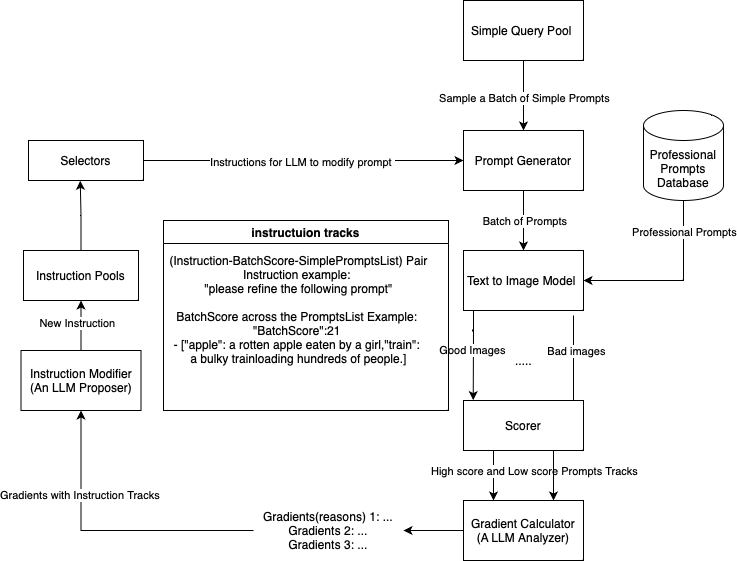

# 利用批量指导梯度优化提示：系统性提升文本至图像合成的提示策略

发布时间：2024年06月12日

`Agent

这篇论文探讨了如何通过一个多代理框架来优化文本到图像模型的输入提示，以提高图像生成的质量。该框架包括一个动态调整初始查询的提示生成机制，以及一个评分系统来评估图像质量。此外，大型语言模型被用来生成新指令，并且整个过程由UCB算法管理。这个研究的重点在于通过代理（如Stable Diffusion模型）来改进图像生成任务的提示设计，因此属于Agent分类。` `图像生成` `人工智能`

> Batch-Instructed Gradient for Prompt Evolution:Systematic Prompt Optimization for Enhanced Text-to-Image Synthesis

# 摘要

> 文本到图像模型在根据用户提示生成高质量图像方面取得了显著进步，但图像质量因模型对语言细微差别的敏感性而异。随着大型语言模型的进步，我们有了新的机会来改进图像生成任务的提示设计。现有研究主要集中在直接交互的提示优化上，而对涉及中介代理（如Stable Diffusion模型）的场景关注不足。本研究提出了一种多代理框架，旨在优化文本到图像模型的输入提示。该框架的核心是一个动态调整初始查询的提示生成机制，通过迭代反馈不断进化。高质量的提示被输入到最先进的文本到图像模型中，而一个专业的提示数据库则作为基准，指导生成高水平的提示。一个评分系统评估图像质量，大型语言模型则根据计算的梯度生成新指令。这一迭代过程由UCB算法管理，并使用HPS v2进行评估。初步研究凸显了系统各组件的有效性，并指出了未来改进的方向。

> Text-to-image models have shown remarkable progress in generating high-quality images from user-provided prompts. Despite this, the quality of these images varies due to the models' sensitivity to human language nuances. With advancements in large language models, there are new opportunities to enhance prompt design for image generation tasks. Existing research primarily focuses on optimizing prompts for direct interaction, while less attention is given to scenarios involving intermediary agents, like the Stable Diffusion model. This study proposes a Multi-Agent framework to optimize input prompts for text-to-image generation models. Central to this framework is a prompt generation mechanism that refines initial queries using dynamic instructions, which evolve through iterative performance feedback. High-quality prompts are then fed into a state-of-the-art text-to-image model. A professional prompts database serves as a benchmark to guide the instruction modifier towards generating high-caliber prompts. A scoring system evaluates the generated images, and an LLM generates new instructions based on calculated gradients. This iterative process is managed by the Upper Confidence Bound (UCB) algorithm and assessed using the Human Preference Score version 2 (HPS v2). Preliminary ablation studies highlight the effectiveness of various system components and suggest areas for future improvements.

[Arxiv](https://arxiv.org/abs/2406.08713)