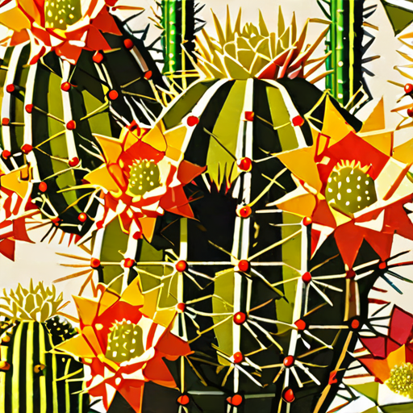

# 利用批量指导梯度优化提示：系统性提升文本至图像合成的提示策略

发布时间：2024年06月12日

`Agent

理由：这篇论文主要探讨了通过多代理框架来优化文本到图像生成模型的输入提示质量。它提出了一个系统，该系统利用中介代理（如Stable Diffusion模型）和大型语言模型来动态精炼和优化初始查询。这种方法涉及代理的使用和交互，因此更符合Agent分类。虽然这个过程中也涉及到了大型语言模型（LLM），但主要焦点在于代理框架的设计和应用，而不是LLM的理论或直接应用。` `图像生成` `人工智能`

> Batch-Instructed Gradient for Prompt Evolution:Systematic Prompt Optimization for Enhanced Text-to-Image Synthesis

# 摘要

> 文本到图像模型在根据用户提示生成高质量图像方面取得了显著进步，但图像质量因模型对语言细微差别的敏感性而异。随着大型语言模型技术的进步，我们有了新的机会来优化图像生成任务的提示设计。目前研究多集中在直接交互的提示优化上，而对涉及中介代理（如Stable Diffusion模型）的场景关注不足。本研究提出了一种多代理框架，旨在通过动态指令精炼初始查询，并通过迭代反馈不断优化，从而提升文本到图像生成模型的输入提示质量。该框架利用专业提示数据库作为基准，指导生成高水平的提示，并通过评分系统和大型语言模型不断迭代优化。整个过程由UCB算法管理，并采用HPS v2进行评估。初步研究显示了系统各组件的有效性，并指出了未来改进的方向。

> Text-to-image models have shown remarkable progress in generating high-quality images from user-provided prompts. Despite this, the quality of these images varies due to the models' sensitivity to human language nuances. With advancements in large language models, there are new opportunities to enhance prompt design for image generation tasks. Existing research primarily focuses on optimizing prompts for direct interaction, while less attention is given to scenarios involving intermediary agents, like the Stable Diffusion model. This study proposes a Multi-Agent framework to optimize input prompts for text-to-image generation models. Central to this framework is a prompt generation mechanism that refines initial queries using dynamic instructions, which evolve through iterative performance feedback. High-quality prompts are then fed into a state-of-the-art text-to-image model. A professional prompts database serves as a benchmark to guide the instruction modifier towards generating high-caliber prompts. A scoring system evaluates the generated images, and an LLM generates new instructions based on calculated gradients. This iterative process is managed by the Upper Confidence Bound (UCB) algorithm and assessed using the Human Preference Score version 2 (HPS v2). Preliminary ablation studies highlight the effectiveness of various system components and suggest areas for future improvements.

[Arxiv](https://arxiv.org/abs/2406.08713)