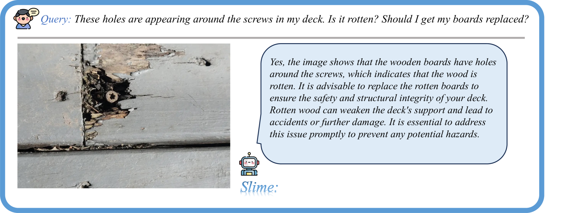

# 超越LLaVA-HD：探索高分辨率大型多模态模型的奥秘

发布时间：2024年06月12日

`RAG

这篇论文主要关注的是大型多模态模型中的高分辨率问题，并提出了一种创新的框架和优化策略来解决现有方法的局限性。论文中提到的混合适配器、可学习的查询嵌入和相似性选择器等技术，都是为了优化多模态模型中的视觉理解和推理能力。这些技术与RAG（Retrieval-Augmented Generation）模型的概念相似，后者也是通过结合检索和生成来提高模型的性能。因此，这篇论文更适合归类到RAG分类中。` `计算机视觉` `机器学习`

> Beyond LLaVA-HD: Diving into High-Resolution Large Multimodal Models

# 摘要

> 高分辨率是大型多模态模型的基石，对视觉理解和推理至关重要。现有方法通过增加局部图像块的数量来提升分辨率，但这种做法不仅计算成本高昂，还可能削弱全局上下文的重要性。本文深入分析了这些问题，并提出了一种创新框架及优化策略。我们采用混合适配器从全局视角提取信息，同时引入可学习的查询嵌入来精简局部图像令牌，通过相似性选择器挑选关键信息。实证结果显示，减少但增强的局部图像令牌能显著提升性能。在训练策略上，我们建议采用交替训练，以平衡全局与局部学习。此外，我们还引入了一个高细节要求的挑战性数据集，以强化局部压缩层的训练。这一名为SliME的方法，在多个基准测试中展现了卓越性能，仅使用200万训练数据。

> Seeing clearly with high resolution is a foundation of Large Multimodal Models (LMMs), which has been proven to be vital for visual perception and reasoning. Existing works usually employ a straightforward resolution upscaling method, where the image consists of global and local branches, with the latter being the sliced image patches but resized to the same resolution as the former. This means that higher resolution requires more local patches, resulting in exorbitant computational expenses, and meanwhile, the dominance of local image tokens may diminish the global context. In this paper, we dive into the problems and propose a new framework as well as an elaborate optimization strategy. Specifically, we extract contextual information from the global view using a mixture of adapters, based on the observation that different adapters excel at different tasks. With regard to local patches, learnable query embeddings are introduced to reduce image tokens, the most important tokens accounting for the user question will be further selected by a similarity-based selector. Our empirical results demonstrate a `less is more' pattern, where \textit{utilizing fewer but more informative local image tokens leads to improved performance}. Besides, a significant challenge lies in the training strategy, as simultaneous end-to-end training of the global mining block and local compression block does not yield optimal results. We thus advocate for an alternating training way, ensuring balanced learning between global and local aspects. Finally, we also introduce a challenging dataset with high requirements for image detail, enhancing the training of the local compression layer. The proposed method, termed LMM with Sophisticated Tasks, Local image compression, and Mixture of global Experts (SliME), achieves leading performance across various benchmarks with only 2 million training data.

[Arxiv](https://arxiv.org/abs/2406.08487)