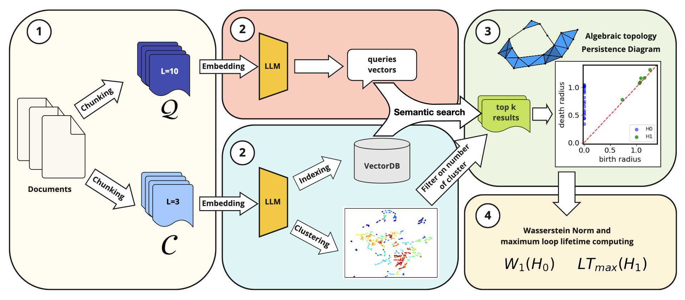
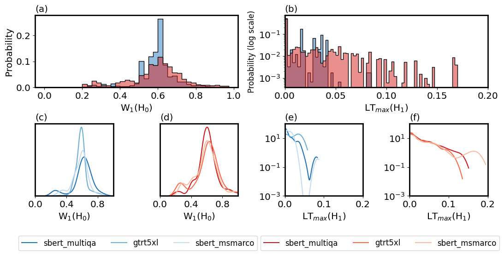
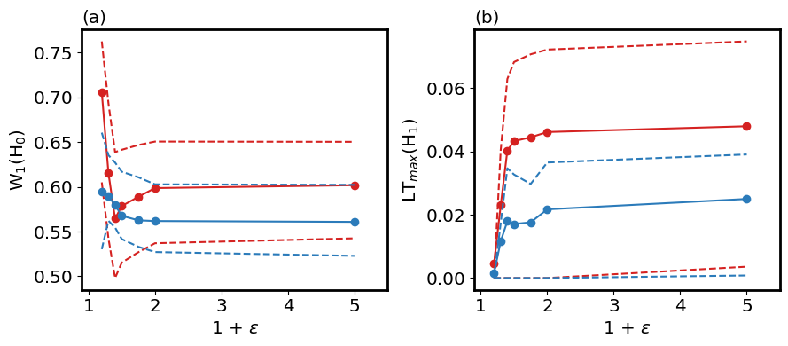
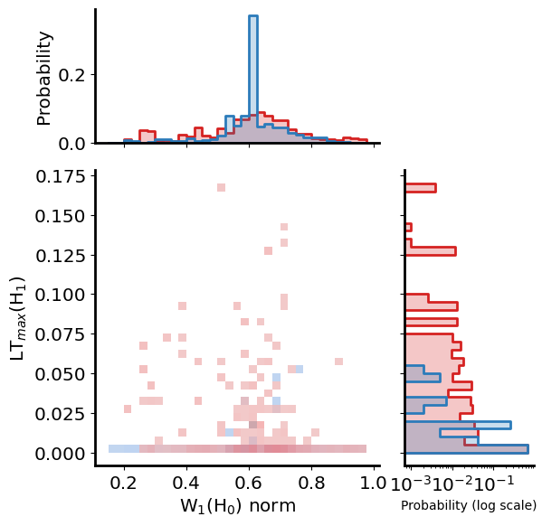
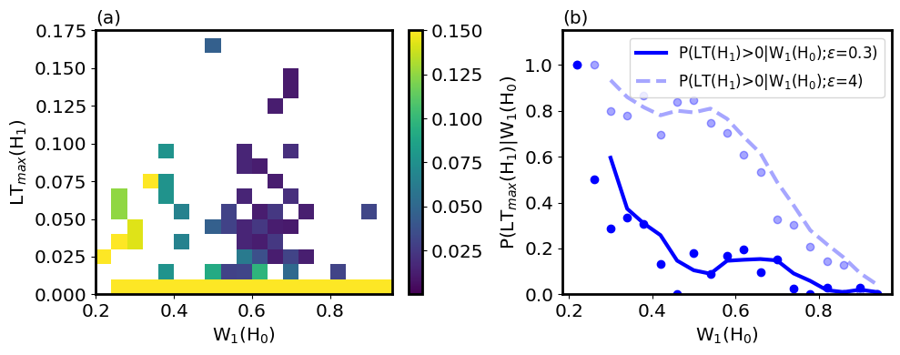
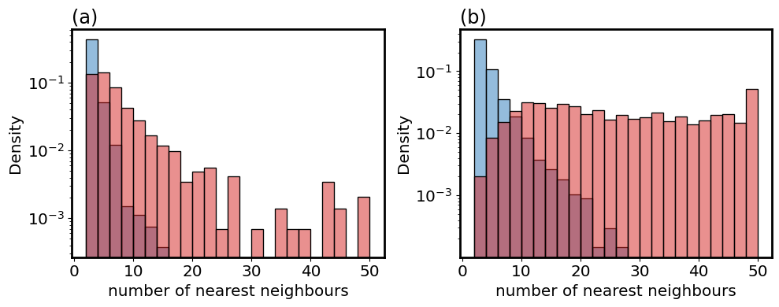
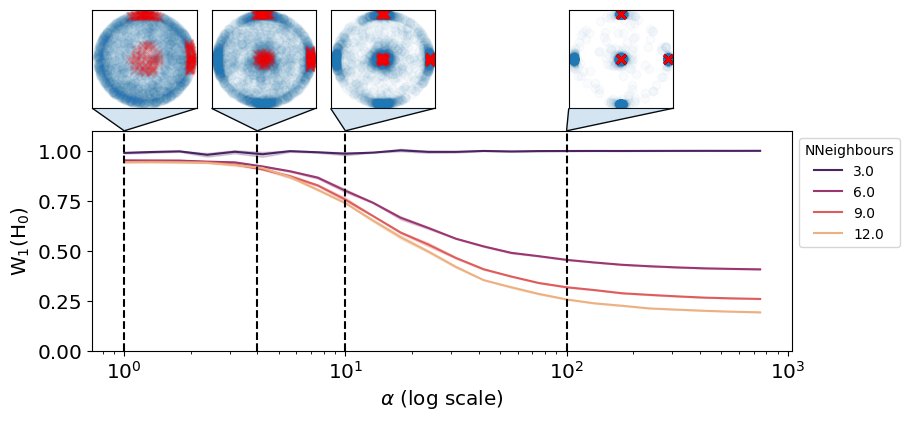
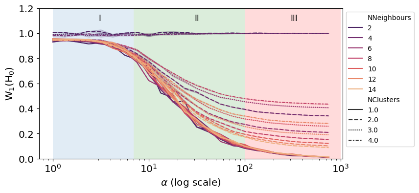

# Blowfish算法：揭示语义搜索模糊性的拓扑与统计特征

发布时间：2024年06月12日

`RAG

该论文摘要主要关注句子嵌入中的模糊性及其在RAG（Retrieval-Augmented Generation）系统中的应用。RAG系统是一种结合了信息检索和文本生成的模型，用于提高自然语言处理任务的性能。论文通过实验探讨了不同大小的数据块对模糊性特征的影响，并提出了一种新的语义相似性评分策略，这些都是RAG系统中的关键技术。因此，该论文应归类于RAG。` `信息检索`

> Blowfish: Topological and statistical signatures for quantifying ambiguity in semantic search

# 摘要

> 本研究揭示了句子嵌入中模糊性的拓扑特征，这些特征在向量搜索和RAG系统中具有排名和解释的潜力。我们定义了模糊性，并通过将数据集拆分为3、5、10行的不同块集合进行实验，以测试模糊性特征并排除干扰因素。结果表明，大小为10的模糊查询与大小为3的文档相比，其特征分布与大小为5的清晰查询对大小为10的文档不同。我们探讨了这些结果，涉及流形复杂性的增加和不连续嵌入子流形的可能性，并提出了一种新的语义相似性评分策略。

> This works reports evidence for the topological signatures of ambiguity in sentence embeddings that could be leveraged for ranking and/or explanation purposes in the context of vector search and Retrieval Augmented Generation (RAG) systems. We proposed a working definition of ambiguity and designed an experiment where we have broken down a proprietary dataset into collections of chunks of varying size - 3, 5, and 10 lines and used the different collections successively as queries and answers sets. It allowed us to test the signatures of ambiguity with removal of confounding factors. Our results show that proxy ambiguous queries (size 10 queries against size 3 documents) display different distributions of homologies 0 and 1 based features than proxy clear queries (size 5 queries against size 10 documents). We then discuss those results in terms increased manifold complexity and/or approximately discontinuous embedding submanifolds. Finally we propose a strategy to leverage those findings as a new scoring strategy of semantic similarities.

[Arxiv](https://arxiv.org/abs/2406.07990)