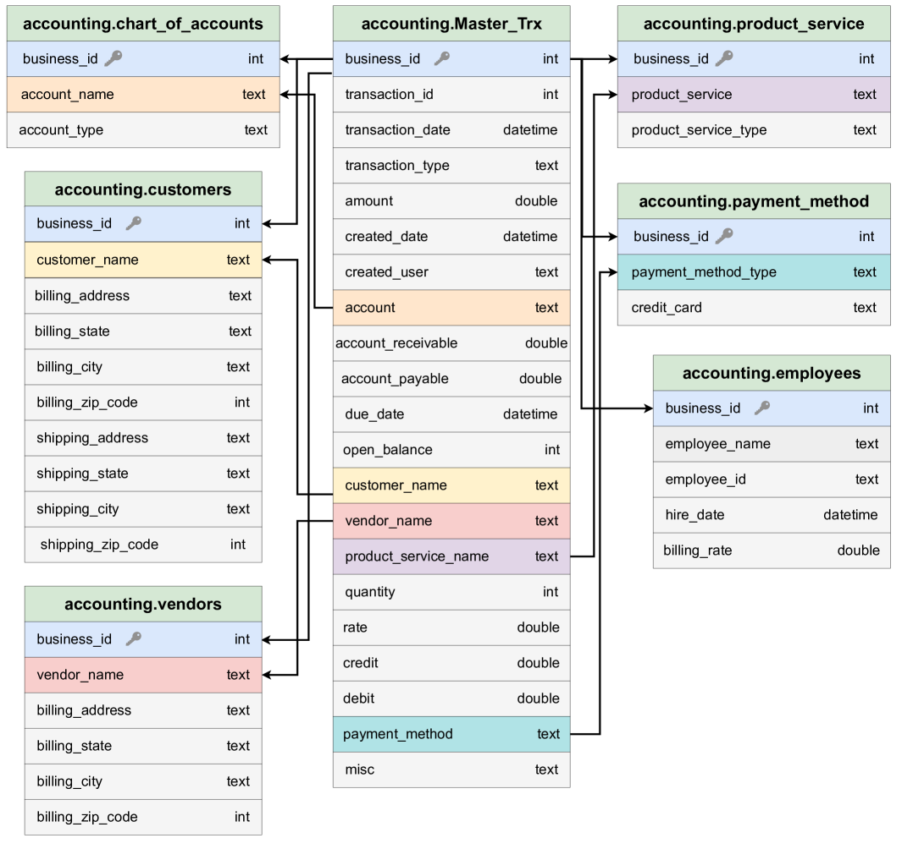
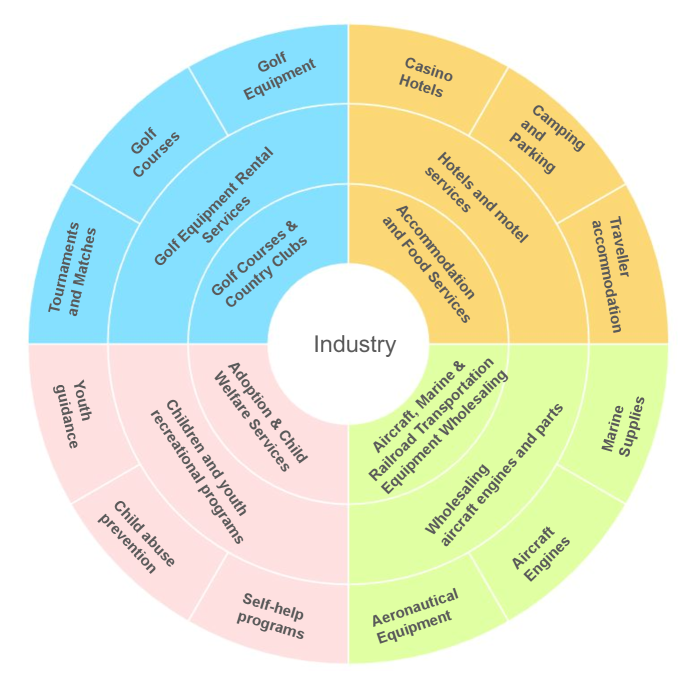
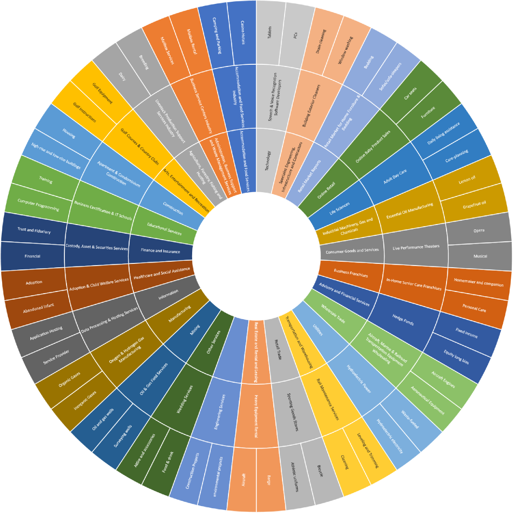

# BookSQL：会计领域的大规模文本至SQL数据集

发布时间：2024年06月12日

`LLM应用

理由：这篇论文主要关注的是在特定领域（会计和金融）中开发和评估大型语言模型（如GPT-4）的应用，特别是在Text-to-SQL任务上的表现。它提出了一个新的数据集BookSQL，并分析了现有模型在该数据集上的性能，强调了特定领域模型开发的必要性。这与LLM的理论研究不同，因为它更侧重于实际应用和模型在特定任务上的表现，而不是探讨LLM的理论基础或机制。此外，它也不涉及Agent或RAG的相关概念。因此，最合适的分类是LLM应用。`

> BookSQL: A Large Scale Text-to-SQL Dataset for Accounting Domain

# 摘要

> 近期，WikiSQL、Spider等大型数据集的提出，为自然语言数据库接口的开发提供了支持。尽管这些数据集覆盖面广，但在金融和会计等关键领域仍有欠缺。鉴于全球非技术人员对会计数据库的依赖，开发能够通过自然语言查询提取信息的模型显得尤为迫切。为此，我们提出了一个专为会计和金融领域设计的大型Text-to-SQL数据集：BookSQL，包含10万对自然语言查询与SQL语句，以及100万条会计数据记录。我们测试并分析了包括GPT-4在内的顶尖模型在BookSQL上的表现，发现性能差距显著，暗示着该领域需要更为专注的模型开发。

> Several large-scale datasets (e.g., WikiSQL, Spider) for developing natural language interfaces to databases have recently been proposed. These datasets cover a wide breadth of domains but fall short on some essential domains, such as finance and accounting. Given that accounting databases are used worldwide, particularly by non-technical people, there is an imminent need to develop models that could help extract information from accounting databases via natural language queries. In this resource paper, we aim to fill this gap by proposing a new large-scale Text-to-SQL dataset for the accounting and financial domain: BookSQL. The dataset consists of 100k natural language queries-SQL pairs, and accounting databases of 1 million records. We experiment with and analyze existing state-of-the-art models (including GPT-4) for the Text-to-SQL task on BookSQL. We find significant performance gaps, thus pointing towards developing more focused models for this domain.

[Arxiv](https://arxiv.org/abs/2406.07860)