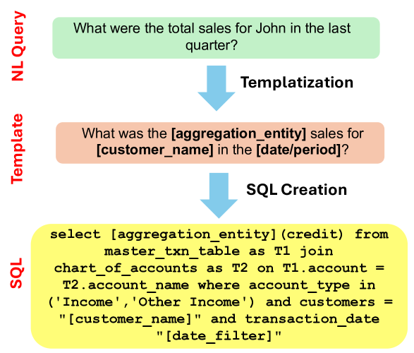

# BookSQL：会计领域的巨型文本至SQL数据集

发布时间：2024年06月12日

`LLM应用

这篇论文主要关注的是在特定领域（会计与金融）中开发和评估自然语言处理模型，特别是Text-to-SQL模型的应用。它提出了一个新的数据集BookSQL，并测试了现有模型（如GPT-4）在该数据集上的表现，强调了为特定领域定制模型的必要性。这与LLM的应用相关，因为它涉及使用大型语言模型来解决实际问题，即通过自然语言查询从会计数据库中提取信息。因此，这篇论文属于LLM应用分类。`

> BookSQL: A Large Scale Text-to-SQL Dataset for Accounting Domain

# 摘要

> 近期，针对数据库的自然语言接口开发，出现了如WikiSQL和Spider等大规模数据集，它们虽覆盖广泛领域，但在金融与会计等关键领域仍显不足。考虑到全球非技术人员对会计数据库的依赖，开发能通过自然语言查询提取信息的模型变得尤为迫切。为此，我们提出了一项新的Text-to-SQL数据集——BookSQL，专为会计与金融领域设计，包含10万对自然语言查询与SQL语句，以及百万条会计数据记录。我们测试并分析了包括GPT-4在内的顶尖模型在BookSQL上的表现，发现性能差距显著，这提示我们需为该领域定制更精准的模型。

> Several large-scale datasets (e.g., WikiSQL, Spider) for developing natural language interfaces to databases have recently been proposed. These datasets cover a wide breadth of domains but fall short on some essential domains, such as finance and accounting. Given that accounting databases are used worldwide, particularly by non-technical people, there is an imminent need to develop models that could help extract information from accounting databases via natural language queries. In this resource paper, we aim to fill this gap by proposing a new large-scale Text-to-SQL dataset for the accounting and financial domain: BookSQL. The dataset consists of 100k natural language queries-SQL pairs, and accounting databases of 1 million records. We experiment with and analyze existing state-of-the-art models (including GPT-4) for the Text-to-SQL task on BookSQL. We find significant performance gaps, thus pointing towards developing more focused models for this domain.

[Arxiv](https://arxiv.org/abs/2406.07860)