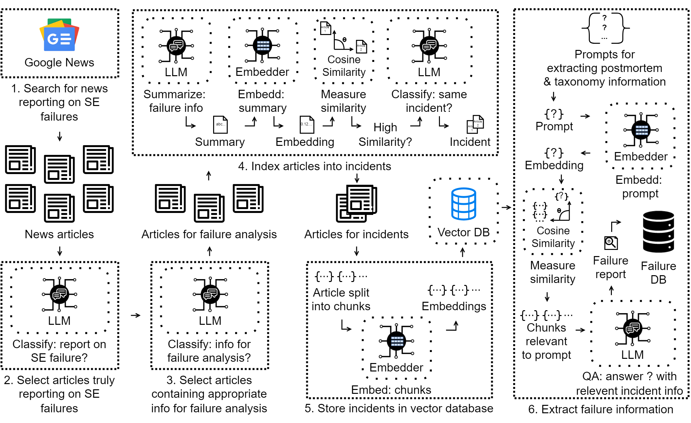
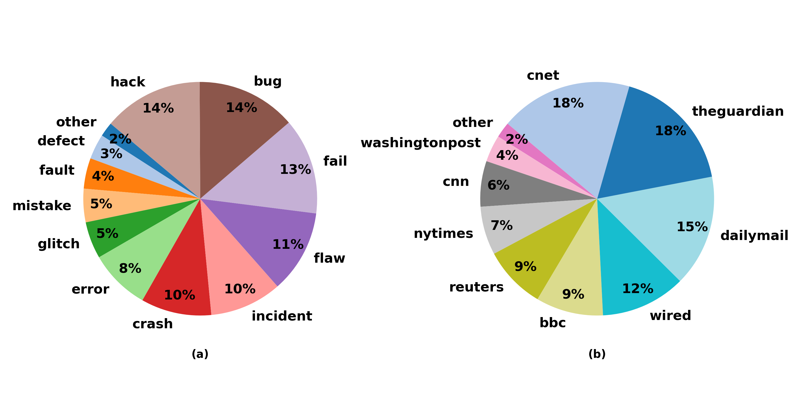
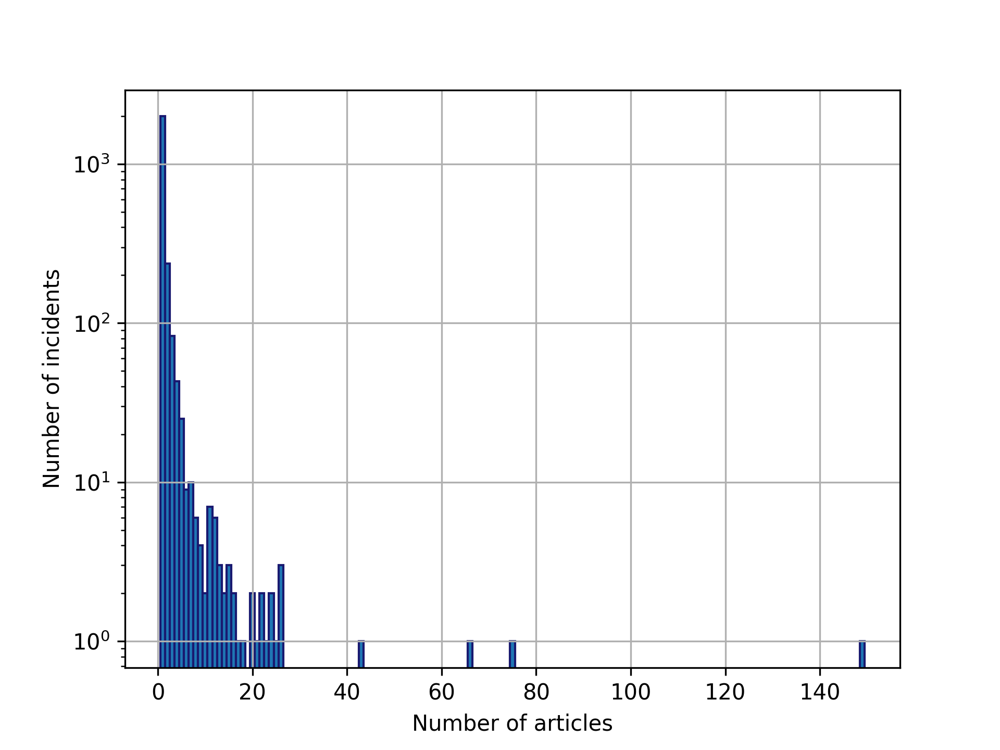
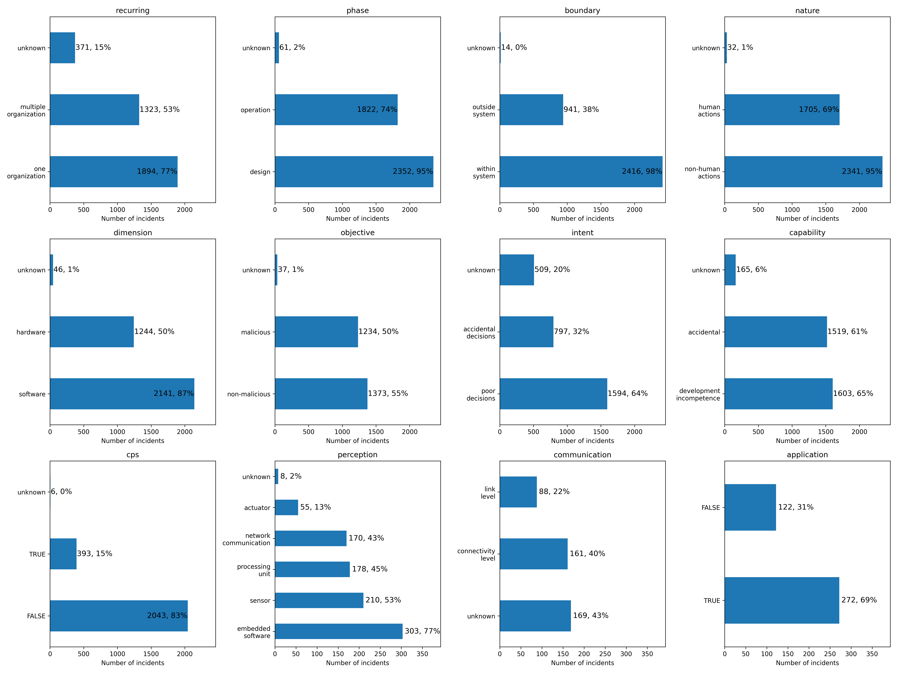
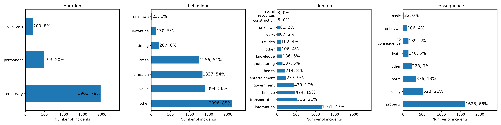

# 大型语言模型是否具备分析新闻报道中软件故障的能力？本研究提出了一种端到端的自动化分析流程，名为FAIL，旨在探索这一问题。

发布时间：2024年06月12日

`Agent

理由：这篇论文介绍了一个名为FAIL的系统，该系统专门设计用于自动化地从新闻中收集、分析和总结软件故障。FAIL系统能够自动收集新闻文章、归类相关报道，并深入分析故障原因和系统特性。这种自动化工具可以被视为一个智能代理（Agent），因为它能够自主地执行任务，处理信息，并提供有价值的分析结果。虽然论文中提到了大型语言模型（LLM）在识别和分析故障新闻中的应用，但主要焦点是FAIL系统作为一个自动化分析工具的功能和应用，因此更适合归类为Agent。` `软件工程` `信息安全`

> Can Large Language Models Analyze Software Failures in the News? An End-to-End Automated Pipeline with FAIL

# 摘要

> 软件故障对工程实践、标准制定和法规完善具有重要启示。例如，Log4J漏洞事件促使政府和行业关注软件供应链的安全评估。由于难以获取内部工程记录，故障分析多依赖新闻报道。但以往研究多采用人工分析，限制了分析的广度和深度。业界急需自动化工具，以广泛涵盖各类新闻源和事件。为此，我们开发了FAIL系统，专门用于从新闻中收集、分析和总结软件故障。FAIL能将报道同一事件的文章归类，并运用现有分类法深入分析故障原因和系统特性。通过手动验证31个案例，FAIL在新闻收集、文章合并和事实提取方面表现出色，准确率高达90%。我们进一步将FAIL应用于2010至2022年间来自11个媒体的137,427篇文章，成功识别并分析了2457个故障案例。研究发现：(1)大型语言模型能有效识别并分析故障新闻；(2)组织内部及跨组织常见故障频发；(3)过去十年软件故障的后果日益严重。FAIL数据库现已开放，供各界人士从多样的软件故障案例中汲取经验。

> Software failures inform engineering work, standards, regulations. For example, the Log4J vulnerability brought government and industry attention to evaluating and securing software supply chains. Accessing private engineering records is difficult, so failure analyses tend to use information reported by the news media. However, prior works in this direction have relied on manual analysis. That has limited the scale of their analyses. The community lacks automated support to enable such analyses to consider a wide range of news sources and incidents.
  In this paper, we propose the Failure Analysis Investigation with LLMs (FAIL) system to fill this gap. FAIL collects, analyzes, and summarizes software failures as reported in the news. FAIL groups articles that describe the same incidents. It then analyzes incidents using existing taxonomies for postmortems, faults, and system characteristics. To tune and evaluate FAIL, we followed the methods of prior works by manually analyzing 31 software failures. FAIL achieved an F1 score of 90% for collecting news about software failures, a V-measure of 0.98 for merging articles reporting on the same incident, and extracted 90% of the facts about failures. We then applied FAIL to a total of 137,427 news articles from 11 providers published between 2010 and 2022. FAIL identified and analyzed 2457 distinct failures reported across 4,184 articles. Our findings include: (1) current generation of large language models are capable of identifying news articles that describe failures, and analyzing them according to structured taxonomies; (2) high recurrences of similar failures within organizations and across organizations; and (3) severity of the consequences of software failures have increased over the past decade. The full FAIL database is available so that researchers, engineers, and policymakers can learn from a diversity of software failures.

[Arxiv](https://arxiv.org/abs/2406.08221)