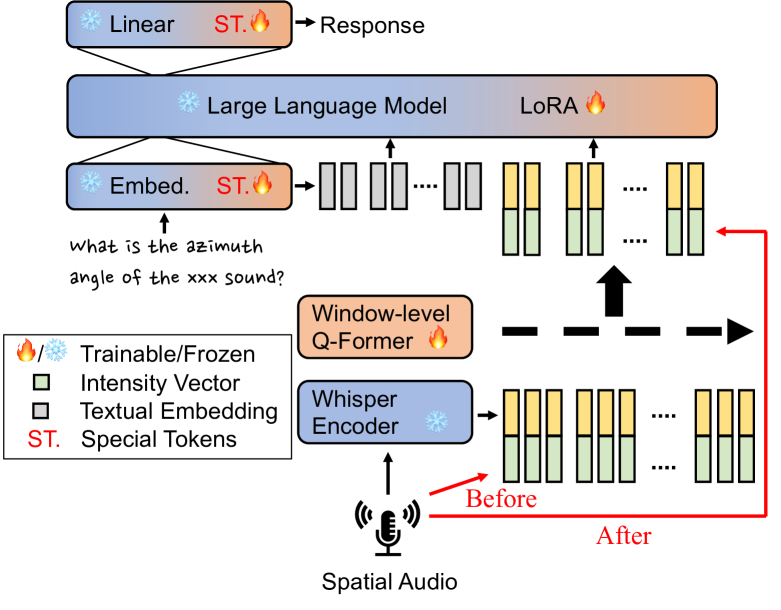
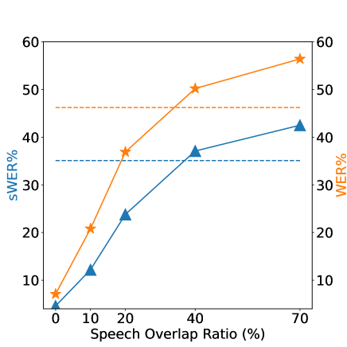
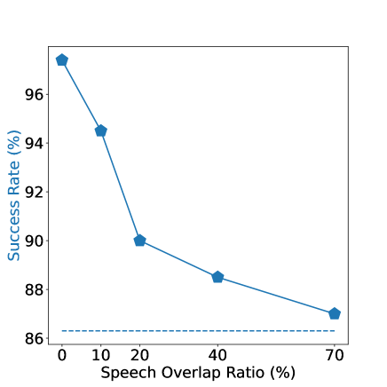

# 大型语言模型是否具备理解空间音频的能力？

发布时间：2024年06月12日

`Agent

这篇论文探讨了如何使大型语言模型（LLMs）具备从多通道音频中解读空间信息的能力，这在当前的听觉型LLMs中是一个未被充分开发的领域。研究集中在三个关键的空间音频任务上，并展示了LLMs在理解和适应物理音频概念方面的潜力。这些成果为未来基于LLM的3D环境智能代理的发展奠定了基础，因此将其归类为Agent。` `音频处理` `智能代理`

> Can Large Language Models Understand Spatial Audio?

# 摘要

> 本文研究了如何让大型语言模型（LLMs）掌握从多通道音频中解读空间信息的能力，这一技能在当前的听觉型LLMs中尚属空白。借助LLMs的先进认知与推理能力，我们旨在通过音频更深入地理解三维环境。研究涵盖了三个关键的空间音频任务：声源定位（SSL）、远场语音识别（FSR）和定位引导的语音提取（LSE），并在每个任务上均取得了显著成果。在SSL任务中，我们的方法在Spatial LibriSpeech数据集上达到了2.70°的平均绝对误差，远超之前约6.60°的记录。此外，我们的模型能有效利用空间线索提升FSR的准确性，并通过文本提示，在嘈杂的语音环境中精准定位并提取来自特定方向的声音，实现LSE。这些成果展示了LLMs适应物理音频概念的巨大潜力，为未来基于LLM的3D环境智能代理奠定了基础。

> This paper explores enabling large language models (LLMs) to understand spatial information from multichannel audio, a skill currently lacking in auditory LLMs. By leveraging LLMs' advanced cognitive and inferential abilities, the aim is to enhance understanding of 3D environments via audio. We study 3 spatial audio tasks: sound source localization (SSL), far-field speech recognition (FSR), and localisation-informed speech extraction (LSE), achieving notable progress in each task. For SSL, our approach achieves an MAE of $2.70^{\circ}$ on the Spatial LibriSpeech dataset, substantially surpassing the prior benchmark of about $6.60^{\circ}$. Moreover, our model can employ spatial cues to improve FSR accuracy and execute LSE by selectively attending to sounds originating from a specified direction via text prompts, even amidst overlapping speech. These findings highlight the potential of adapting LLMs to grasp physical audio concepts, paving the way for LLM-based agents in 3D environments.

[Arxiv](https://arxiv.org/abs/2406.07914)