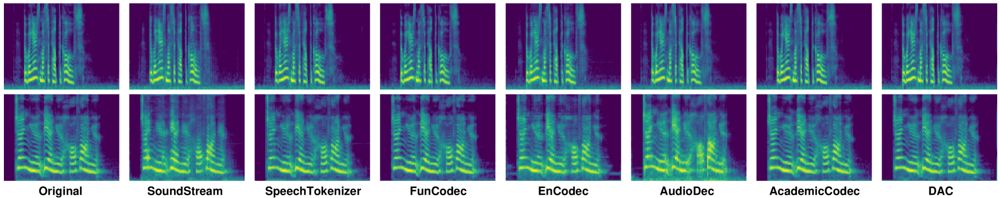

# Codecfake：初步打造的用于识别基于大型语言模型生成的深度伪造音频的数据集

发布时间：2024年06月12日

`LLM应用

这篇论文主要关注基于大型语言模型（LLM）的深度伪造音频的检测问题，并提出了一种新的检测方法，该方法针对的是直接由神经编解码器生成的音频，而不是传统的通过声码器转换的音频。这种新方法通过创建一个包含多种神经编解码器方法的数据集Codecfake，并在此基础上训练检测模型，显著提高了检测性能。因此，这篇论文属于LLM应用类别，因为它探讨了LLM在实际应用中的一个具体问题——深度伪造音频的检测，并提出了解决方案。` `音频处理` `深度伪造检测`

> Codecfake: An Initial Dataset for Detecting LLM-based Deepfake Audio

# 摘要

> 随着基于大型语言模型（LLM）的深度伪造音频日益泛滥，我们急需有效的检测手段。传统的深度伪造音频生成方法通常包含多个步骤，最后通过声码器将手工特征转换为波形。但基于LLM的音频生成则直接从神经编解码器端到端生成，省略了声码器这一环节，给依赖声码器痕迹的现有音频深度伪造检测（ADD）模型带来了挑战。为了应对这一挑战，我们聚焦于生成过程的核心——神经编解码器到波形的转换，并创建了Codecfake数据集，该数据集涵盖了七种主流的神经编解码器方法。实验表明，采用编解码器训练的ADD模型在Codecfake测试集上的平均等错误率较声码器训练的模型降低了41.406%。

> With the proliferation of Large Language Model (LLM) based deepfake audio, there is an urgent need for effective detection methods. Previous deepfake audio generation methods typically involve a multi-step generation process, with the final step using a vocoder to predict the waveform from handcrafted features. However, LLM-based audio is directly generated from discrete neural codecs in an end-to-end generation process, skipping the final step of vocoder processing. This poses a significant challenge for current audio deepfake detection (ADD) models based on vocoder artifacts. To effectively detect LLM-based deepfake audio, we focus on the core of the generation process, the conversion from neural codec to waveform. We propose Codecfake dataset, which is generated by seven representative neural codec methods. Experiment results show that codec-trained ADD models exhibit a 41.406% reduction in average equal error rate compared to vocoder-trained ADD models on the Codecfake test set.

[Arxiv](https://arxiv.org/abs/2406.08112)