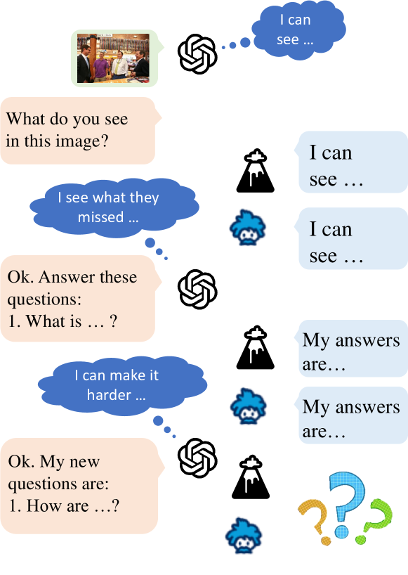
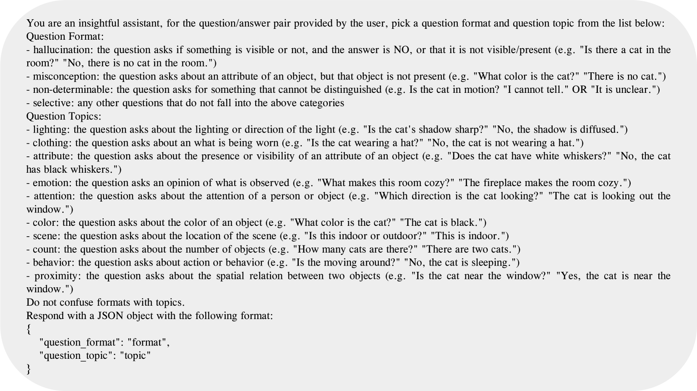
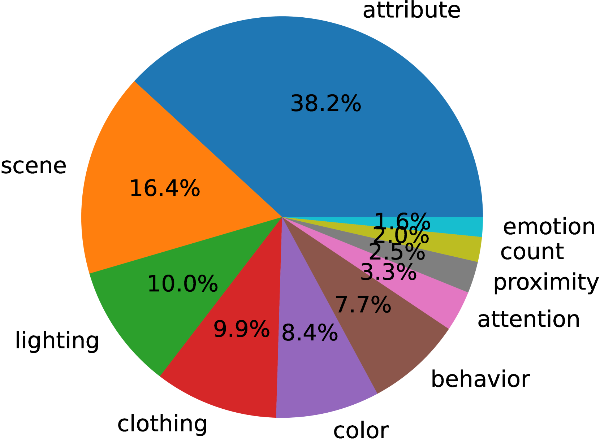
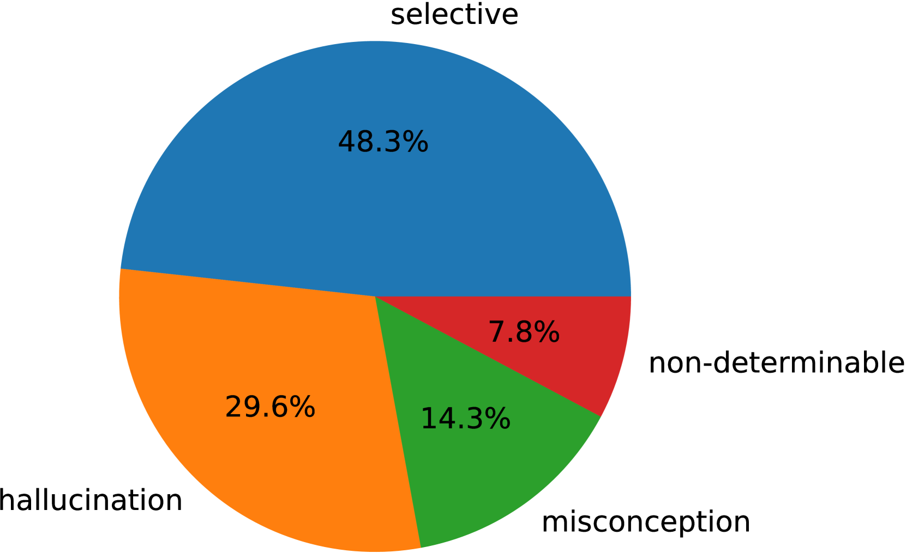

# ConMe：审视现代视觉语言模型组合推理评估的新视角

发布时间：2024年06月12日

`LLM理论

理由：这篇论文主要关注的是大型语言模型（LLM）在组合推理（CR）任务中的性能和挑战，特别是通过引入新的基准和数据生成流程来评估和挑战现有的视觉-语言模型（VLMs）。论文的核心在于探讨和提升LLM在复杂推理任务中的理论理解和性能，而不是直接应用LLM到某个特定领域或讨论LLM的安全性问题。因此，它更符合LLM理论分类，因为它深入探讨了LLM的能力和局限性，并提出了新的理论挑战和评估方法。` `人工智能` `教育评估`

> ConMe: Rethinking Evaluation of Compositional Reasoning for Modern VLMs

# 摘要

> 组合推理（CR）要求理解属性、关系和词序的重要性。近期，结合视觉编码器和大型语言模型（LLM）解码器的视觉-语言模型（VLMs）在推理任务上表现出色。然而，一个关键问题浮现：VLMs是否真正攻克了CR难题？我们认为，现有的CR基准可能未能充分挑战现代VLMs，因其依赖于单一LLM的负面文本生成流程，导致生成的负面例子或是VLMs学习的自然语言分布中的异常，或是在图像上下文中显得不合逻辑。为此，我们推出了ConMe——一个组合推理基准和创新的数据生成流程，利用VLMs生成高难度的CR问答。通过让VLMs相互对话以揭示彼此的弱点，我们的流程自主创造、评估并精选出具有挑战性的组合推理问题，构建了一个经过人工验证的强大CR基准。这一新基准使得CR性能相比以往下降了高达33%，再次凸显了即使是顶尖VLMs也面临的CR挑战。

> Compositional Reasoning (CR) entails grasping the significance of attributes, relations, and word order. Recent Vision-Language Models (VLMs), comprising a visual encoder and a Large Language Model (LLM) decoder, have demonstrated remarkable proficiency in such reasoning tasks. This prompts a crucial question: have VLMs effectively tackled the CR challenge? We conjecture that existing CR benchmarks may not adequately push the boundaries of modern VLMs due to the reliance on an LLM-only negative text generation pipeline. Consequently, the negatives produced either appear as outliers from the natural language distribution learned by VLMs' LLM decoders or as improbable within the corresponding image context. To address these limitations, we introduce ConMe -- a compositional reasoning benchmark and a novel data generation pipeline leveraging VLMs to produce `hard CR Q&A'. Through a new concept of VLMs conversing with each other to collaboratively expose their weaknesses, our pipeline autonomously generates, evaluates, and selects challenging compositional reasoning questions, establishing a robust CR benchmark, also subsequently validated manually. Our benchmark provokes a noteworthy, up to 33%, decrease in CR performance compared to preceding benchmarks, reinstating the CR challenge even for state-of-the-art VLMs.

[Arxiv](https://arxiv.org/abs/2406.08164)