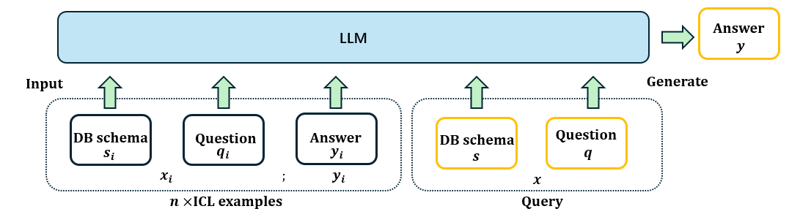

# DeTriever：一种基于解码器表示的检索器，旨在提升 NL2SQL 上下文学习的性能

发布时间：2024年06月12日

`Agent

理由：这篇论文介绍了一种名为DeTriever的创新演示检索框架，它通过学习LLM隐藏状态的加权组合来捕捉丰富的语义信息，并用于优化示例选择。这种方法涉及创建一个代理分数来估算示例的相对益处，并在NL2SQL任务中进行了测试。这种框架可以被视为一个智能代理，因为它能够自主地选择和优化示例，以提高LLM在特定任务上的性能。因此，这篇论文更适合归类为Agent，因为它描述了一个能够自主执行任务的系统或代理。` `数据库`

> DeTriever: Decoder-representation-based Retriever for Improving NL2SQL In-Context Learning

# 摘要

> 尽管上下文学习（ICL）在提升大型语言模型（LLMs）处理复杂任务的能力上表现出色，尤其是在将自然语言问题转化为结构化查询语言（NL2SQL）方面，但如何挑选出最优的演示示例仍是一个待解之谜。以往的研究多依赖现成编码器动态检索示例，但这些外部检索器与LLMs在表示能力上存在本质差异。此外，优化示例选择并非易事，因为没有直接方法评估示例间的相对益处，除非进行成对推理。为此，我们推出了DeTriever，一种创新的演示检索框架，它通过学习LLM隐藏状态的加权组合，捕捉丰富的语义信息。我们提出了一种代理分数，基于输出查询间的相似性来估算示例的相对益处，以此训练模型。在两个NL2SQL基准测试中，我们的方法在一击NL2SQL任务上显著超越了现有技术水平。

> While in-context Learning (ICL) has proven to be an effective technique to improve the performance of Large Language Models (LLMs) in a variety of complex tasks, notably in translating natural language questions into Structured Query Language (NL2SQL), the question of how to select the most beneficial demonstration examples remains an open research problem. While prior works often adapted off-the-shelf encoders to retrieve examples dynamically, an inherent discrepancy exists in the representational capacities between the external retrievers and the LLMs. Further, optimizing the selection of examples is a non-trivial task, since there are no straightforward methods to assess the relative benefits of examples without performing pairwise inference. To address these shortcomings, we propose DeTriever, a novel demonstration retrieval framework that learns a weighted combination of LLM hidden states, where rich semantic information is encoded. To train the model, we propose a proxy score that estimates the relative benefits of examples based on the similarities between output queries. Experiments on two popular NL2SQL benchmarks demonstrate that our method significantly outperforms the state-of-the-art baselines on one-shot NL2SQL tasks.

[Arxiv](https://arxiv.org/abs/2406.07913)