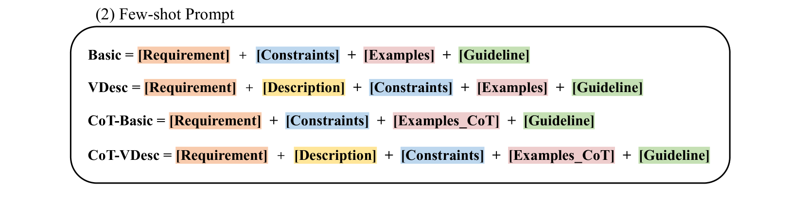

# 探索人类评估指南中的脆弱性：为实现自然语言生成评估的可靠性迈出初步研究的一步

发布时间：2024年06月12日

`LLM应用

理由：这篇论文主要关注的是自然语言生成（NLG）系统的质量评估，特别是评估指南的制定和漏洞检测。虽然它涉及到使用大型语言模型（LLMs）来检测评估指南中的漏洞，但其核心贡献在于提出了一个评估指南数据集和分类法，以及利用LLMs来提高评估的可靠性。这些工作更多地体现了LLMs在实际应用中的使用，即在NLG系统评估中的应用，而不是深入探讨LLMs的理论或Agent的设计与实现，也不是关于检索增强生成（RAG）的研究。因此，将其归类为LLM应用是合适的。` `评估标准`

> Defining and Detecting Vulnerability in Human Evaluation Guidelines: A Preliminary Study Towards Reliable NLG Evaluation

# 摘要

> 人类评估是衡量NLG系统质量的金标准，但评估指南这一关键要素却鲜为人重视。我们发现，顶级会议上的论文中，仅少数公布了评估指南，且多数存在缺陷。这些漏洞可能导致NLG评估失准，阻碍其正确发展。为此，我们创建了首个评估指南数据集，并提出了一个包含八种漏洞的分类法及编写原则。我们还开发了一种利用LLMs检测漏洞的方法，并提出了提升评估可靠性的建议。相关数据集和代码已公开，以供研究使用。

> Human evaluation serves as the gold standard for assessing the quality of Natural Language Generation (NLG) systems. Nevertheless, the evaluation guideline, as a pivotal element ensuring reliable and reproducible human assessment, has received limited attention.Our investigation revealed that only 29.84% of recent papers involving human evaluation at top conferences release their evaluation guidelines, with vulnerabilities identified in 77.09% of these guidelines. Unreliable evaluation guidelines can yield inaccurate assessment outcomes, potentially impeding the advancement of NLG in the right direction. To address these challenges, we take an initial step towards reliable evaluation guidelines and propose the first human evaluation guideline dataset by collecting annotations of guidelines extracted from existing papers as well as generated via Large Language Models (LLMs). We then introduce a taxonomy of eight vulnerabilities and formulate a principle for composing evaluation guidelines. Furthermore, a method for detecting guideline vulnerabilities has been explored using LLMs, and we offer a set of recommendations to enhance reliability in human evaluation. The annotated human evaluation guideline dataset and code for the vulnerability detection method are publicly available online.

[Arxiv](https://arxiv.org/abs/2406.07935)