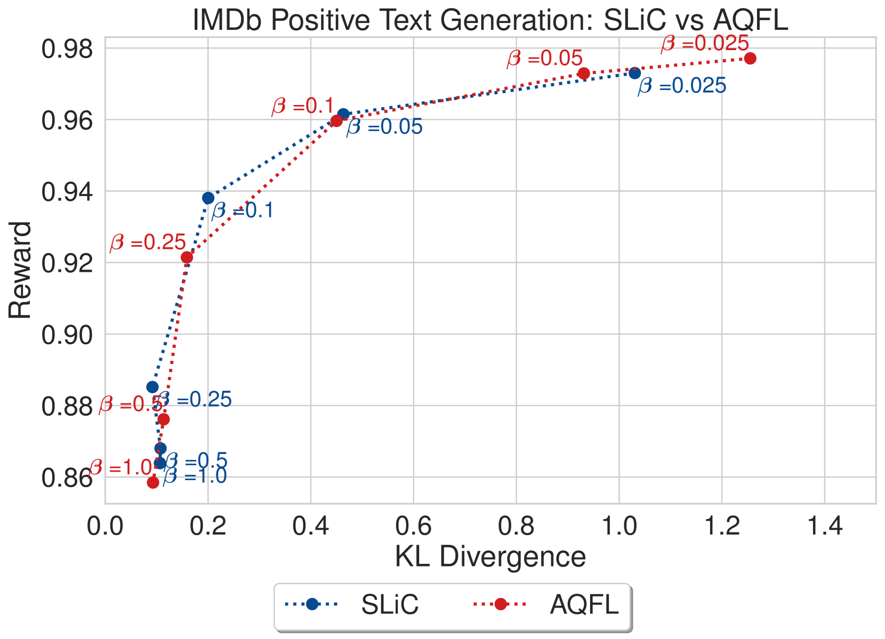

# 探索与大规模语言模型相适应的偏好优化算法

发布时间：2024年06月12日

`LLM理论

这篇论文探讨了大型语言模型（LLM）在离线偏好优化中的应用，提出了一种新的方法来自动发现和优化损失函数，以提高模型的输出质量。这种方法不依赖于传统的手工设计损失函数，而是通过LLM自身迭代提示来发现新的优化算法。这种研究深入探讨了LLM的理论和内部机制，特别是在损失函数设计和优化算法方面的创新，因此属于LLM理论分类。` `机器学习`

> Discovering Preference Optimization Algorithms with and for Large Language Models

# 摘要

> 离线偏好优化是提升大型语言模型（LLM）输出质量的关键手段。传统上，这一过程依赖于手工设计的凸损失函数进行离线监督学习，但这种方法受限于人类的创造力，未能充分探索损失函数的广阔空间。我们采用LLM驱动的目标发现方法，自动发掘无需人类专家介入的先进偏好优化算法。具体而言，我们通过迭代提示LLM，基于先前的性能评估指标提出并实施新的偏好优化损失函数，从而揭示了先前未知的、高效的优化算法。其中表现最优的算法我们命名为“发现偏好优化”（DiscoPOP），它巧妙地融合了逻辑与指数损失，自适应性强。实验结果显示，DiscoPOP不仅性能卓越，还能成功应用于未见任务，展现了其前沿地位。

> Offline preference optimization is a key method for enhancing and controlling the quality of Large Language Model (LLM) outputs. Typically, preference optimization is approached as an offline supervised learning task using manually-crafted convex loss functions. While these methods are based on theoretical insights, they are inherently constrained by human creativity, so the large search space of possible loss functions remains under explored. We address this by performing LLM-driven objective discovery to automatically discover new state-of-the-art preference optimization algorithms without (expert) human intervention. Specifically, we iteratively prompt an LLM to propose and implement new preference optimization loss functions based on previously-evaluated performance metrics. This process leads to the discovery of previously-unknown and performant preference optimization algorithms. The best performing of these we call Discovered Preference Optimization (DiscoPOP), a novel algorithm that adaptively blends logistic and exponential losses. Experiments demonstrate the state-of-the-art performance of DiscoPOP and its successful transfer to held-out tasks.

[Arxiv](https://arxiv.org/abs/2406.08414)