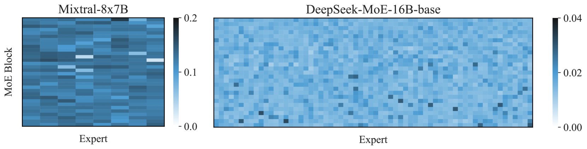
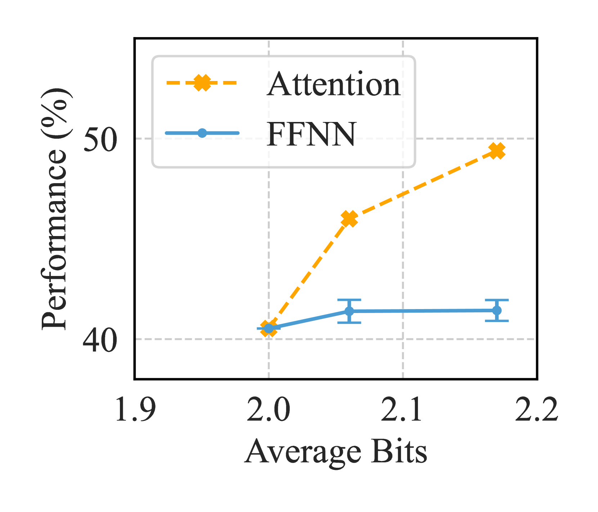
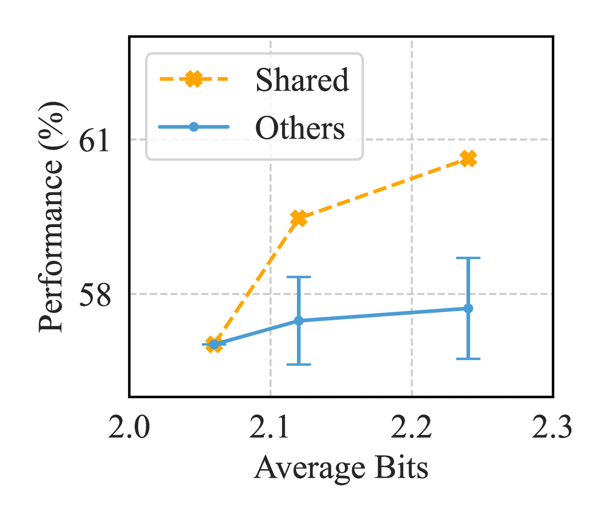
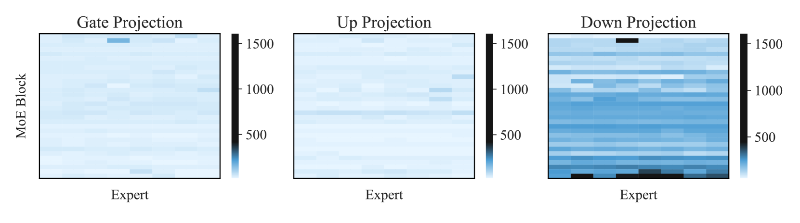
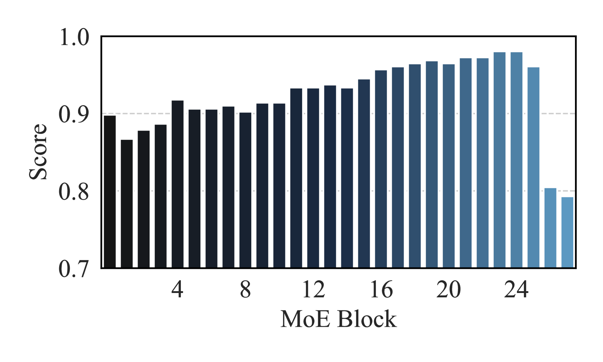
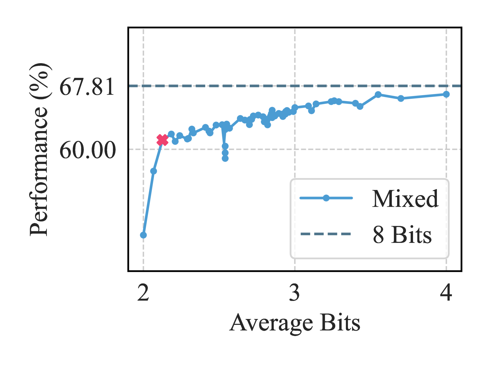

# 探究专家混合模型后的训练量化：一项基准评估

发布时间：2024年06月12日

`LLM理论

这篇论文主要探讨了大型语言模型（LLMs）中的混合专家（MoE）方法及其在模型压缩中的应用。论文深入分析了针对MoE结构的量化策略，并提出了新的量化优化方法。这些内容属于对LLMs理论层面的研究，特别是关于模型压缩和优化的技术细节。因此，它被归类为LLM理论。` `模型压缩`

> Examining Post-Training Quantization for Mixture-of-Experts: A Benchmark

# 摘要

> 大型语言模型（LLMs）在自然语言处理领域扮演着基石角色，其性能随着模型规模的扩大而提升。混合专家（MoE）方法通过稀疏激活减少了计算量，为更高效地扩展 LLMs 提供了希望。然而，MoE 方法的内存开销巨大，亟需模型压缩技术。后训练量化虽是常用的压缩手段，但因忽视了 MoE 的固有稀疏性，直接应用于 MoE 模型时效果不佳。本文深入探讨了多种针对 MoE 结构的量化策略，从整体块到单个线性权重，涵盖了从粗到细的不同粒度。研究发现，不同的 MoE 结构（如块、专家、线性层）在量化时需要不同数量的权重位，以确保既有效又高效。这些发现通过在两个典型 MoE 模型和六个任务上的广泛测试得到了验证。我们还创新性地引入了新的量化优化方法，更精准地识别出在 MoE 量化中需要更多位分配的关键权重，包括线性权重异常值评分器和 MoE 块评分器。后续实验进一步证实了这些发现，无论是在权重还是激活的量化上。

> Large Language Models~(LLMs) have become foundational in the realm of natural language processing, demonstrating performance improvements as model sizes increase. The Mixture-of-Experts~(MoE) approach offers a promising way to scale LLMs more efficiently by using fewer computational FLOPs through sparse activation. However, it suffers from significant memory overheads, necessitating model compression techniques. Post-training quantization, a popular method for model compression, proves less effective when directly applied to MoE models due to MoE's overlooked inherent sparsity. This paper explores several MoE structure-aware quantization heuristics, ranging from coarse to fine granularity, from MoE block to individual linear weight. Our investigations reveal critical principles: different MoE structures (i.e., blocks, experts, linear layers) require varying numbers of weight bits for effective and efficient quantization. Conclusions are supported by extensive benchmarking across two representative MoE models and six tasks. We further introduce novel enhancements to more accurately identify the most critical weights in MoE quantization that necessitate higher bit allocations, including the linear weight outlier scorer and MoE block scorer. Additionally, subsequent experiments validate our findings in the context of both weight and activation quantization.

[Arxiv](https://arxiv.org/abs/2406.08155)