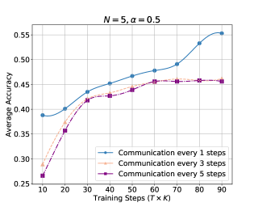

# FDLoRA：利用双重LoRA调优，个性化大型语言模型的联邦学习新策略

发布时间：2024年06月12日

`LLM应用

这篇论文主要探讨了如何通过联邦学习（FL）框架来优化大型语言模型（LLMs）的训练过程，特别是在处理分布式私有数据和减少计算资源消耗方面的应用。论文提出的FDLoRA框架通过个性化联邦学习方法，有效地整合了跨客户端的知识，同时降低了通信和计算成本。这种方法直接应用于LLMs的训练和优化，因此属于LLM应用类别。` `联邦学习` `个性化学习`

> FDLoRA: Personalized Federated Learning of Large Language Model via Dual LoRA Tuning

# 摘要

> 大型语言模型（LLMs）在多个领域中扮演着关键角色，但其训练过程耗费大量计算资源和标注数据，对个人用户而言颇具挑战。为此，我们引入了联邦学习（FL），一种能够在分布式私有数据上协同训练模型的方法。尽管如此，现有方法仍受困于数据异质性、系统异质性和模型大小的难题，导致性能不尽如人意且成本高昂。为此，我们提出了一种名为FDLoRA的个性化联邦学习框架变体，它支持单设备或集群作为客户端，并采用低秩适应（LoRA）进行调整。FDLoRA在每个客户端配置双LoRA模块，分别捕捉个性化与全局知识，仅全局LoRA模块向中央服务器上传参数以整合跨客户端知识。通过自适应融合技术，FDLoRA有效利用了分散在各客户端的私有数据，显著提升了客户端性能，同时避免了高昂的通信与计算开销。我们在两个实际场景中进行了详尽的实验，结果显示FDLoRA在性能、稳定性、鲁棒性、计算成本及通信成本方面均超越了六个基准方法。

> Large language models (LLMs) have emerged as important components across various fields, yet their training requires substantial computation resources and abundant labeled data. It poses a challenge to robustly training LLMs for individual users (clients). To tackle this challenge, the intuitive idea is to introduce federated learning (FL), which can collaboratively train models on distributed private data. However, existing methods suffer from the challenges of data heterogeneity, system heterogeneity, and model size, resulting in suboptimal performance and high costs. In this work, we proposed a variant of personalized federated learning (PFL) framework, namely FDLoRA, which allows the client to be a single device or a cluster and adopts low-rank adaptation (LoRA) tuning. FDLoRA sets dual LoRA modules on each client to capture personalized and global knowledge, respectively, and only the global LoRA module uploads parameters to the central server to aggregate cross-client knowledge. Finally, an adaptive fusion approach is employed to combine the parameters of the dual LoRAs. This enables FDLoRA to make effective use of private data distributed across different clients, thereby improving performance on the client without incurring high communication and computing costs. We conducted extensive experiments in two practice scenarios. The results demonstrate that FDLoRA outperforms six baselines in terms of performance, stability, robustness, computation cost, and communication cost.

[Arxiv](https://arxiv.org/abs/2406.07925)