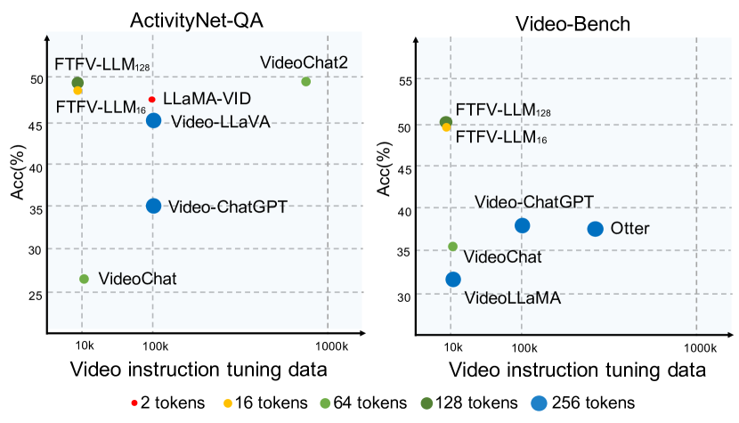
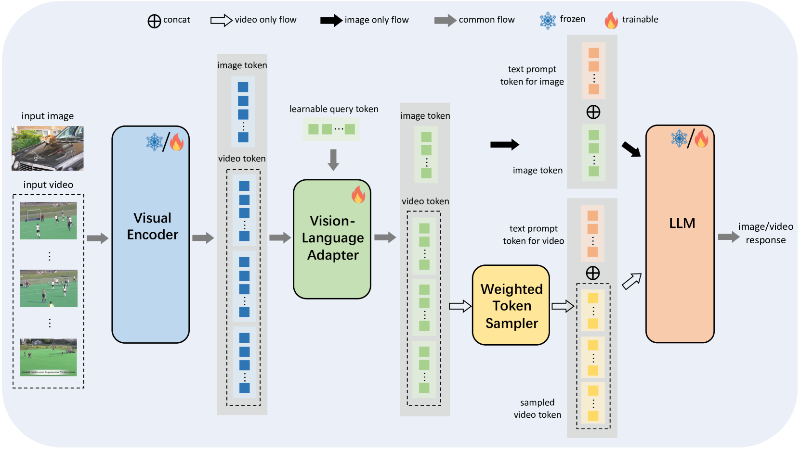
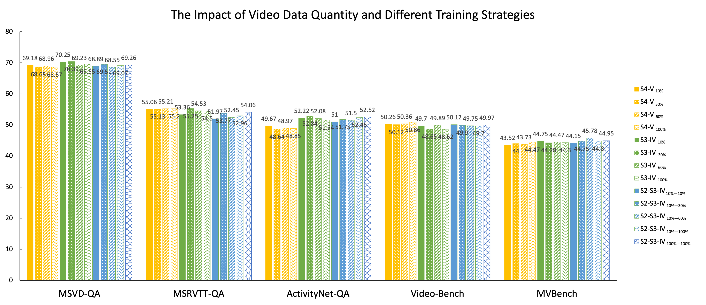

# 精简令牌与视频：拓展大型视觉-语言模型的视频理解潜能

发布时间：2024年06月12日

`LLM应用

这篇论文主要探讨了如何将基于图像的大型视觉-语言模型（image-LVLM）高效地转化为视频模型（video-LVLM），通过优化模型架构、创新训练策略，并精准选择视频指令数据类型。这一研究成果直接应用于改进和扩展现有的LLM技术，特别是在视觉-语言模型的视频处理能力上，因此属于LLM应用类别。` `视频处理` `人工智能`

> Fewer Tokens and Fewer Videos: Extending Video Understanding Abilities in Large Vision-Language Models

# 摘要

> 随着基于图像的大型视觉-语言模型（image-LVLM）技术的进步，向视频模型（video-LVLM）的转变因缺乏高质量视频数据而受阻。本文巧妙利用图像与视频间的视觉共性，将image-LVLM高效转化为video-LVLM。我们开发了一种经济高效的video-LVLM，通过优化模型架构、创新训练策略，并精准选择视频指令数据类型。创新的加权令牌采样器大幅减少每帧视频的视觉令牌，显著降低计算成本。实验表明，仅用10%的视频数据，相比以往模型，在多个训练阶段均取得显著成效。我们还探讨了在资源受限环境下，视频指令数据对模型性能的影响，强调了注重时间理解的视频训练数据的重要性。最终的FTFV-LVLM在视频和图像测试中表现卓越，充分证明了我们模型设计和训练策略的有效性。

> Amidst the advancements in image-based Large Vision-Language Models (image-LVLM), the transition to video-based models (video-LVLM) is hindered by the limited availability of quality video data. This paper addresses the challenge by leveraging the visual commonalities between images and videos to efficiently evolve image-LVLMs into video-LVLMs. We present a cost-effective video-LVLM that enhances model architecture, introduces innovative training strategies, and identifies the most effective types of video instruction data. Our innovative weighted token sampler significantly compresses the visual token numbers of each video frame, effectively cutting computational expenses. We also find that judiciously using just 10% of the video data, compared to prior video-LVLMs, yields impressive results during various training phases. Moreover, we delve into the influence of video instruction data in limited-resource settings, highlighting the significance of incorporating video training data that emphasizes temporal understanding to enhance model performance. The resulting Fewer Tokens and Fewer Videos LVLM (FTFV-LVLM) exhibits exceptional performance across video and image benchmarks, validating our model's design and training approaches.

[Arxiv](https://arxiv.org/abs/2406.08024)