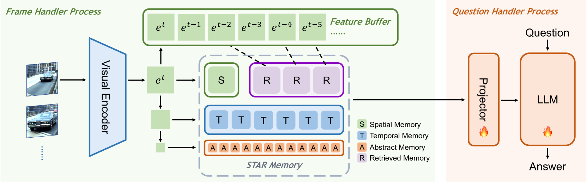

# Flash-VStream：长视频流实时理解的内存解决方案

发布时间：2024年06月12日

`Agent

理由：这篇论文介绍了一种名为Flash-VStream的视频语言模型，该模型能够实时处理长视频流并即时响应查询，模拟人类记忆机制。这种模型可以被视为一个智能Agent，因为它能够自主地处理输入的视频流并提供即时的响应，类似于一个智能体在动态环境中进行决策和交互。此外，论文中提到的模型特别适合在线视频流理解，这进一步强调了其在实时交互和决策制定方面的Agent特性。因此，将其归类为Agent是合适的。` `在线视频流` `视频理解`

> Flash-VStream: Memory-Based Real-Time Understanding for Long Video Streams

# 摘要

> 受益于大型语言模型和跨模态技术的进步，多模态视频理解在离线场景中已大放异彩。然而，在线视频流这一现实世界中的常见媒体形式，却鲜为人关注。在线视频流的动态特性为现有模型带来了挑战，涉及极长期信息存储和视觉内容与用户问题的异步交互。为此，我们推出了Flash-VStream，一种模拟人类记忆机制的视频语言模型，能实时处理长视频流并即时响应查询。相较于现有技术，Flash-VStream大幅降低了推理延迟和资源消耗，特别适合在线视频流理解。针对现有基准多聚焦于离线场景的现状，我们创建了VStream-QA，一个专为在线视频流理解量身打造的问答基准。在该基准上，我们的方法展现出超越现有技术的优势。此外，我们在传统视频理解基准上的测试也验证了其离线场景下的顶尖性能。所有相关资源均已公开，详情请访问https://invinciblewyq.github.io/vstream-page/。

> Benefiting from the advancements in large language models and cross-modal alignment, existing multi-modal video understanding methods have achieved prominent performance in offline scenario. However, online video streams, as one of the most common media forms in the real world, have seldom received attention. Compared to offline videos, the 'dynamic' nature of online video streams poses challenges for the direct application of existing models and introduces new problems, such as the storage of extremely long-term information, interaction between continuous visual content and 'asynchronous' user questions. Therefore, in this paper we present Flash-VStream, a video-language model that simulates the memory mechanism of human. Our model is able to process extremely long video streams in real-time and respond to user queries simultaneously. Compared to existing models, Flash-VStream achieves significant reductions in inference latency and VRAM consumption, which is intimately related to performing understanding of online streaming video. In addition, given that existing video understanding benchmarks predominantly concentrate on offline scenario, we propose VStream-QA, a novel question answering benchmark specifically designed for online video streaming understanding. Comparisons with popular existing methods on the proposed benchmark demonstrate the superiority of our method for such challenging setting. To verify the generalizability of our approach, we further evaluate it on existing video understanding benchmarks and achieves state-of-the-art performance in offline scenarios as well. All code, models, and datasets are available at the https://invinciblewyq.github.io/vstream-page/

[Arxiv](https://arxiv.org/abs/2406.08085)