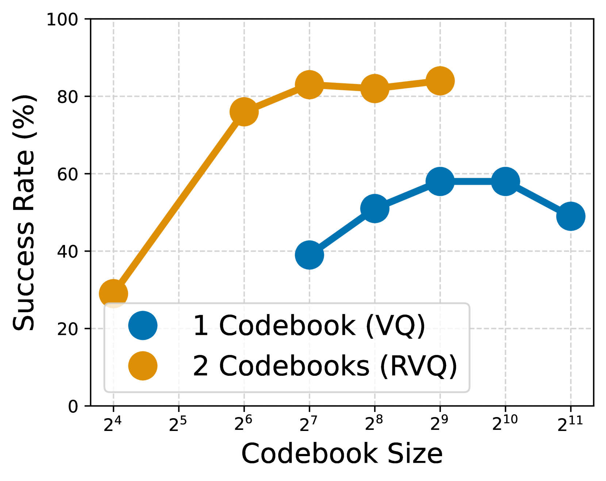

# 融合动作基础的多模态大型语言模型

发布时间：2024年06月12日

`Agent

理由：这篇论文主要探讨了如何将多模态大型语言模型（MLLMs）应用于具身AI中，通过统一架构和动作空间适配器来优化模型的性能。这种研究涉及到模型的具体应用和集成，特别是在具身AI中的应用，这与Agent的定义相符，即一个能够感知环境并采取行动以达到目标的系统。因此，这篇论文更适合归类为Agent。` `具身AI` `机器人技术`

> Grounding Multimodal Large Language Models in Actions

# 摘要

> 多模态大型语言模型（MLLMs）在多个领域，包括具身AI，展现了其卓越能力。本研究聚焦于如何将MLLM巧妙融入不同具身及其动作空间，以充分利用其多模态知识。我们通过统一架构和动作空间适配器，探索了多种方法。对于连续动作，我们发现学习型标记化能提供精准建模，从而在下游任务中表现卓越。对于离散动作，我们发现与MLLM的原始输出标记空间进行语义对齐，能显著提升性能。通过在五个不同环境中对七个动作空间适配器进行详尽研究，涵盖114个具身任务，我们得出了这些宝贵见解。

> Multimodal Large Language Models (MLLMs) have demonstrated a wide range of capabilities across many domains, including Embodied AI. In this work, we study how to best ground a MLLM into different embodiments and their associated action spaces, with the goal of leveraging the multimodal world knowledge of the MLLM. We first generalize a number of methods through a unified architecture and the lens of action space adaptors. For continuous actions, we show that a learned tokenization allows for sufficient modeling precision, yielding the best performance on downstream tasks. For discrete actions, we demonstrate that semantically aligning these actions with the native output token space of the MLLM leads to the strongest performance. We arrive at these lessons via a thorough study of seven action space adapters on five different environments, encompassing over 114 embodied tasks.

[Arxiv](https://arxiv.org/abs/2406.07904)