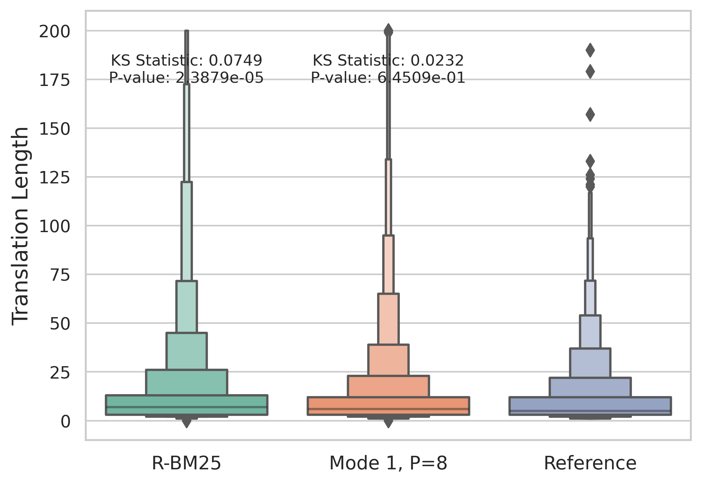
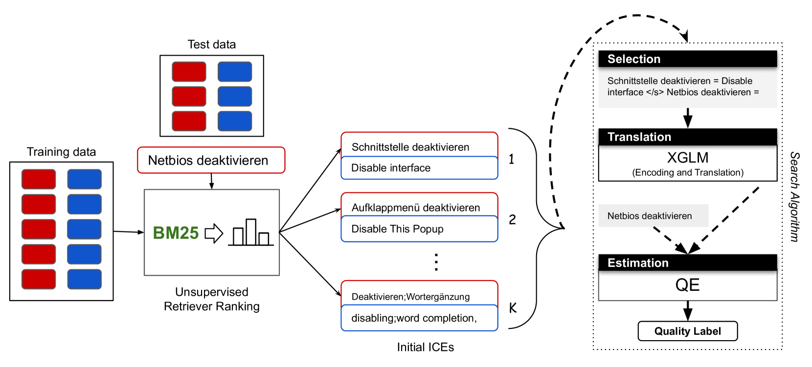

# 利用质量评估引导 LLMs 的上下文学习，优化机器翻译效果

发布时间：2024年06月12日

`LLM应用

这篇论文主要探讨了大型语言模型（LLMs）在机器翻译（MT）中的应用，特别是在如何通过改进上下文示例（ICEs）的选择来提高翻译质量。论文提出了一种新的方法，利用特定领域质量评估（QE）指导的搜索算法来精选ICEs，这种方法利用了XGLM模型来评估翻译质量，无需翻译参考。这一方法在提升翻译质量方面超越了现有的ICL方法及微调mBART-50等预训练语言模型的表现。因此，这篇论文的内容更偏向于LLM的具体应用，而不是理论研究或Agent、RAG相关的研究。` `机器翻译` `质量评估`

> Guiding In-Context Learning of LLMs through Quality Estimation for Machine Translation

# 摘要

> 大型语言模型（LLMs）在机器翻译（MT）中的输出质量，很大程度上取决于伴随查询提供的上下文示例（ICEs）的质量。ICEs的有效性受源文本领域、呈现顺序、示例数量及提示模板等多种因素影响。本文提出了一种创新的ICL方法，通过特定领域质量评估（QE）指导的搜索算法，利用XGLM模型无需翻译参考即可精准评估翻译质量，从而为MT精选ICEs，显著提升翻译质量，超越了现有ICL方法及微调mBART-50等预训练语言模型的表现。

> The quality of output from large language models (LLMs), particularly in machine translation (MT), is closely tied to the quality of in-context examples (ICEs) provided along with the query, i.e., the text to translate. The effectiveness of these ICEs is influenced by various factors, such as the domain of the source text, the order in which the ICEs are presented, the number of these examples, and the prompt templates used. Naturally, selecting the most impactful ICEs depends on understanding how these affect the resulting translation quality, which ultimately relies on translation references or human judgment. This paper presents a novel methodology for in-context learning (ICL) that relies on a search algorithm guided by domain-specific quality estimation (QE). Leveraging the XGLM model, our methodology estimates the resulting translation quality without the need for translation references, selecting effective ICEs for MT to maximize translation quality. Our results demonstrate significant improvements over existing ICL methods and higher translation performance compared to fine-tuning a pre-trained language model (PLM), specifically mBART-50.

[Arxiv](https://arxiv.org/abs/2406.07970)