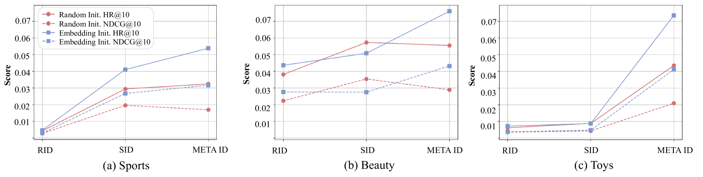

# 优化大型语言模型，使其能有效处理推荐系统中的超词汇标记

发布时间：2024年06月12日

`LLM应用

这篇论文探讨了在基于大型语言模型（LLMs）的推荐系统中如何有效地标记化用户和物品，特别强调了词汇外（OOV）标记的重要性。通过聚类历史用户-物品交互的表示，论文提出了一种方法来共享具有相似属性的用户/物品组合的OOV标记，并将这些标记融入LLM词汇中，以增强在下游任务微调中对用户和物品的区分能力。这种方法在多个下游推荐任务中超越了现有最佳方法，因此属于LLM应用类别。` `推荐系统` `用户行为分析`

> Improving LLMs for Recommendation with Out-Of-Vocabulary Tokens

# 摘要

> 在推荐系统中，通过向量描述用户和物品至关重要。近期研究尝试利用大型语言模型（LLMs）通过问答方式进行推荐，其中用户和物品（如物品编号2024）被表示为词汇内标记（如“物品”、“20”、“24”）。然而，由于LLMs主要针对自然语言任务预训练，这些词汇内标记难以准确表达独特的用户和物品，导致推荐能力在微调后仍受限。本文探讨了如何在基于LLM的推荐系统中有效标记化用户和物品，强调了词汇外（OOV）标记的重要性，并主张记忆捕捉用户/物品相关性和OOV标记多样性的OOV标记。通过聚类历史用户-物品交互的表示，我们使得具有相似属性的用户/物品组合共享相同的OOV标记。将这些OOV标记融入LLM词汇，有助于在下游任务微调中更好地区分用户和物品，增强用户-物品关系的捕捉。我们的框架在多个下游推荐任务中超越了现有最佳方法。

> Characterizing users and items through vector representations is crucial for various tasks in recommender systems. Recent approaches attempt to apply Large Language Models (LLMs) in recommendation through a question and answer format, where real users and items (e.g., Item No.2024) are represented with in-vocabulary tokens (e.g., "item", "20", "24"). However, since LLMs are typically pretrained on natural language tasks, these in-vocabulary tokens lack the expressive power for distinctive users and items, thereby weakening the recommendation ability even after fine-tuning on recommendation tasks. In this paper, we explore how to effectively tokenize users and items in LLM-based recommender systems. We emphasize the role of out-of-vocabulary (OOV) tokens in addition to the in-vocabulary ones and claim the memorization of OOV tokens that capture correlations of users/items as well as diversity of OOV tokens. By clustering the learned representations from historical user-item interactions, we make the representations of user/item combinations share the same OOV tokens if they have similar properties. Furthermore, integrating these OOV tokens into the LLM's vocabulary allows for better distinction between users and items and enhanced capture of user-item relationships during fine-tuning on downstream tasks. Our proposed framework outperforms existing state-of-the-art methods across various downstream recommendation tasks.

[Arxiv](https://arxiv.org/abs/2406.08477)