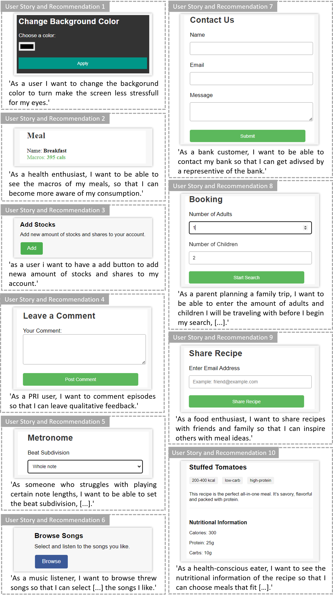

# 用户故事与GUI原型互连：基于LLM的半自动方法探索

发布时间：2024年06月12日

`LLM应用

这篇论文介绍了一种基于大型语言模型（LLM）的新方法，用于协助验证GUI原型中基于功能性自然语言（NL）需求实现的正确性，并提供实现这些需求的合适GUI组件的建议。这种方法直接应用于实际的软件开发过程中，特别是在GUI原型设计阶段，以提高效率和准确性。因此，它属于LLM应用类别，因为它展示了LLM在实际应用场景中的使用，特别是在解决具体的技术问题，如GUI原型设计的需求验证和组件推荐。` `软件开发` `用户体验设计`

> Interlinking User Stories and GUI Prototyping: A Semi-Automatic LLM-based Approach

# 摘要

> 在当今世界，交互式系统无处不在，创建图形用户界面（GUIs）的需求也随之普遍。GUI原型设计作为一种有效的需求获取和验证技术，通常在收集了以自然语言（NL）表示的初步用户需求（如用户故事）后使用。然而，这一过程往往资源密集，成本高昂且耗时。尽管市面上有多种易用的原型工具，但根据用户需求开发GUI原型仍面临资源不足的问题。为此，我们提出了一种基于大型语言模型（LLM）的新方法，旨在协助验证GUI原型中基于功能性NL需求实现的正确性，并提供实现这些需求的合适GUI组件的建议。我们收集了现有GUI的用户故事需求，并评估了我们的验证和推荐方法。结果显示，该方法在用户故事验证方面表现出色，并证明了GUI组件推荐的实用性。

> Interactive systems are omnipresent today and the need to create graphical user interfaces (GUIs) is just as ubiquitous. For the elicitation and validation of requirements, GUI prototyping is a well-known and effective technique, typically employed after gathering initial user requirements represented in natural language (NL) (e.g., in the form of user stories). Unfortunately, GUI prototyping often requires extensive resources, resulting in a costly and time-consuming process. Despite various easy-to-use prototyping tools in practice, there is often a lack of adequate resources for developing GUI prototypes based on given user requirements. In this work, we present a novel Large Language Model (LLM)-based approach providing assistance for validating the implementation of functional NL-based requirements in a GUI prototype embedded in a prototyping tool. In particular, our approach aims to detect functional user stories that are not implemented in a GUI prototype and provides recommendations for suitable GUI components directly implementing the requirements. We collected requirements for existing GUIs in the form of user stories and evaluated our proposed validation and recommendation approach with this dataset. The obtained results are promising for user story validation and we demonstrate feasibility for the GUI component recommendations.

[Arxiv](https://arxiv.org/abs/2406.08120)