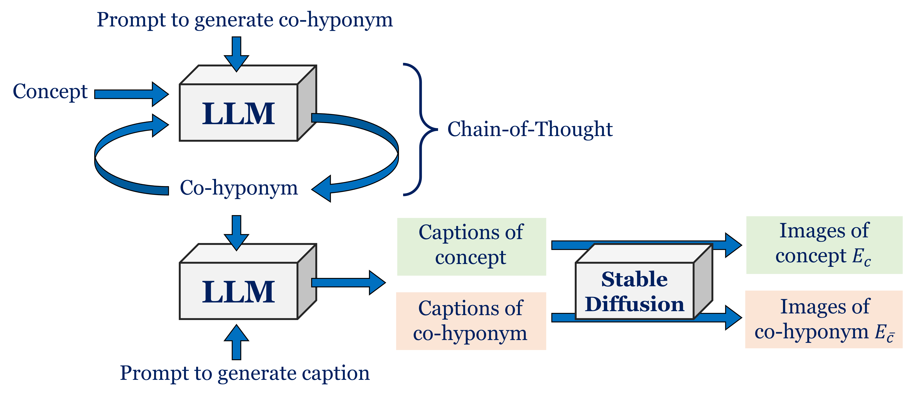
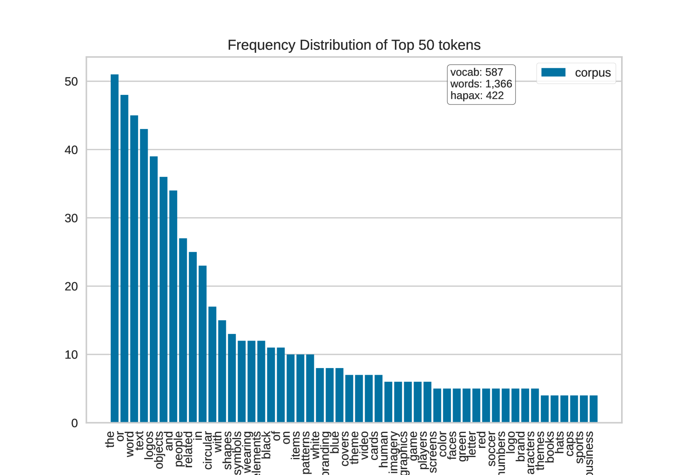
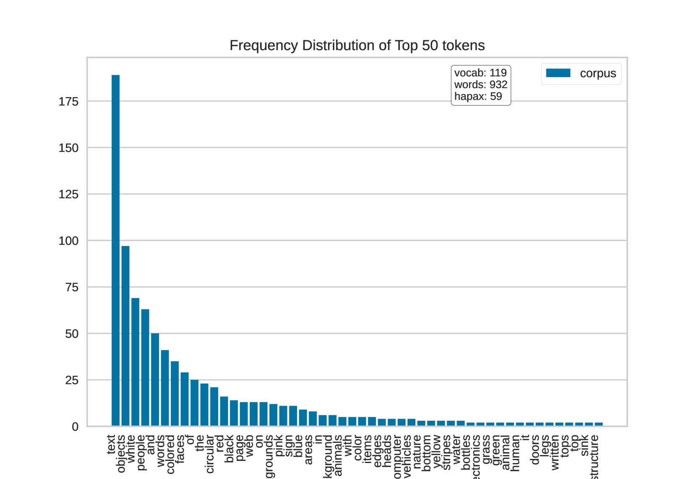
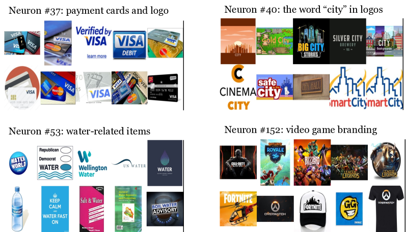
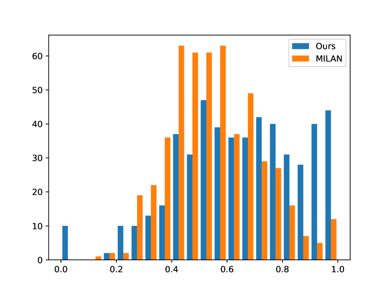

# 利用LLM辅助进行概念发现：自动揭示并阐释神经元的作用

发布时间：2024年06月12日

`LLM理论

理由：这篇论文主要探讨了如何利用多模态大型语言模型（LLM）来自动探索和发现深度神经网络（DNNs）中神经元的新概念解释。这种方法涉及理论层面的创新，即如何通过LLM来理解和解释DNNs的工作原理，而不是直接应用LLM到某个具体的应用场景。因此，这篇论文更符合LLM理论的分类。` `自动化工具`

> LLM-assisted Concept Discovery: Automatically Identifying and Explaining Neuron Functions

# 摘要

> 理解深度神经网络（DNNs）的工作原理，关键在于为其中的神经元提供基于文本的概念解释。以往的研究通过预设的概念集或示例来关联神经元与概念，这限制了新概念的发现，并需要用户手动定义概念。为此，我们提出了一种新方法，利用多模态大型语言模型自动探索并发现新概念。这种方法摆脱了预设概念的束缚，能够揭示更贴近模型实际行为的新颖解释性概念。我们通过生成正反例并测试神经元对新图像集的反应来验证这些概念的有效性。这一创新方法不仅能够自动发现新概念，还能即时验证其准确性，为深度神经网络的解释提供了一个强有力的自动化工具。

> Providing textual concept-based explanations for neurons in deep neural networks (DNNs) is of importance in understanding how a DNN model works. Prior works have associated concepts with neurons based on examples of concepts or a pre-defined set of concepts, thus limiting possible explanations to what the user expects, especially in discovering new concepts. Furthermore, defining the set of concepts requires manual work from the user, either by directly specifying them or collecting examples. To overcome these, we propose to leverage multimodal large language models for automatic and open-ended concept discovery. We show that, without a restricted set of pre-defined concepts, our method gives rise to novel interpretable concepts that are more faithful to the model's behavior. To quantify this, we validate each concept by generating examples and counterexamples and evaluating the neuron's response on this new set of images. Collectively, our method can discover concepts and simultaneously validate them, providing a credible automated tool to explain deep neural networks.

[Arxiv](https://arxiv.org/abs/2406.08572)