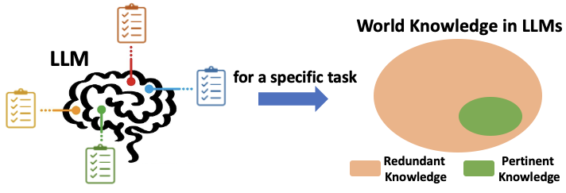
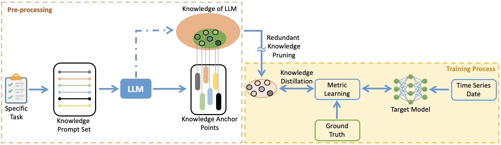
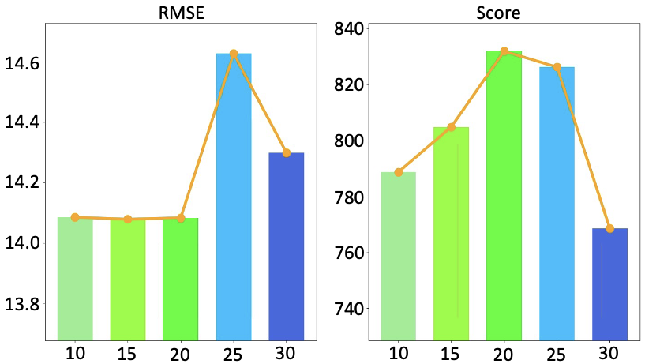

# 利用LLM进行知识剪枝，优化边缘设备上的时间序列数据分析

发布时间：2024年06月12日

`LLM应用

这篇论文主要探讨了在资源受限环境中如何有效利用大型语言模型（LLMs）处理时间序列数据的问题。通过提出一种名为知识剪枝（KP）的创新方法，该论文展示了如何精简模型以保留对特定任务有用的知识，从而降低模型大小和计算成本，提高模型在特定任务上的性能。这种方法的应用性质明显，因此将其归类为LLM应用。` `时间序列分析` `机器学习`

> LLM-based Knowledge Pruning for Time Series Data Analytics on Edge-computing Devices

# 摘要

> 时间序列数据的规模和多样性限制了神经网络的性能，导致过拟合并表现不佳。而大型语言模型（LLMs）则在多个领域展现出卓越的泛化能力。尽管基于LLM的时间序列处理方法层出不穷，但它们在资源受限环境中因高计算需求而难以应用。为此，我们提出了一种创新方法——知识剪枝（KP），旨在精简模型，仅保留对特定任务有用的“相关知识”。KP不仅大幅降低了模型大小和计算成本，还无需在训练和测试时加载整个LLM，从而减轻了计算负担。实验证明，KP使轻量级网络能够高效学习相关知识，以低成本实现了显著的性能提升，回归任务平均提升19.7%，分类任务最高提升13.7%，达到了业界领先水平。

> Limited by the scale and diversity of time series data, the neural networks trained on time series data often overfit and show unsatisfacotry performances. In comparison, large language models (LLMs) recently exhibit impressive generalization in diverse fields. Although massive LLM based approaches are proposed for time series tasks, these methods require to load the whole LLM in both training and reference. This high computational demands limit practical applications in resource-constrained settings, like edge-computing and IoT devices. To address this issue, we propose Knowledge Pruning (KP), a novel paradigm for time series learning in this paper. For a specific downstream task, we argue that the world knowledge learned by LLMs is much redundant and only the related knowledge termed as "pertinent knowledge" is useful. Unlike other methods, our KP targets to prune the redundant knowledge and only distill the pertinent knowledge into the target model. This reduces model size and computational costs significantly. Additionally, different from existing LLM based approaches, our KP does not require to load the LLM in the process of training and testing, further easing computational burdens. With our proposed KP, a lightweight network can effectively learn the pertinent knowledge, achieving satisfactory performances with a low computation cost. To verify the effectiveness of our KP, two fundamental tasks on edge-computing devices are investigated in our experiments, where eight diverse environments or benchmarks with different networks are used to verify the generalization of our KP. Through experiments, our KP demonstrates effective learning of pertinent knowledge, achieving notable performance improvements in regression (19.7% on average) and classification (up to 13.7%) tasks, showcasing state-of-the-art results.

[Arxiv](https://arxiv.org/abs/2406.08765)