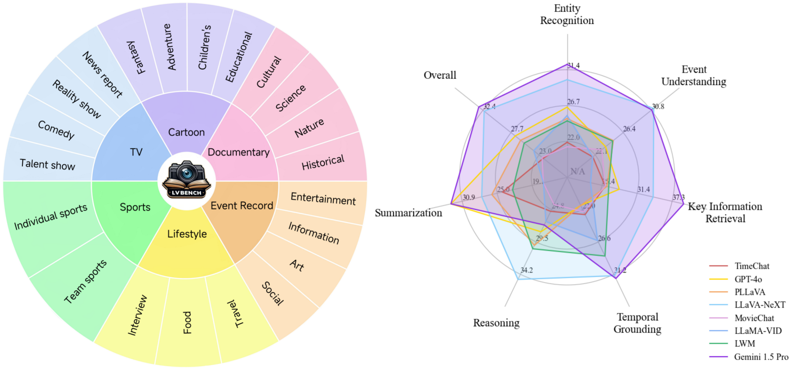
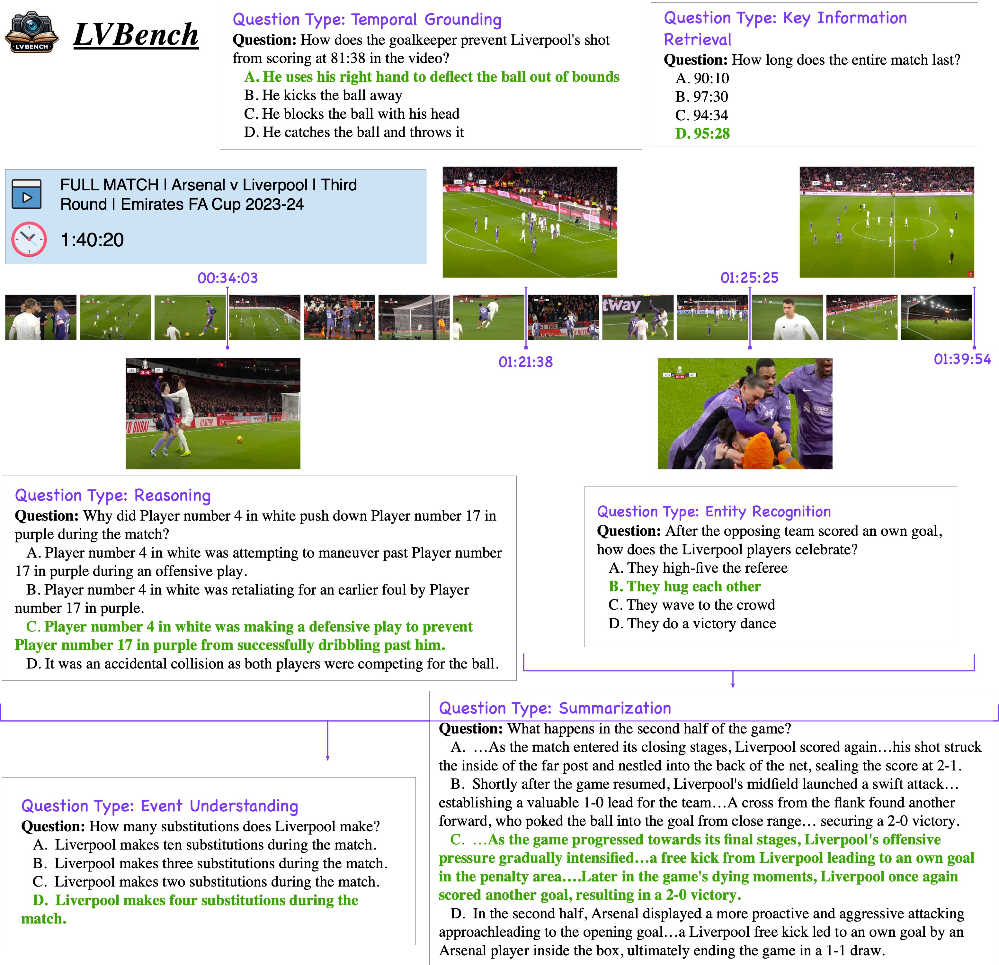
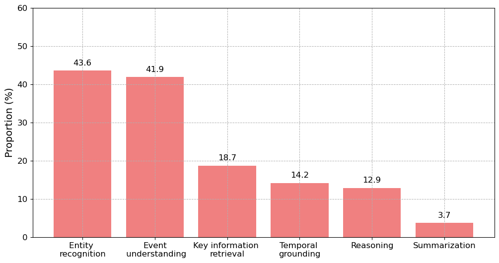
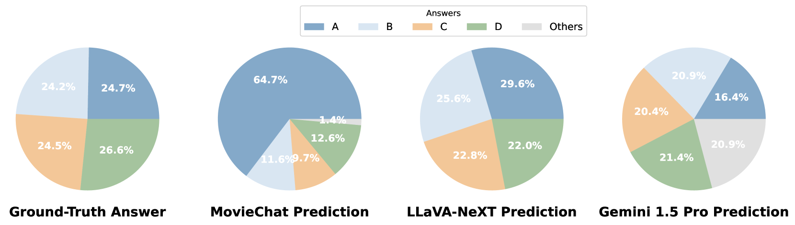
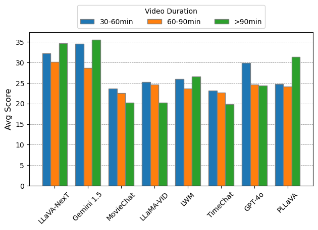
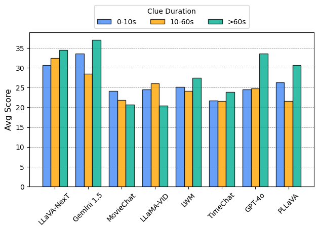
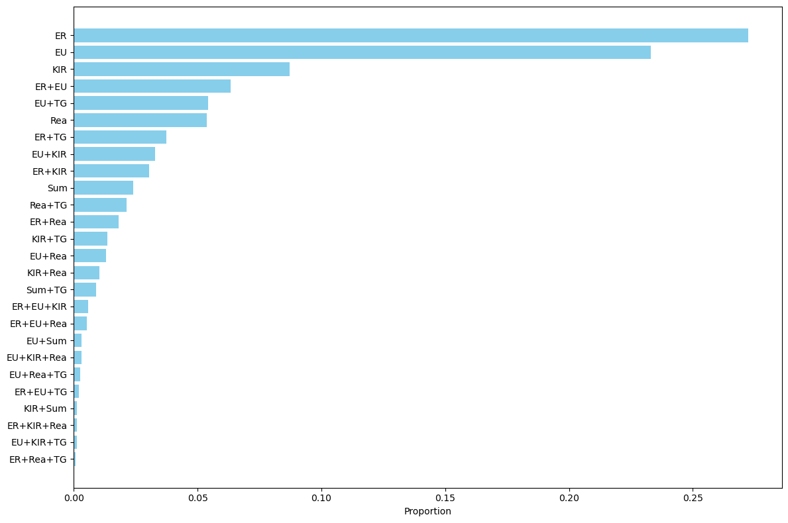

# LVBench：极端长视频理解的全新基准

发布时间：2024年06月12日

`Agent

这篇论文介绍了LVBench，一个专为长视频理解设计的基准，它挑战了多模态模型的长期记忆和深度理解能力。这与智能体（Agent）的分类相关，因为智能体通常需要处理和理解复杂、长时间序列的数据，如长视频，以进行决策和交互。此外，论文中提到的应用场景，如长期决策的智能体、深度电影分析及实时体育评论，都是智能体可能涉及的任务。因此，将这篇论文归类为Agent是合适的。` `视频分析` `人工智能`

> LVBench: An Extreme Long Video Understanding Benchmark

# 摘要

> 多模态大型语言模型的最新进展显著提升了对短视频的理解，但面对需要深入理解数小时长视频的实际应用，如长期决策的智能体、深度电影分析及实时体育评论，这些进步都显得力不从心。为此，我们推出了LVBench，一个专为长视频理解量身打造的基准。该数据集包含多样化的公开视频，旨在全面测试长视频的理解与信息提取能力。LVBench旨在考验多模态模型的长期记忆与深度理解力，而我们的评估表明，现有模型在这些高难度的长视频理解任务上仍有提升空间。通过LVBench，我们期望激发更先进模型的研发，以应对长视频理解的挑战。相关数据和代码已公开，详情请访问：https://lvbench.github.io。

> Recent progress in multimodal large language models has markedly enhanced the understanding of short videos (typically under one minute), and several evaluation datasets have emerged accordingly. However, these advancements fall short of meeting the demands of real-world applications such as embodied intelligence for long-term decision-making, in-depth movie reviews and discussions, and live sports commentary, all of which require comprehension of long videos spanning several hours. To address this gap, we introduce LVBench, a benchmark specifically designed for long video understanding. Our dataset comprises publicly sourced videos and encompasses a diverse set of tasks aimed at long video comprehension and information extraction. LVBench is designed to challenge multimodal models to demonstrate long-term memory and extended comprehension capabilities. Our extensive evaluations reveal that current multimodal models still underperform on these demanding long video understanding tasks. Through LVBench, we aim to spur the development of more advanced models capable of tackling the complexities of long video comprehension. Our data and code are publicly available at: https://lvbench.github.io.

[Arxiv](https://arxiv.org/abs/2406.08035)