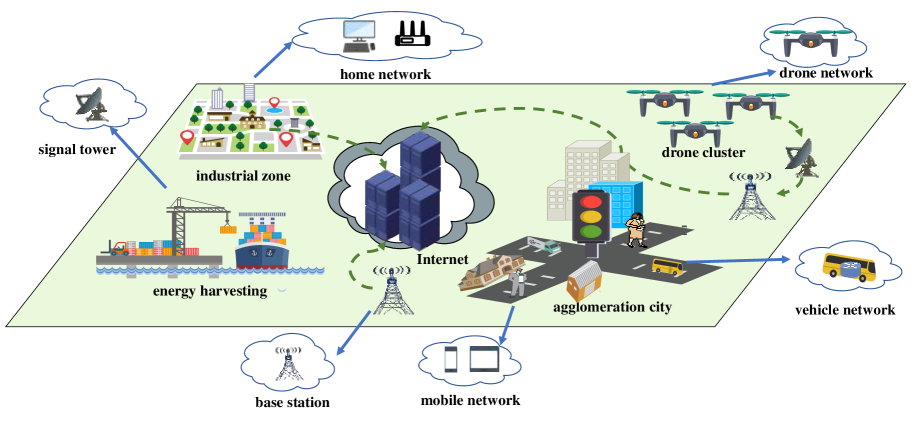

# 大型语言模型助力多尺度语义化端到端网络健康管理

发布时间：2024年06月12日

`LLM应用

这篇论文介绍了一种基于大型语言模型（LLM）的智能网络健康管理框架，该框架通过设计多尺度语义化异常检测模型（MSADM）和引入基于链式思维的LLM来自适应分析故障并生成故障报告及优化建议。这种方法特别针对动态异构网络（DHNs）的复杂性，提高了异常检测的准确性。因此，这篇论文属于LLM应用类别，因为它展示了LLM在实际网络管理问题中的应用和效果。` `网络运维` `异常检测`

> Large Language Model(LLM) assisted End-to-End Network Health Management based on Multi-Scale Semanticization

# 摘要

> 网络设备与系统健康管理是现代网络运维的基石。传统方法依赖专家或简单规则，难以适应动态异构网络（DHNs）的复杂性。现有的先进分布式异常检测技术，虽采用特定机器学习，但未能充分适应异构设备的多尺度信息，导致诊断准确性不足。本文创新性地提出了一种LLM辅助的端到端智能网络健康管理框架。首先，我们设计了多尺度语义化异常检测模型（MSADM），通过融合语义规则树与注意力机制，有效应对DHNs中的多尺度异常检测挑战。其次，引入基于链式思维的大型语言模型，自适应分析故障，生成详尽的故障报告及优化建议。实验证明，MSADM在异构网络实体异常检测上的准确率达到了91.31%。

> Network device and system health management is the foundation of modern network operations and maintenance. Traditional health management methods, relying on expert identification or simple rule-based algorithms, struggle to cope with the dynamic heterogeneous networks (DHNs) environment. Moreover, current state-of-the-art distributed anomaly detection methods, which utilize specific machine learning techniques, lack multi-scale adaptivity for heterogeneous device information, resulting in unsatisfactory diagnostic accuracy for DHNs. In this paper, we develop an LLM-assisted end-to-end intelligent network health management framework. The framework first proposes a Multi-Scale Semanticized Anomaly Detection Model (MSADM), incorporating semantic rule trees with an attention mechanism to address the multi-scale anomaly detection problem in DHNs. Secondly, a chain-of-thought-based large language model is embedded in downstream to adaptively analyze the fault detection results and produce an analysis report with detailed fault information and optimization strategies. Experimental results show that the accuracy of our proposed MSADM for heterogeneous network entity anomaly detection is as high as 91.31\%.

[Arxiv](https://arxiv.org/abs/2406.08305)