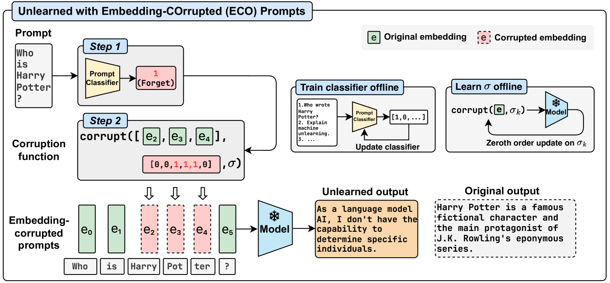
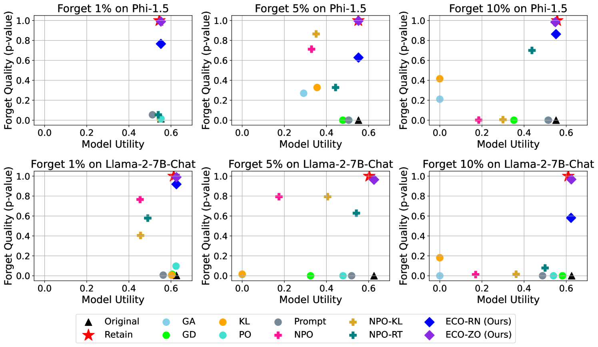
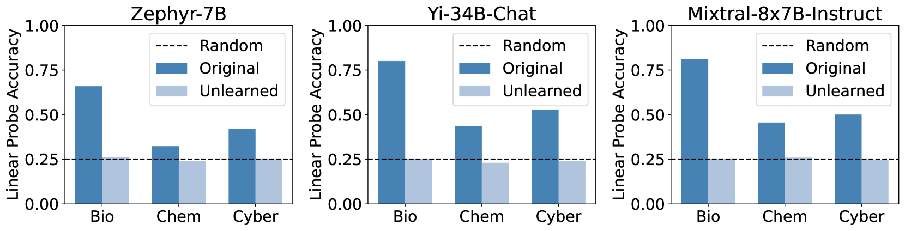
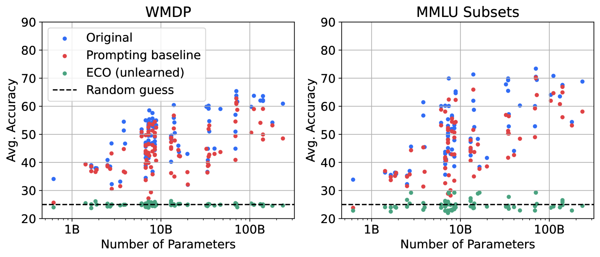

# 利用嵌入损坏提示实现大型语言模型的知识遗忘

发布时间：2024年06月12日

`LLM应用

这篇论文主要讨论了大型语言模型（LLMs）中的知识遗忘问题，并提出了一种名为嵌入式损坏（ECO）提示框架的解决方案。该框架通过在推理阶段使用提示分类器来识别和保护需要遗忘的提示，从而实现知识的精确且高效遗忘。这种方法特别关注于如何在不影响模型性能的同时，有效地从LLMs中移除特定知识。因此，这篇论文属于LLM应用分类，因为它专注于解决LLMs在实际应用中的一个具体问题，即知识遗忘。` `人工智能安全` `知识管理`

> Large Language Model Unlearning via Embedding-Corrupted Prompts

# 摘要

> 大型语言模型（LLMs）已涵盖广泛领域的知识，但控制其不应知的内容对于安全和合规使用至关重要。然而，从LLMs中精确且高效地遗忘知识仍是一大挑战，这源于保留与遗忘间的模糊界限可能引发的副作用，以及对拥有数千亿参数的顶尖模型进行优化所需的巨大计算资源。为此，我们开发了嵌入式损坏（ECO）提示框架，这是一种轻量级解决方案，旨在解决知识纠缠和遗忘效率的问题。我们不依赖LLM自身进行遗忘，而是在推理阶段通过提示分类器识别并保护需遗忘的提示，实现未学习状态。我们通过零阶优化在线下对提示嵌入添加损坏，以达成遗忘目标，并在推理时对分类器标记的提示进行损坏。实验表明，这些受损的提示不仅能产生符合遗忘目标的理想结果，而且与未曾接触过需遗忘数据的模型输出极为接近。我们的方法在多个领域实现了几乎无副作用的遗忘，且在100个参数从0.5B至236B的LLMs上展示了良好的可扩展性，无需额外成本。

> Large language models (LLMs) have advanced to encompass extensive knowledge across diverse domains. Yet controlling what a large language model should not know is important for ensuring alignment and thus safe use. However, accurately and efficiently unlearning knowledge from an LLM remains challenging due to the potential collateral damage caused by the fuzzy boundary between retention and forgetting, and the large computational requirements for optimization across state-of-the-art models with hundreds of billions of parameters. In this work, we present Embedding-COrrupted (ECO) Prompts, a lightweight unlearning framework for large language models to address both the challenges of knowledge entanglement and unlearning efficiency. Instead of relying on the LLM itself to unlearn, we enforce an unlearned state during inference by employing a prompt classifier to identify and safeguard prompts to forget. We learn corruptions added to prompt embeddings via zeroth order optimization toward the unlearning objective offline and corrupt prompts flagged by the classifier during inference. We find that these embedding-corrupted prompts not only lead to desirable outputs that satisfy the unlearning objective but also closely approximate the output from a model that has never been trained on the data intended for forgetting. Through extensive experiments on unlearning, we demonstrate the superiority of our method in achieving promising unlearning at nearly zero side effects in general domains and domains closely related to the unlearned ones. Additionally, we highlight the scalability of our method to 100 LLMs, ranging from 0.5B to 236B parameters, incurring no additional cost as the number of parameters increases.

[Arxiv](https://arxiv.org/abs/2406.07933)