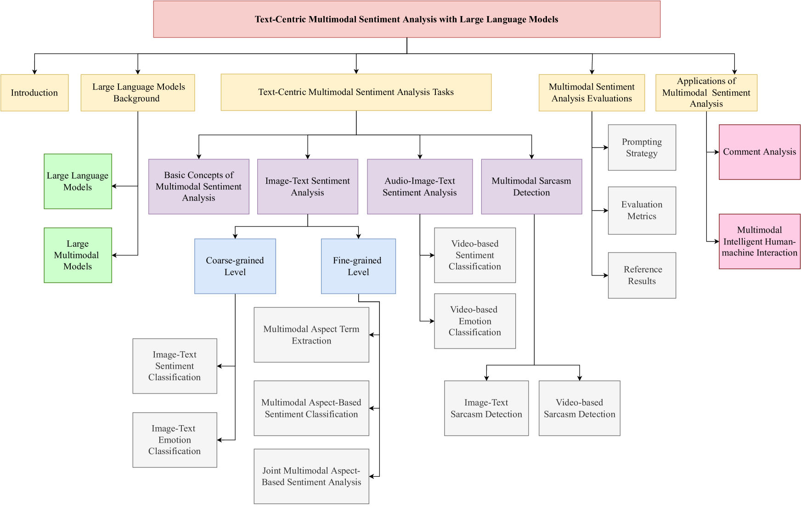
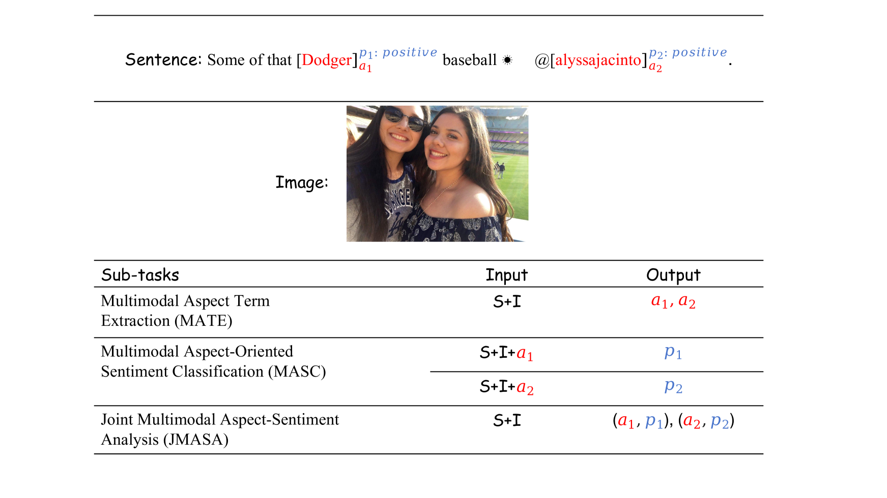
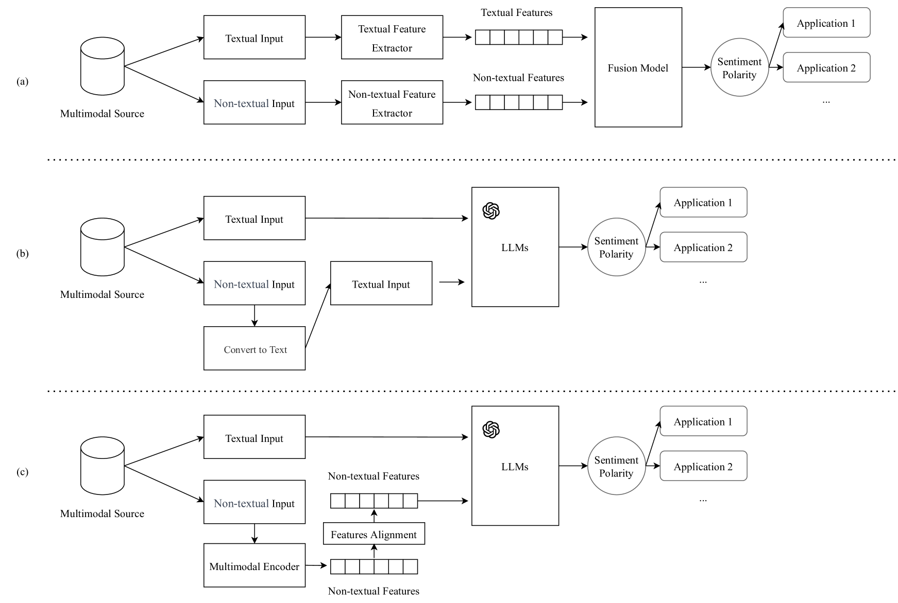
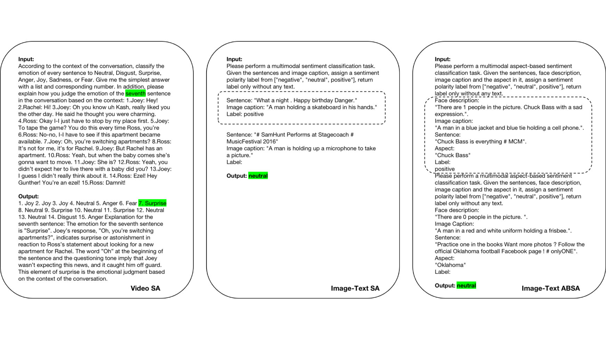

# 大型语言模型与文本主导的多模态情感分析：一次深度探索

发布时间：2024年06月12日

`LLM应用

这篇论文摘要讨论了大型语言模型（LLMs）在多模态情感分析中的应用，特别是在以文本为主导的任务中的潜力和挑战。它探讨了如何使现有的LLMs更有效地适应这类任务，并总结了相关的研究、方法、优势、局限以及应用场景。这与LLM的应用相关，因为它关注的是LLMs在特定任务（即多模态情感分析）中的实际应用和改进，而不是LLM的理论基础或Agent的设计与行为。因此，它被归类为LLM应用。` `情感分析` `多模态分析`

> Large Language Models Meet Text-Centric Multimodal Sentiment Analysis: A Survey

# 摘要

> 相较于仅关注文本的传统情感分析，多模态情感分析更贴近人类处理现实情感的方式，因为它同时考虑了来自语言、图像、视频等多种来源的情感信号。尽管其他模态也携带着丰富的情感线索，自然语言因其丰富的上下文信息而在分析中占据核心地位。随着ChatGPT的问世，大型语言模型（LLMs）在以文本为主导的多模态任务中展现出巨大潜力。然而，如何让现有的LLMs更有效地适应这类任务仍是一个未解之谜。本综述旨在全面审视以文本为中心的多模态情感分析的最新研究，探讨LLMs的潜力及其方法、优势与局限，总结其应用场景，并展望未来研究方向和挑战。

> Compared to traditional sentiment analysis, which only considers text, multimodal sentiment analysis needs to consider emotional signals from multimodal sources simultaneously and is therefore more consistent with the way how humans process sentiment in real-world scenarios. It involves processing emotional information from various sources such as natural language, images, videos, audio, physiological signals, etc. However, although other modalities also contain diverse emotional cues, natural language usually contains richer contextual information and therefore always occupies a crucial position in multimodal sentiment analysis. The emergence of ChatGPT has opened up immense potential for applying large language models (LLMs) to text-centric multimodal tasks. However, it is still unclear how existing LLMs can adapt better to text-centric multimodal sentiment analysis tasks. This survey aims to (1) present a comprehensive review of recent research in text-centric multimodal sentiment analysis tasks, (2) examine the potential of LLMs for text-centric multimodal sentiment analysis, outlining their approaches, advantages, and limitations, (3) summarize the application scenarios of LLM-based multimodal sentiment analysis technology, and (4) explore the challenges and potential research directions for multimodal sentiment analysis in the future.

[Arxiv](https://arxiv.org/abs/2406.08068)