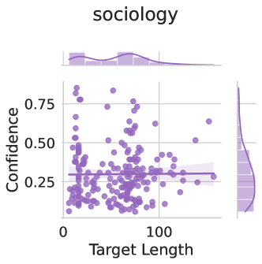
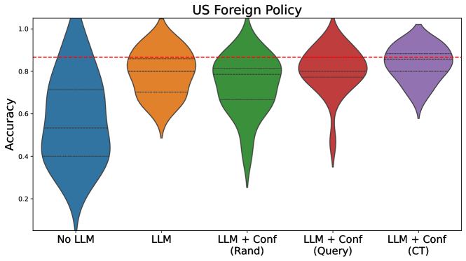
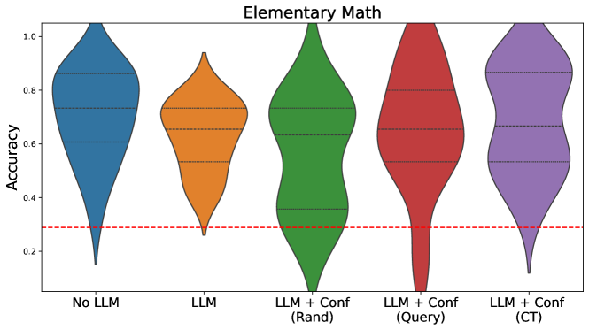

# 大型语言模型需学会识别自身的知识盲区。

发布时间：2024年06月12日

`LLM应用

这篇论文主要探讨了大型语言模型（LLMs）在高风险应用中的不确定性估计问题，并提出了一种通过微调模型来生成既泛化能力强又计算成本低的不确定性估计的方法。此外，论文还分析了确保LLM不确定性估计可靠性的机制，并通过用户研究展示了不确定性估计在人机协作场景中的应用。这些内容主要关注LLM的实际应用，特别是在提高模型预测的可信度和不确定性估计方面的应用，因此属于LLM应用分类。` `人机协作` `模型不确定性估计`

> Large Language Models Must Be Taught to Know What They Don't Know

# 摘要

> 在高风险应用中使用大型语言模型（LLMs）时，我们必须明确何时可以信赖其预测。有观点认为，只需提示高性能LLMs即可产生准确的不确定性估计，而另一些方法则提出了可能成本高昂的采样技术。本研究首先指出，仅依赖提示不足以达到良好的校准效果，随后通过在包含正误答案的小规模数据集上微调，我们发现可以生成既泛化能力强又计算成本低的不确定性估计。实验证明，仅需一千个分级样本即可超越现有方法，并且通过模型特征进行训练对于性能至关重要，对于采用LoRA的大型开源模型而言，这一过程是可行的。此外，我们深入分析了确保LLM不确定性估计可靠性的机制，揭示了众多模型不仅能评估自身的不确定性，还能评估其他模型的不确定性。最后，通过用户研究，我们展示了不确定性估计在人机协作场景中对人类使用LLMs的指导作用。

> When using large language models (LLMs) in high-stakes applications, we need to know when we can trust their predictions. Some works argue that prompting high-performance LLMs is sufficient to produce calibrated uncertainties, while others introduce sampling methods that can be prohibitively expensive. In this work, we first argue that prompting on its own is insufficient to achieve good calibration and then show that fine-tuning on a small dataset of correct and incorrect answers can create an uncertainty estimate with good generalization and small computational overhead. We show that a thousand graded examples are sufficient to outperform baseline methods and that training through the features of a model is necessary for good performance and tractable for large open-source models when using LoRA. We also investigate the mechanisms that enable reliable LLM uncertainty estimation, finding that many models can be used as general-purpose uncertainty estimators, applicable not just to their own uncertainties but also the uncertainty of other models. Lastly, we show that uncertainty estimates inform human use of LLMs in human-AI collaborative settings through a user study.

[Arxiv](https://arxiv.org/abs/2406.08391)